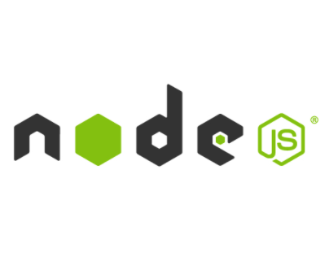

{{ page.title }}
===

<h3 class="pull-right price-tag">contact us at: <a href="mailto:office@codbex.com">office@codbex.com</a></h3>

<h2><i class="fa fa-server fa-fw"></i>
For companies which plan to build SaaS solutions
</h2>

<b>codbex</b> offers experiences consultants at attractive rates.

  

The areas of competences of our experts includes:
<ul>
	<li><a href="https://www.dirigible.io">Eclipse Dirigible</a> - the open source Low Code platform. We are the people behind the project working currenly also as independent consultants in close collaboration and support from Eclipse Foundation. We can help you when:</li>
	<ul>
		<li>You want to build custom Low Code platform integrated in your landscape</li>
		<li>You want to build application based on our stack hosted and operated by us</li>
		<li>You want to build own toolset to be integrated in your solutions</li>
	</ul>
	<li><a href="https://www.xsk.io">XSK</a> - the compatible layer for SAP HANA XS development model running on Kubernetes or Cloud Foundry against SAP HANA Cloud service. We can help in case you want to migrate your existing applications running currently on SAP HANA (on-premises or SAP BTP Neo) to multi-cloud. The phases of migration are as follows:</li>
	<ol>
		<li>Contact us at <a href="mailto:office@codbex.com">office@codbex.com</a> with your request including the company name, application name, number of users, number of artefacts, current deployments, name of the business owner, name of the technical contact</li>
		<li>We will setup a kick-off meeting to start the evaluation phase. During the call we expect to dig deeper in the application functionality and especially the features which are used - hdbtables, hdbviews, hdbdd files, calculation views, analytical privileges, xsjs, xsjslib, xsodata, xsaccess, xsprivileges, etc.</li>
		<li>We expect that you will provide the application source code or delivery units to be able to migrate and run on our site. We can use a sample application build by you especially for this purpose containing all type of the artifacts from the original one</li>
		<li>Setup regular calls with the technical person from your side (one hour, bi-weekly) to update on the progress and discuss the open issues if any</li>
		<li>Once we are ready with the migration phase, we will provide you the source code of working application running on XSK against HANA Cloud</li>
		<li>The next phase is to setup the development, test and production landscape on your side. We can guide you what you have to buy as runtimes and services from SAP BTP based on your scenario</li>
		<li>Once the setup is done you can start with the acceptance tests which will be driven by you, so you have to plan the required resources for this phase in advance</li>
		<li>The running support cost will depend on the users count and the volume of the application</li>
	</ol>
	<li>We can guide you in case you want to develop extensions on <a href="https://www.sap.com/products/business-technology-platform.html">SAP Business Technology Platform</a> as we are veterans in this area</li>
	<ul>
		<li><a href="https://discovery-center.cloud.sap/serviceCatalog/sap-hana-cloud?region=all">HANA Cloud</a></li>
		<li><a href="https://discovery-center.cloud.sap/serviceCatalog/document-management-service-application-option?service_plan=standard&region=all">Document Management</a></li>
		<li><a href="https://discovery-center.cloud.sap/serviceCatalog/sap-analytics-cloud?region=all">Analytics Cloud</a></li>
		<li><a href="https://discovery-center.cloud.sap/serviceCatalog/integration-suite?region=all">Integration Suite</a></li>
		<li><a href="https://www.sap.com/products/human-resources-hcm.html">SuccessFactors</a></li>
        <li><a href="https://www.ariba.com/solutions/solutions-overview/supplier-management/supplier-lifecycle-management">Ariba</a></li>
        <li><a href="https://www.sap.com/products/crm.html">Hybris</a></li>
	</ul>
	<li>We can help in further development of your existing <a href="https://help.sap.com/viewer/52715f71adba4aaeb480d946c742d1f6/2.0.06/en-US/a718a000d64c45e5a3dcdf0532538d35.html">SAP HANA XS</a> applications</li>
	<li>We are also experts in cloud native environments like <a href="https://www.kubernetes.io/">Kubernetes</a>, especially in <a href="https://discovery-center.cloud.sap/serviceCatalog/kyma-runtime?region=all">Kyma</a> and <a href="https://discovery-center.cloud.sap/serviceCatalog/cloud-foundry-runtime?region=all">Cloud Foundry</a></li>

