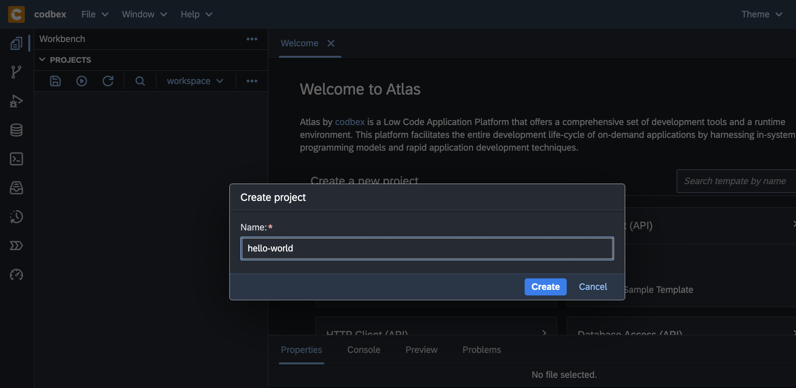
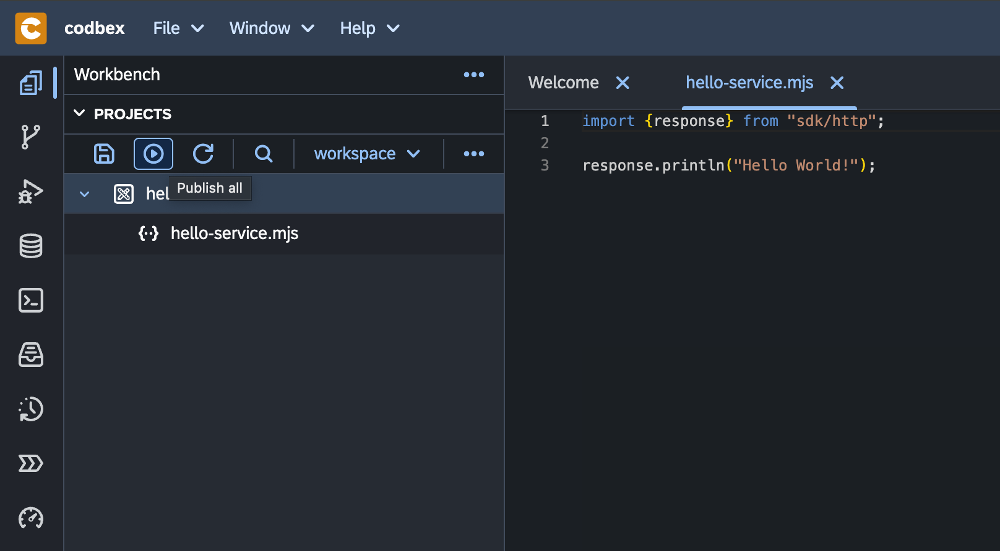
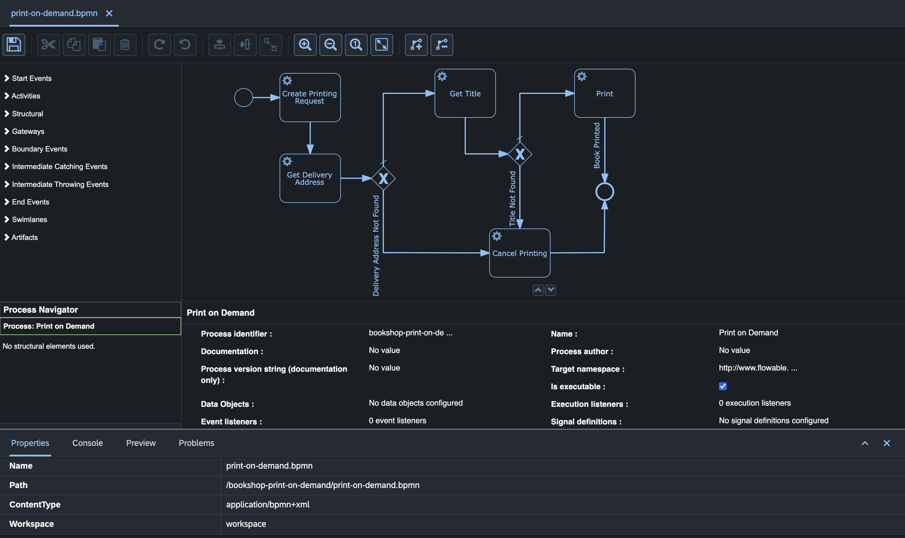

# Getting Started

Welcome to the Getting Started guide!

## Overview

This guide outlines the process of using the __codbex__ platform to create your initial 'Hello World' service. For more in-depth technical information on various aspects of the platform, its components, and capabilities, refer to the documentation listed in the references section below.

   

## Hello World

In this guide, we'll walk you through creating a simple "Hello World" service using the Request and Response APIs.

### Setting Up Your Environment

Before we begin, ensure you have the necessary tools installed and your development environment configured.

You can run the all in one platform as a Docker container as described [here](https://github.com/codbex/codbex-atlas?tab=readme-ov-file#docker) or [build](https://github.com/codbex/codbex-atlas?tab=readme-ov-file#build) and [run](https://github.com/codbex/codbex-atlas?tab=readme-ov-file#run) locally.

#### Access the instance

In case of a local setup on your machine, you can access the web IDE at the following location: [http://localhost/](http://localhost)

::: info Default Credentials
The default username is `admin` and the default password is `admin`. The credentials can be updated, as described in the [configuration options](configurations/basic-auth.md).
:::

### Creating Your First Service

Let's start by creating a basic "Hello World" service. We'll use the Request API to get the REST method from the incoming requests and the Response API to send a response back to the client.

### Create a `Hello World` service
Once you have a running __codbex__ instance, you can start with your project:

1. Right-click inside the `Projects` view.
1. From the menu select the **New Project** option.

    

1. Enter `hello-world` for the name of the project and click the **Create** button. 

    

1. Right-click on the `hello-world` project in the `Projects` view and choose **JavaScript** service from the **New** dropdown:

- Select the **New** **&rarr;** **JavaScript Service** option:

    

- Enter `hello-service.mjs` for the name of the **JavaScript Service**:

    

- Double-click on the `hello-service.js` to open the file in the editor on the right.

    

::: info
The file already contains a `Hello World` service implementation. As it's not specified otherwise, the service can be executed by performing any of the following HTTP methods: `GET`, `POST`, `PUT`, `DELETE` and `PATCH`.
:::

- Click on the **Publish All** button from the toolbar:

    

- With the `service.js` selected in the `Projects` view, check the result of the execution of the server-side **JavaScript Service** in the `Preview` view:

    

::: tip Note
The **JavaScript Service** is published and available at the `http://localhost/services/js/hello-world/hello-service.mjs`URL. It can be accessed in a separate browser tab, consumed by a third-party application or API tools like `Postman` or `cURL`.
:::

## Explore the Tooling

### Overview: Getting Started with Tooling

This overview will guide you through the basics of the various tools and perspectives available within the platform's workbench. Whether you're managing databases, debugging applications, or designing integration flows, this comprehensive set of tools empowers you to streamline your development workflow and maximize productivity.

#### Workbench Basics

- **[Workbench](tooling/workbench/index.md):** The central hub where you perform your development tasks. It provides access to various perspectives and tools tailored to different aspects of application development.

- **[Import Area](tooling/workbench/import.md):** Easily import existing projects or resources into your workspace.

- **[Search Area](tooling/workbench/search.md):** Quickly find files, resources, or symbols within your project.

- **[Properties Area](tooling/workbench/properties.md):** View and edit properties of selected files or resources.

- **[Console View](tooling/workbench/console.md):** Monitor application logs and execute commands directly within the platform.

- **[Code Editor (Monaco)](tooling/workbench/code-editor.md):** Write, edit, and debug code using the powerful Monaco editor, which provides syntax highlighting, auto-completion, and other advanced features.

- **[Problems View](tooling/workbench/problems.md):** Identify and resolve issues in your codebase with real-time error and warning notifications.

- **[Preview View](tooling/workbench/preview.md):** Preview web pages, documents, or other content directly within the platform.

- **[Logs View](tooling/workbench/logs.md):** Monitor system logs and diagnostic information to troubleshoot issues.

- **[Loggers View](tooling/workbench/loggers.md):** Configure logging settings for different components within your application.

#### Git Perspective

- **[Git Projects View](tooling/git/git-projects.md):** Manage Git repositories, clone, pull, push, and share projects seamlessly.

- **[Local Branches View](tooling/git/local-branches.md):** View and manage local branches within your Git repository.

- **[Remote Branches View](tooling/git/remote-branches.md):** Explore and interact with remote branches in your Git repository.

- **[History View](tooling/git/history.md):** Track changes and revisions in your Git repository's history.

- **[Git Staging View](tooling/git/staging.md):** Stage, unstage, and commit changes to your Git repository.

- **[Diff Editor](tooling/git/diff-editor.md):** Compare and merge differences between files or commits.

#### Databases Perspective

- **[Database Explorer](tooling/databases/explorer.md):** Interact with databases, execute queries, and manage database connections.

- **NoSQL Datasources Support:** Seamlessly work with NoSQL databases and data sources.

- **[SQL Console](tooling/databases/sql.md):** Execute SQL queries and commands directly within the platform.

- **[Result View](tooling/databases/result.md):** View query results and data sets returned from database operations.

- **[Databases View](tooling/databases/databases.md):** Manage database connections, configurations, and schemas.

- **[Transfer View](tooling/databases/transfer.md):** Transfer data between different databases and data sources seamlessly.

- **[Data Export and Import](tooling/databases/export-import.md):** Export and import data between databases using CSV and JSON formats.

#### Debugger Perspective

- **[Debugger Basics](tooling/debugger/index.md#getting-started):** Debug applications using a suite of tools including breakpoints, call stack, variables, and watch expressions.

- **Debugging Tools:** Utilize debugging tools to identify and fix issues in your codebase.

- **[Breakpoints View](tooling/debugger/index.md#2-breakpoints):** Set breakpoints to pause execution at specific points in your code.

- **Call Stack View:** View the call stack to understand the flow of execution.

- **[Variables View](tooling/debugger/index.md#4-variable-inspection):** Inspect and modify variable values during debugging sessions.

#### Documents Perspective

- **[Documents Explorer](tooling/documents/explorer.md):** Manage and organize documents within your project.

- **[Document Preview](tooling/documents/preview.md):** Preview documents and files directly within the platform.

- **[File Upload and Management](tooling/documents/explorer.md#5-drag-and-drop-interaction):** Upload, organize, and manage files and documents within your project.

#### Processes Workspace Perspective

- **[Process Definitions View](tooling/processes/definitions.md):** Explore and manage BPMN process definitions.

- **[Process Instances View](tooling/processes/instances.md):** Monitor and manage running instances of BPMN processes.

- **[Process Context View](tooling/processes/context.md):** View and manage process context data associated with BPMN processes.

- **[Process Viewer](tooling/processes/viewer.md):** Visualize BPMN process diagrams and instances.

- **[Process Inbox](tooling/processes/inbox.md):** Manage user tasks and interactions within BPMN processes.

- **[Dead-Letter Jobs View](tooling/processes/dead-letter-jobs.md):** Monitor and handle failed or erroneous process jobs.

#### Terminal Perspective

- **[Terminal Basics](tooling/terminal/index.md):** Access a command-line interface directly within the platform.

- **[Commands and Shortcuts](tooling/terminal/index.md#2-xtermjs-emulator):** Execute commands, navigate directories, and perform various tasks using terminal commands.

## Modelling Applications

### Overview: Getting Started with MDD

This overview will guide you through the basics of the model driven techniques.

#### Model-Driven Development (MDD)

The __codbex__ platform offers a comprehensive set of MDD features, including entity data modeling, code generation, predefined modules, and application building blocks. By leveraging these features, organizations can streamline the development process, reduce development time and costs, and deliver high-quality applications that meet their business requirements.

- **[General Overview](tooling/modeling.md#overview):** Understand the concept and benefits of Model-Driven Architecture (MDA) for application development.

- **[Entity Data Modeler (EDM)](tooling/modeling.md#entity-data-modeler-edm):** Design and define domain models using the Entity Data Modeler tool.

#### Business Processes Management

The __codbex__ platform offers a wide range of BPM features, including BPMN modeling, process execution, task management, and administrative tools. By leveraging these features, organizations can streamline their business processes, improve operational efficiency, and achieve better visibility and control over their business operations.

- **[BPMN Modeler (BPMN)](tooling/processes/modeler.md):** Design and define business process models using the BPMN Modeler tool.

#### System Integrations and ETL

The __codbex__ platform offers a rich set of ETL features, including visual route modeling, integration engine based on Apache Camel, extensive library of connectors, and comprehensive admin tools. These features empower users to design, deploy, and manage complex data integration workflows with ease, enabling organizations to efficiently extract, transform, and load data across their IT landscape.

#### Form Designer

The Form Designer in the __codbex__ platform offers a flexible and intuitive solution for designing input forms, enabling users to create visually appealing and highly functional forms for their applications with ease. Whether building simple data entry forms or complex multi-step workflows, the Form Designer provides the tools and capabilities needed to design engaging and user-friendly interfaces for a wide range of business use cases.

### Extensibility in the Platform

- **[Overview](tooling/extensibility.md#overview):** Explore the extensibility features of the platform, including extension points and extensions.

- **[Extension Points](tooling/extensibility.md#extension-points):** Identify and leverage extension points to customize and extend platform functionality.

- **[Extensions](tooling/extensibility.md#extensions):** Develop and deploy extensions to enhance the capabilities of the platform.
