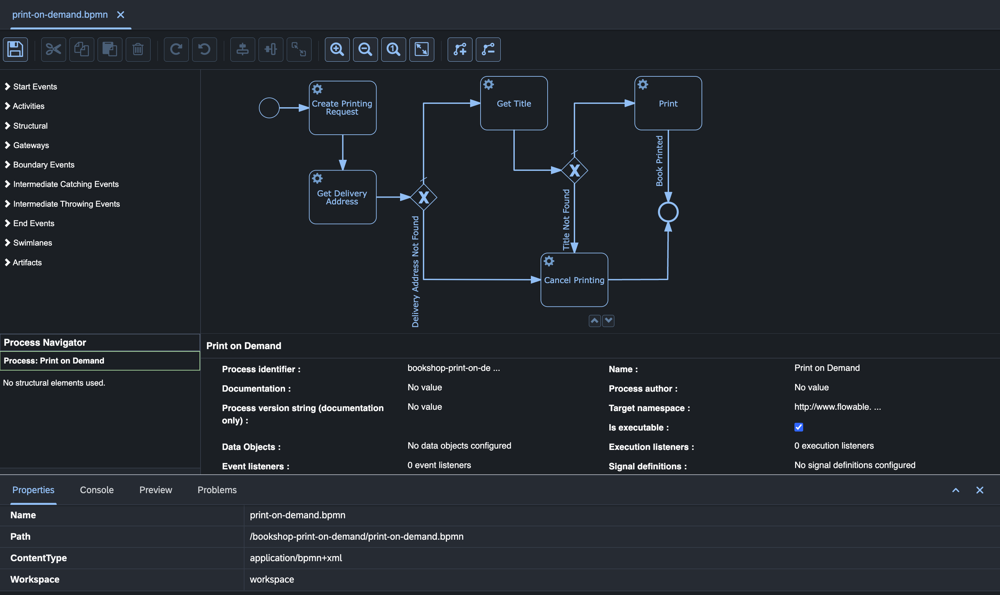

# BPM Engine

## Introduction

The BPM Engine in the __codbex__ platform empowers organizations to model, automate, and manage their business processes efficiently. This documentation introduces key features of the BPM Engine, focusing on its support for the BPMN (Business Process Model and Notation) v2 specification and the utilization of `*.bpmn` files for the definition and execution of business processes. The underlying BPMN process execution is powered by the Flowable framework (formerly Activiti).

## BPM Engine Features

### BPMN v2 Specification Support

The BPM Engine adheres to the BPMN v2 specification, a standardized notation for representing business processes visually. BPMN enables business analysts to design and communicate process workflows, fostering collaboration between business and technical stakeholders.

Example BPMN v2 Diagram:



### Process Definition in `*.bpmn` Files

BPM Engine utilizes `*.bpmn` files to define business processes. These files are authored using BPMN elements and notation, providing a clear and visual representation of the process flow, tasks, gateways, and events.

Example`*.bpmn` Process Definition:

```xml
<bpmn:process id="myProcess" name="My BPMN Process">
  <bpmn:startEvent id="startEvent" name="Start Event" />
  <bpmn:task id="task1" name="Task 1" />
  <bpmn:exclusiveGateway id="gateway" name="Exclusive Gateway" />
  <bpmn:task id="task2" name="Task 2" />
  <bpmn:task id="task3" name="Task 3" />
  <bpmn:endEvent id="endEvent" name="End Event" />
  
  <!-- Sequence flows -->
  <bpmn:sequenceFlow sourceRef="startEvent" targetRef="task1" />
  <bpmn:sequenceFlow sourceRef="task1" targetRef="gateway" />
  <bpmn:sequenceFlow sourceRef="gateway" targetRef="task2">
    <bpmn:conditionExpression xsi:type="bpmn:tFormalExpression">${variable == 'condition'}</bpmn:conditionExpression>
  </bpmn:sequenceFlow>
  <bpmn:sequenceFlow sourceRef="gateway" targetRef="task3">
    <bpmn:conditionExpression xsi:type="bpmn:tFormalExpression">${variable != 'condition'}</bpmn:conditionExpression>
  </bpmn:sequenceFlow>
  <bpmn:sequenceFlow sourceRef="task2" targetRef="endEvent" />
  <bpmn:sequenceFlow sourceRef="task3" targetRef="endEvent" />
</bpmn:process>
```

### Execution of Business Processes with Flowable Framework

The BPM Engine interprets and executes `*.bpmn` process definitions, enabling organizations to automate and orchestrate their business processes. During execution, the engine handles tasks, events, gateways, and other BPMN elements defined in the process.

The BPM Engine leverages the Flowable framework (formerly Activiti) for the execution of BPMN processes. Flowable is an open-source workflow and Business Process Management (BPM) platform that provides a robust and scalable engine for process execution.

## Conclusion

The BPM Engine in the __codbex__ platform provides a powerful platform for modeling, executing, and managing business processes according to the BPMN v2 specification. By utilizing `*.bpmn` files and Flowable APIs, organizations can design, automate, and analyze their business workflows, fostering improved efficiency, collaboration, and agility.