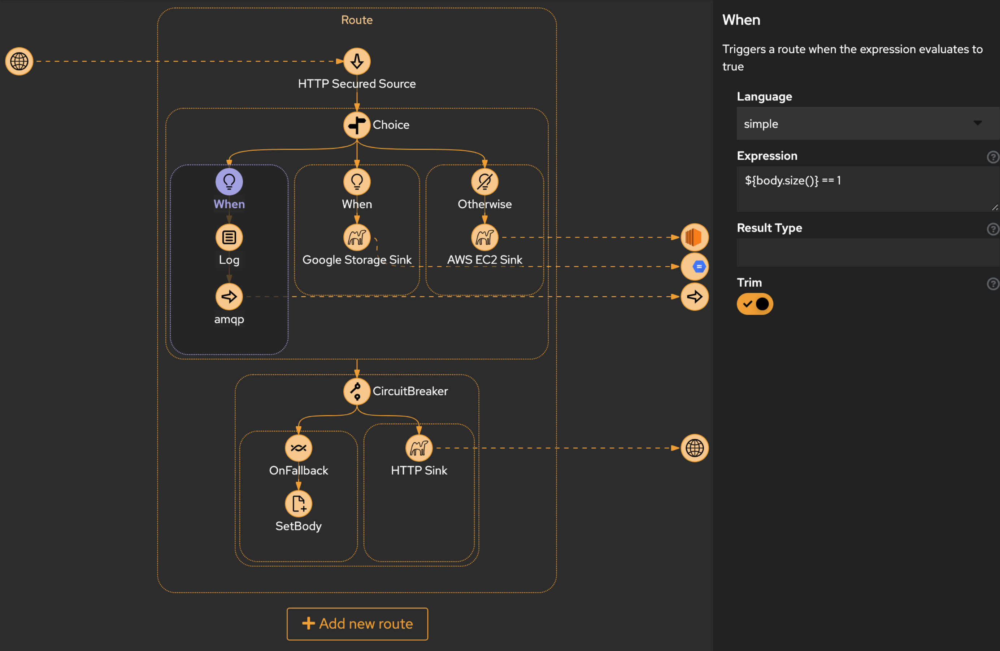

# Inegrations Engine

## Introduction

The Integrations Engine in the __codbex__ platform empowers organizations to seamlessly connect and integrate various systems and services. This documentation explores key features of the Integrations Engine, focusing on its underlying integration with Apache Camel. The engine supports a myriad of connectors for diverse systems and can be configured using `*.camel`` descriptor files.

## Integrations Engine Features

### Apache Camel Integration

The Integrations Engine leverages Apache Camel, a powerful open-source integration framework that provides a rule-based routing and mediation engine. Apache Camel simplifies the integration of different systems and applications using a variety of connectors and patterns.

Example Camel Flow:



### Hundreds of Connectors

Apache Camel supports a vast array of connectors, allowing seamless integration with numerous systems and services. Connectors cover technologies such as databases, messaging queues, cloud services, file systems, and more. Developers can choose from a wide range of connectors based on their integration requirements.

### Configuration via `*.camel` Descriptor Files

The Integrations Engine is configured using `*.camel` descriptor files. These files define integration routes, components, and options in a structured format, providing a clear and concise way to configure integration scenarios.

Example `*.camel` Descriptor Configuration:

```yaml
- route:
    id: route-e308
    from:
      uri: platform-http:/camelFlow
      id: from-48ea
      steps:
        - setProperty:
            name: resource
            id: setProperty-8ed5
            expression:
              constant:
                expression: camel_flow/calledFromCamel.mjs
                id: constant-f4ba
        - to:
            uri: class:org.eclipse.dirigible.components.engine.camel.invoke.Invoker
            id: to-5fb3
            parameters:
              method: invoke
- route:
    id: route-bda8
    from:
      uri: direct:inbound1
      id: from-3850
      steps:
        - log:
            message: '[CamelFlow] Route inbound1 called with message: ${body}'
            id: log-be9c
        - setBody:
            id: setBody-0552
            expression:
              simple:
                expression: ${body} -> camel route inbound1 handled this message
                id: simple-57b6
```

## Conclusion

The Integrations Engine in the __codbex__ platform, powered by Apache Camel, offers a flexible and extensible solution for connecting and integrating diverse systems. By utilizing `*.camel` descriptor files, organizations can easily configure and manage integration routes, leveraging the extensive set of Apache Camel connectors for seamless connectivity.
