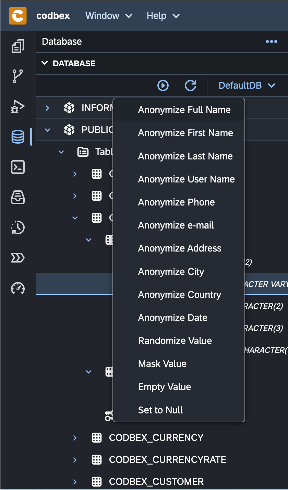

### Data Anonymization

Data Anonymization is a process used to protect sensitive information by converting or removing personally identifiable information (PII) from datasets. The primary goal of anonymization is to prevent individuals from being identified while still maintaining the utility and integrity of the data for analysis and research purposes.

{ style="width:300px"}

#### Key Components:

1. **Personal Data Removal**: Anonymization techniques involve removing direct identifiers such as names, social security numbers, addresses, and other personal information from the dataset.

2. **Pseudonymization**: In cases where removing data entirely is not feasible, pseudonymization replaces direct identifiers with artificial identifiers or pseudonyms. This technique helps to obscure the identity of individuals while still allowing for analysis.

3. **Generalization**: Generalization involves replacing specific values with more general or less precise values. For example, replacing exact ages with age ranges (e.g., 20-30 years old) or replacing precise geographic locations with broader regions (e.g., city-level data replaced with country-level data).

4. **Data Masking**: Data masking involves replacing sensitive data with fictional or anonymized data while preserving the format and structure of the original data. This technique ensures that the data remains useful for testing or development purposes without exposing sensitive information.

#### Benefits:

- **Privacy Protection**: Data anonymization helps organizations comply with privacy regulations such as GDPR, CCPA, and HIPAA by safeguarding individuals' privacy rights and preventing unauthorized access to personal data.

- **Data Sharing**: Anonymized datasets can be shared more freely for research, collaboration, and analysis purposes, as they minimize the risk of exposing sensitive information.

- **Risk Reduction**: By anonymizing data, organizations mitigate the risk of data breaches, identity theft, and other security incidents associated with the exposure of personal information.

- **Ethical Considerations**: Anonymization promotes ethical data handling practices by prioritizing the privacy and confidentiality of individuals' information.

#### Challenges:

- **Data Utility**: Anonymization techniques must balance the need for privacy with the preservation of data utility. Over-anonymization can lead to data sets that are less useful for analysis and research purposes.

- **Re-identification Risk**: Despite anonymization efforts, there is always a risk of re-identification, especially when combining anonymized datasets or using advanced data analysis techniques.

- **Complexity**: Anonymizing data effectively requires expertise in data privacy, security, and regulatory compliance. Implementing robust anonymization processes can be complex and resource-intensive.

#### Conclusion:

Data Anonymization is a critical practice for organizations looking to protect sensitive information, comply with privacy regulations, and foster trust with their customers and stakeholders. By adopting effective anonymization techniques, organizations can strike a balance between privacy protection and data utility, ensuring that data remains valuable for analysis while minimizing privacy risks.
