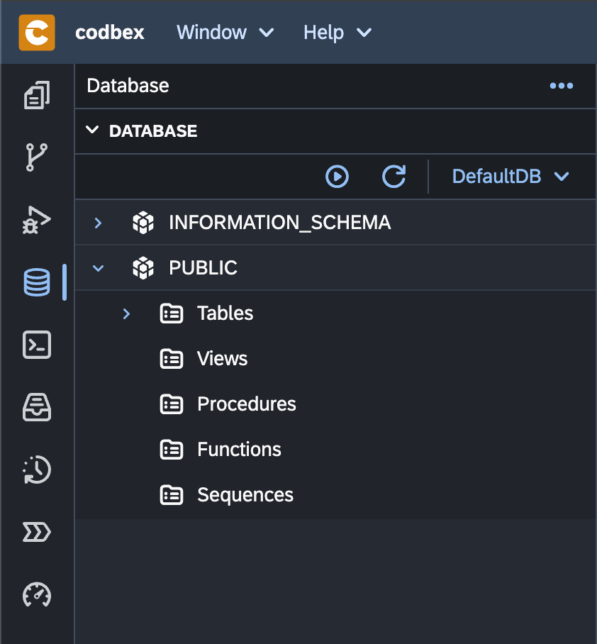
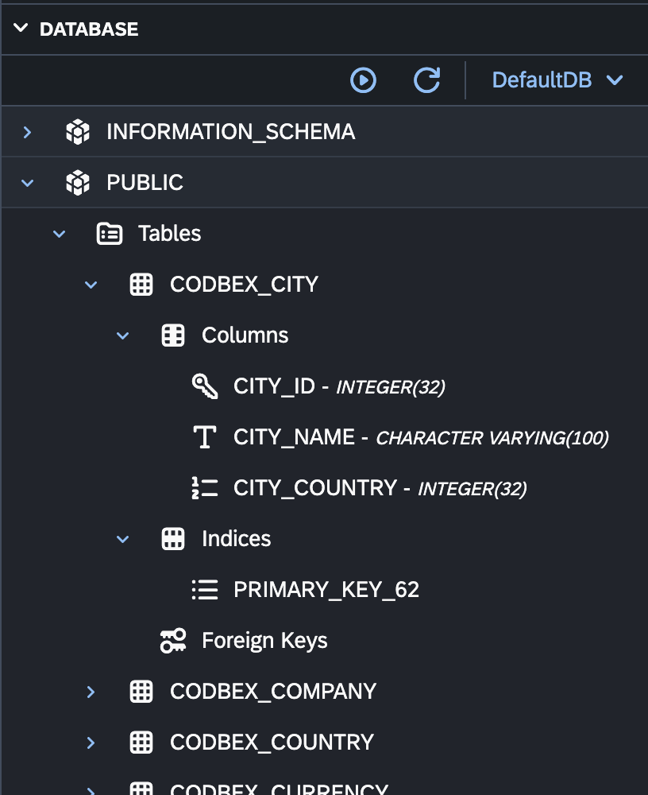

# Database Explorer

The "Database Explorer" in the Databases perspective is a powerful tool for managing and interacting with databases. This section provides an overview of the key features and actions available in the "Database Explorer."

{ style="width:400px"}

## Connecting to a Database

1. **Open the Database Explorer:**
   - Navigate to the Databases perspective and select "Database Explorer" tab.

2. **Explore Connected Databases:**
   - Once connected, the Database Explorer displays a list of connected databases. Expand the nodes to view tables, views, procedures, and other database objects.

## Interacting with Relational Database Objects

{ style="width:400px"}

1. **View Table Data:**
   - Double-click on a table to view its data. Use the grid to edit, filter, and sort records.

2. **Execute SQL Queries:**
   - Execute custom SQL queries by right-clicking on the database, selecting "Execute SQL," and entering your query.

3. **Explore Schema Objects:**
   - Navigate through the database schema to explore tables, views, indexes, procedures, and other objects.

4. **Manage Indexes and Constraints:**
   - Right-click on a table to manage indexes and constraints. Create, edit, or drop indexes and constraints as needed.

## Interacting with NoSQL Datasources

{ style="width:400px"}

1. **Explore NoSQL Collections or Tables:**
   - Once connected to a NoSQL datasource, explore collections or tables to view and interact with NoSQL data.

2. **Execute NoSQL Queries:**
   - Perform queries on NoSQL data using the respective query language or tools provided by the NoSQL datasource.

## [Anonymizing Data](data-anonymization.md)

1. **Select Columns for Anonymization:**
   - Right-click on a table and choose "Anonymize Data" to select specific columns for anonymization.

2. **Choose Anonymization Type:**
   - Select the type of anonymization or masking for the chosen columns. Options may include randomization, data scrambling, or setting values to null.

3. **Execute Anonymization:**
   - Execute the anonymization process to apply the chosen anonymization type to the selected columns.

## Actions in the Database Explorer

{ style="width:400px"}

### 1. **Refresh Database Connection:**
   - Use the "Refresh" button or right-click on a connection to refresh the list of objects and their statuses.

### 2. **Show Contents:**
   - Use the "Show Contents" menu to execute a query to select all the records.

### 3. **Generate query scripts:**
   - Use the "Select", "Insert", "Update", "Delete" menu items (once the "Columns" node is expanded) to generate the corresponding query in the SQL Console.

### 4. **Import and Export Data:**
   - Import and export data to and from tables using the "Import Data" and "Export Data" options.

### 5. **Export Metadata:**
   - Export metadadata from schema using the "Export Metadata" option.

## Conclusion

The "Database Explorer" in the Databases perspective of the __codbex__ platform provides a comprehensive and user-friendly interface for managing and interacting with databases. Explore its features to streamline database-related tasks and enhance your development workflow.