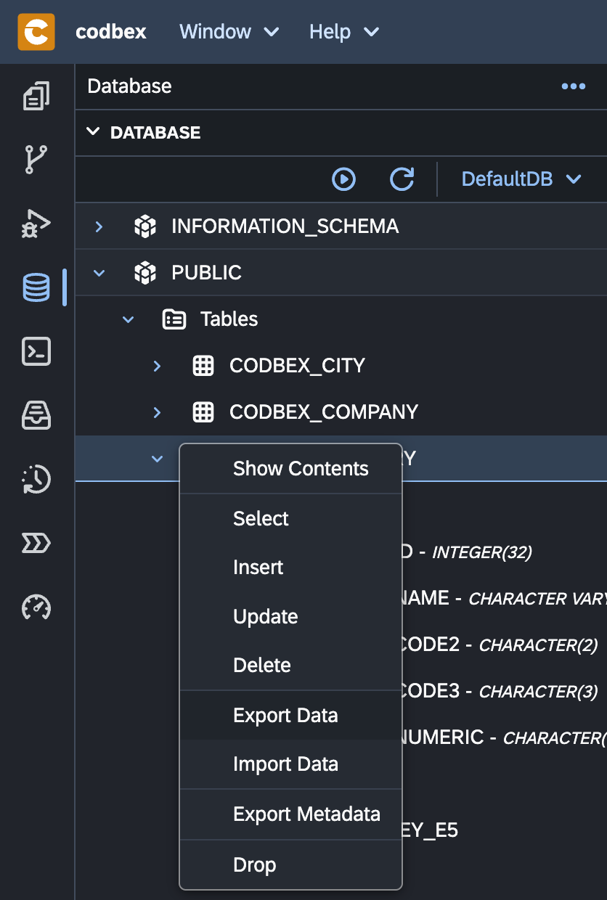
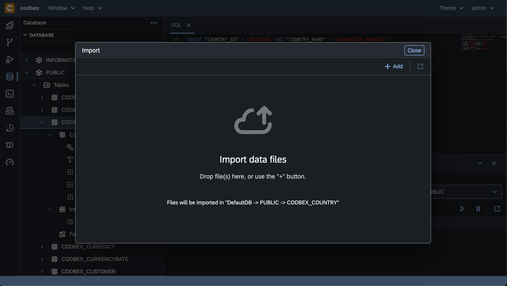

# Data Export & Import

The "Data Export and Import" functionality in the __codbex__ platform provides a versatile solution for transferring data between different datasources. This section covers the key features and actions related to data export and import, supporting both relational databases and NoSQL datasources.

## Exporting Data

{ style="width:300px"}

### Relational Databases

1. **CSV Format:**
   - When exporting data from relational databases, the default file format is CSV (Comma-Separated Values). This format ensures compatibility and ease of use across various platforms.

2. **Streamed Transfer:**
   - The underlying layer of the export functionality employs streaming, allowing the transfer of large datasets efficiently. This ensures optimal performance and reduced resource consumption.

### NoSQL Datasources

1. **JSON Format:**
   - For NoSQL datasources like MongoDB, the default file format for data export is JSON (JavaScript Object Notation). JSON provides a flexible and widely supported structure for representing document-based data.

2. **Streaming Support:**
   - Similar to relational databases, NoSQL data export benefits from the streaming underlying layer, enabling the transfer of large JSON files efficiently.

## Importing Data

### Relational Databases

1. **CSV File Import:**
   - Import data into relational databases using CSV files. The import wizard guides you through the process, allowing mapping of CSV columns to database fields.

2. **Streaming Mechanism:**
   - Leverage the streaming mechanism for importing large CSV files seamlessly. This ensures optimal resource utilization during the import operation.

### NoSQL Datasources

1. **JSON File Import:**
   - Import data into NoSQL datasources by uploading JSON files. The import wizard facilitates mapping JSON attributes to the corresponding document fields in the datasource.

2. **Efficient Streaming:**
   - The underlying streaming mechanism supports the efficient import of large JSON files, ensuring a smooth and resource-efficient process.

## Conclusion

The "Data Export and Import" functionality in the platform provides a robust solution for transferring data seamlessly between different datasources. Whether dealing with relational databases or NoSQL datasources, the support for CSV and JSON formats, coupled with the efficient streaming mechanism, ensures optimal performance and flexibility.
