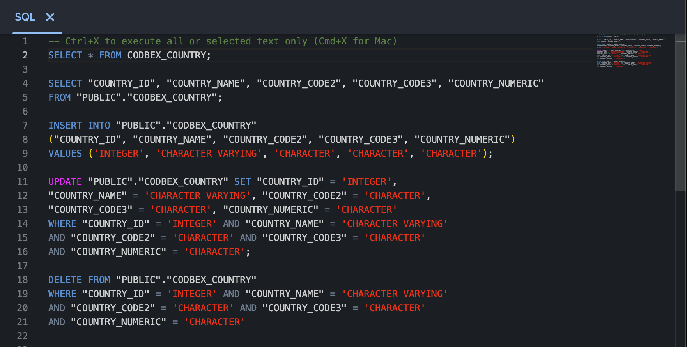
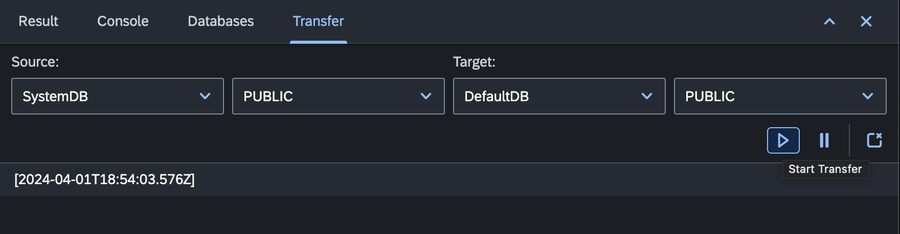
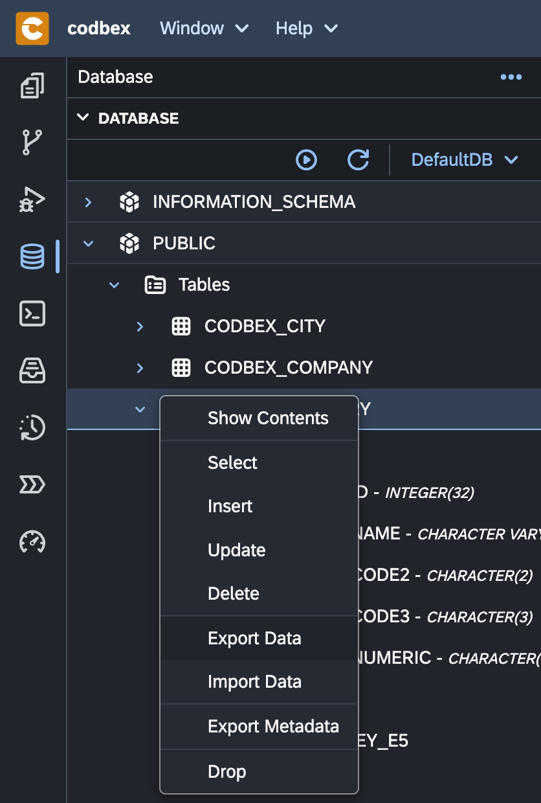
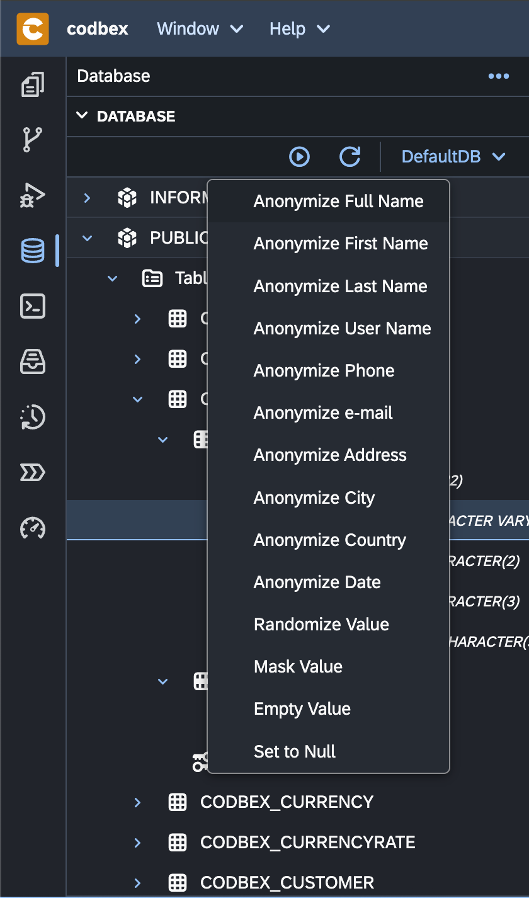

# Databases

Welcome to the "Database" perspective in the __codbex__ platform! This perspective is tailored for developers and database administrators, offering a suite of tools to interact with both relational and NoSQL databases seamlessly. Explore the various features and tools available to streamline your database-related tasks.

## 1. [Databases Explorer](explorer):

Inspect the datasources, schemes, tables, views, procedures, sequences and other database artefacts.

{ style="width:300px"}

## 2. [SQL Console](sql):

Execute SQL queries, interact with the database, and perform data anonymization directly from the console.

{ style="width:700px"}

## 3. [Result View](result):

View and analyze the results of SQL queries, perform data anonymization, and export data seamlessly.

{ style="width:700px"}

## 4. [Databases View](databases):

Manage datasources, configure connections, and perform essential actions related to database connectivity.

{ style="width:700px"}

## 5. [Transfer View](transfer):

Facilitate on-line synchronous data transfer between two datasource schemas, providing instant logs for progress tracking.

{ style="width:700px"}

## 6. [Data Export and Import](export-import):

Transfer data between relational databases and NoSQL datasources using CSV and JSON formats, with support for streaming large files.

{ style="width:300px"}

## 7. [Data Anonymization](explorer):

Data Anonymization is a critical practice for organizations looking to protect sensitive information, comply with privacy regulations, and foster trust with their customers and stakeholders.

{ style="width:300px"}

The Database perspective in the platform empowers developers and database administrators to efficiently manage, query, and transfer data across various datasources. Dive into the specific tools and features to enhance your database-related workflows.
