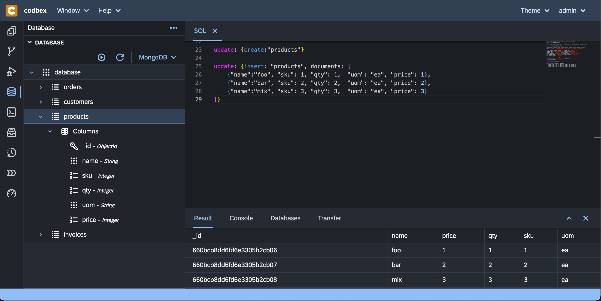

# NoSQL Queries in SQL Console

 How to use NoSQL queries in the SQL Console, including specifying collections, counting collections, creating and dropping collections, inserting, finding, updating, and deleting documents.



## Specify a collection to query

To specify a collection to query, use the following syntax:

```json
{find:"myCollection"}
```

## Specify a count of a collection

To specify the count of a collection, use the following syntax:

```json
{count:"myCollection"}
```

## Specify creating a collection

To create a collection, use the following syntax:

```json
{create:"myCollection"}
```

## Specify dropping a collection

To drop a collection, use the following syntax:

```json
{drop:"myCollection"}
```

## Insert documents

To insert documents into a collection, use the following syntax:

```json
{
    "insert": "myCollection",
    "documents": [
        {"name":"foo", "age": 1},
        {"name":"bar", "age": 2},
        {"name":"mix", "age": 3}
    ]
}
```

## Find document(s)

To find document(s) in a collection, use the following syntax:

```json
{
    "find": "myCollection",
    "filter": {"name": {"$eq": "foo"}}
}
```

## Update document(s)

To update document(s) in a collection, use the following syntax:

```json
{
    "update": "myCollection",
    "updates": [
        {
            "q": {"name": "foo"},
            "u": {"$set": {"name": "foo2"}}
        }
    ]
}
```

## Delete document(s)

To delete document(s) from a collection, use the following syntax:

```json
{
    "delete": "myCollection",
    "deletes": [
        {
            "q": {"name": "foo2"},
            "limit": 0
        }
    ]
}
```

## References

### List of Commands

- [General](https://www.mongodb.com/docs/manual/reference/command/)
- [Find](https://docs.mongodb.org/manual/reference/command/find/#dbcmd.find)
- [Update](https://docs.mongodb.org/manual/reference/command/update/#dbcmd.update)
- [Operators](https://www.mongodb.com/docs/manual/reference/operator/query/)
