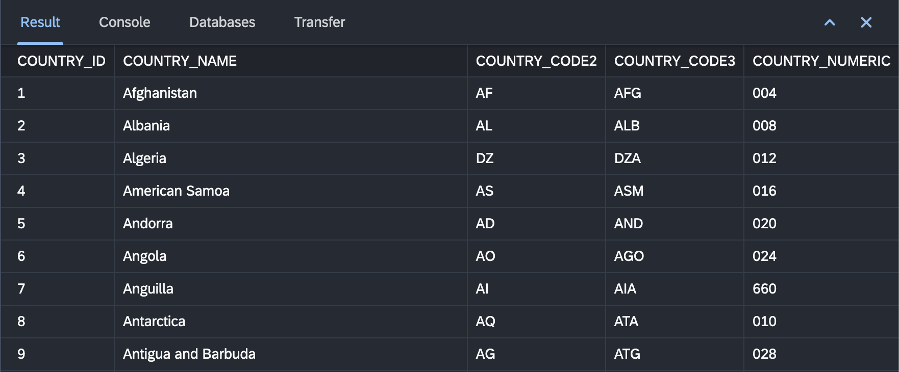

# Result View

The "Result View" in the Databases perspective is a crucial component that provides a detailed presentation of the output generated by SQL queries executed in the SQL Console. This section provides an overview of the key features and actions available in the "Result View."

{ style="width:700px"}

## Viewing SQL Query Results

1. **Access Result View:**
   - Execute SQL queries in the SQL Console, and the results are automatically displayed in the Result View.

2. **View Result Set:**
   - The Result View presents the result set of your SQL query in a tabular format. Columns and rows provide a structured representation of the data.

3. **Interactive Grid:**
   - Interact with the result set grid to sort, filter, and navigate through the data. Click on column headers to sort, use the filter option to narrow down results, and scroll through rows.

4. **Data Export Options:**
   - Export the result set to various formats, including CSV and Excel, using the export options available in the Result View.

## Result View Actions

### 1. **Refresh Result Set:**
   - Use the "Refresh" button to re-run the last executed query and update the Result View with the latest data.

### 2. **Copy Data to Clipboard:**
   - Copy selected cells, rows, or columns to the clipboard for easy data transfer.

### 3. **Export Data:**
   - Export the entire result set or selected data to various file formats, facilitating data sharing and analysis.

### 4. **Adjust Result View Preferences:**
   - Configure Result View preferences, such as the number of rows to display, to tailor the display according to your preferences.

## Conclusion

The "Result View" in the Databases perspective provides a rich and interactive environment for viewing and manipulating SQL query results. Leverage its features to analyze data, perform data anonymization, and export data for further analysis.
