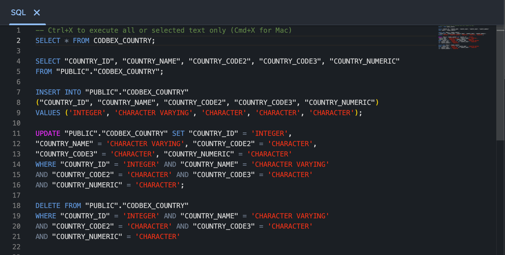

# SQL Console

The "SQL Console" in the Databases perspective provides a versatile environment for executing SQL queries and interacting with your relational and NoSQL databases. This section provides an overview of the key features and actions available in the "SQL Console."

{ style="width:700px"}

## Executing SQL Queries

1. **Open the SQL Console:**
   - Navigate to the Databases perspective and select "SQL Console" view.

2. **Execute SQL Queries:**
   - Enter your SQL queries in the console editor and execute them by clicking the "Run" button or using the keyboard shortcut `Ctrl+X`. View the results in the "Result" output.

3. **Explore Query History:**
   - The SQL Console maintains a history of executed queries. Access the query history to review and re-run previous queries.

## Conclusion

The "SQL Console" in the Databases perspective provides a flexible and efficient way to execute SQL queries and explore query history. Utilize its features to streamline database interactions and enhance your SQL development workflow.
