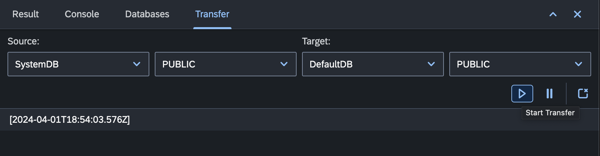

# Data Transfer

The "Transfer View" in the __codbex__ platform is a powerful tool that enables online synchronous data transfer between two datasource schemas. This section provides an overview of the key features and actions available in the "Transfer View."

{ style="width:700px"}

## Initiating Data Transfer

1. **Open the Transfer View:**
   - Navigate to the Databases perspective and select "Transfer" view.

2. **Select Source and Target Datasources:**
   - Choose the source and target datasources for the transfer. Specify the schema details for both the source and target databases.

3. **Preview Data Transfer:**
   - Before executing the transfer, use the preview option to see a sample of the data that will be transferred.

4. **Initiate Transfer:**
   - Click the "Transfer" button to start the online synchronous data transfer process.

## Monitoring Transfer Progress

1. **Real-time Logs:**
   - The Transfer View provides real-time logs that display the progress of the data transfer. Monitor the logs to track the status of each record transferred.

2. **Detailed Transfer Report:**
   - After the transfer is complete, view a detailed report summarizing the success or failure of the data transfer, including any error messages.

3. **Pause and Resume Transfer:**
   - Pause and resume the transfer process if needed. This allows you to manage large data transfers efficiently.

## Conclusion

The "Transfer View" in the platform streamlines the process of online synchronous data transfer between two datasource schemas. Utilize its features to configure, monitor, and manage data transfers efficiently, with real-time logs providing insights into the transfer progress.
