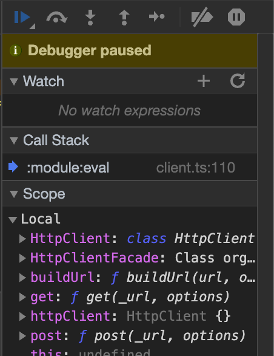

# Debugger

The "Debugger" perspective in the __codbex__ provides a seamless integration with the Chrome DevTools, enabling developers to debug and analyze JavaScript and TypeScript applications running on the __codbex__ runtime. This section covers key features and actions available in the Debugger Perspective.

## Getting Started

1. **Open the Debugger Perspective:**
   - Navigate to the Debugger perspective. This perspective is designed to facilitate efficient debugging and analysis of server-side JavaScript and TypeScript code.

2. **Connect to the Runtime:**
   - Connect the debugger to the runtime by selecting a server-side JavaScript or TypeScript file in the Projects view.

## Features

### 1. **Source Code Inspection:**
   - Explore and inspect the source code of your JavaScript and TypeScript applications. View the hierarchy of files and navigate through the codebase effortlessly.

### 2. **Breakpoints:**
   - Set breakpoints in your code to pause execution at specific lines. This allows you to inspect variables, step through code, and identify issues in your application logic.

### 3. **Step Through Code:**
   - Use the step-through functionality to execute code line by line. This is invaluable for understanding the flow of your application and identifying the cause of issues.

{ style="width:300px"}

### 4. **Variable Inspection:**
   - Inspect the values of variables at different points in your code. The Debugger Perspective provides a comprehensive view of variable values, making it easier to troubleshoot.

{ style="width:500px"}

### 5. **Console Integration:**
   - The integrated console allows you to execute JavaScript code directly in the context of your application. This can be useful for quick testing and exploration.

{ style="width:500px"}

### 6. **Memory Profiling:**
   - Utilize memory profiling tools to identify memory leaks and optimize memory usage in your applications. This feature is crucial for improving the overall performance of your code.

## Advanced Debugging

1. **Remote Debugging:**
   - Extend the debugging capabilities to remote instances of the __codbex__ runtime. This is particularly useful for debugging applications deployed on different servers.

2. **Breakpoint Conditions:**
   - Set conditions for breakpoints to control when the debugger should pause execution. This allows for more fine-grained control over the debugging process.

3. **Async Function Debugging:**
   - Debug asynchronous functions and promises efficiently. The Debugger Perspective supports advanced debugging features for applications that heavily rely on asynchronous programming.

## Conclusion

The "Debugger" perspective in the __codbex__ platform, based on Chrome DevTools integration, provides a robust environment for debugging and analyzing server-side JavaScript and TypeScript applications. Leverage its features to identify and resolve issues in your code, ensuring the reliability and performance of your applications.
