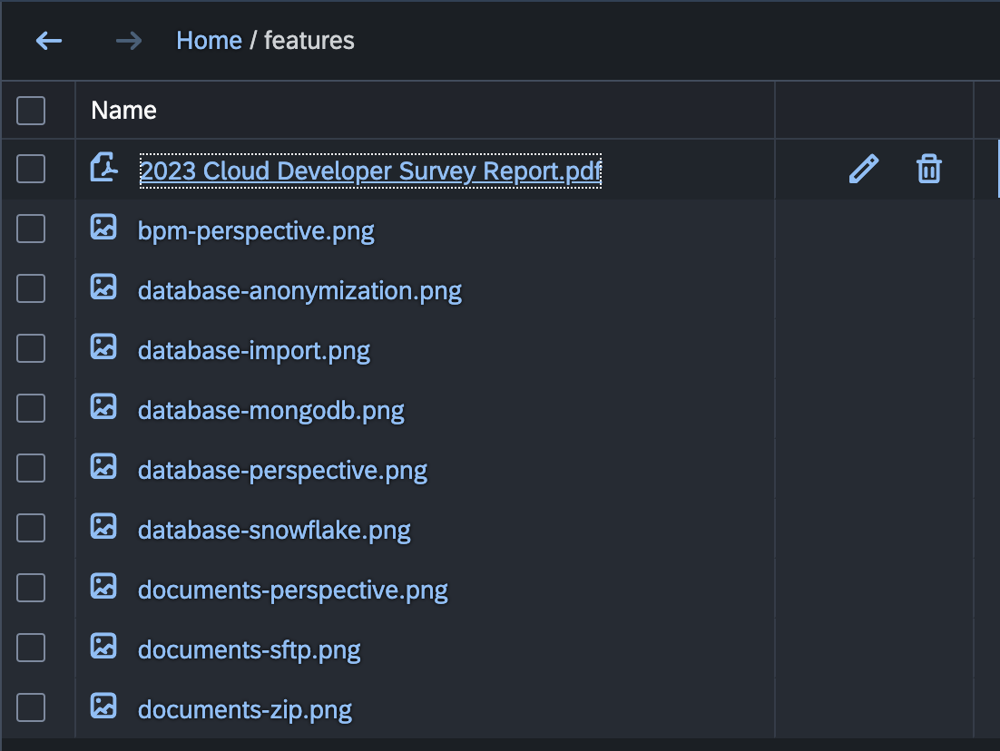

# Documents Explorer

The "Documents" hierarchical repository structure view provides a visual representation of the hierarchical structure of content within a Content Management System (CMS) repository. This view is designed to facilitate efficient navigation, exploration, and organization of content stored in the CMS.

## Accessing the Documents Explorer

1. **Navigate to the Documents Perspective:**
   - Access the Documents perspective in the platform.

2. **Open the Documents Explorer:**
   - Within the Documents perspective, locate the "Documents Explorer" repository structure view on the left side. This view displays the hierarchical arrangement of content within the connected CMS repository.

{ style="width:600px"}

## Features

### 1. **Hierarchical Representation:**
   - The Documents repository structure view presents a hierarchical view of the content stored in the connected CMS repository. This structure reflects the organization of folders, subfolders, and documents.

### 2. **Navigation and Exploration:**
   - Navigate through the CMS repository structure effortlessly. Explore folders and subfolders to quickly locate and access specific content.

### 3. **Visual Clarity:**
   - Enjoy a visually clear representation of the repository structure, making it easy to understand the relationships between different folders and documents.

### 4. **Contextual Actions:**
   - Perform contextual actions directly from the CMS repository structure view. Access options such as opening, editing, deleting, and moving content within the hierarchy.

### 5. **Drag-and-Drop Interaction:**
   - Organize content intuitively by leveraging drag-and-drop functionality. Rearrange folders and documents within the hierarchy with ease.

### 6. **Expand and Collapse Nodes:**
   - Expand or collapse nodes within the hierarchical structure to focus on specific areas of interest. This feature enhances navigation efficiency, especially in repositories with complex structures.

## Advanced Functionality

1. **CMS-Specific Features:**
   - Depending on the CMS integration in use (e.g., CMIS-compliant repositories), access CMS-specific features directly from the CMS Repository Structure View. This may include versioning, metadata editing, and more.

2. **Search and Filtering:**
   - Utilize search and filtering options within the Documents Explorer to quickly locate specific content based on criteria such as file names, document types, or metadata.

## Conclusion

The "Documents Explorer" hierarchical repository structure view in the __codbex__ platform enhances your content management experience by providing a clear and intuitive representation of the hierarchical structure of a CMS repository. Navigate through folders, explore documents, and perform actions directly from this view to streamline your content management workflows.
