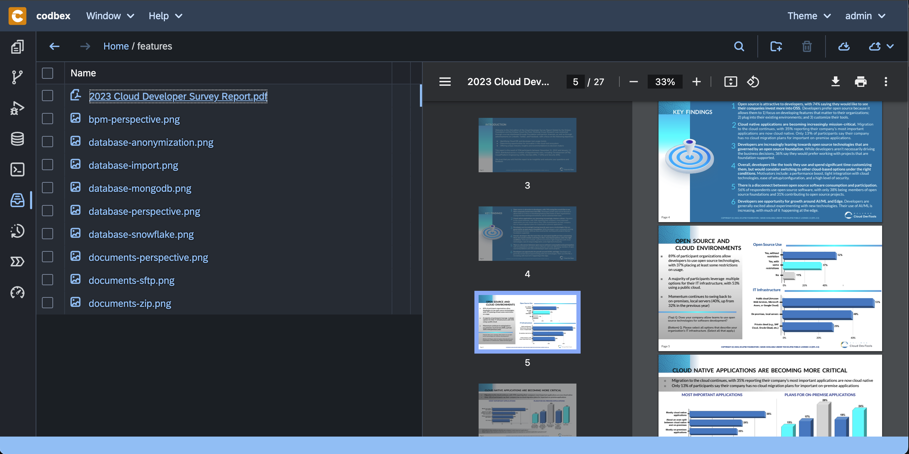
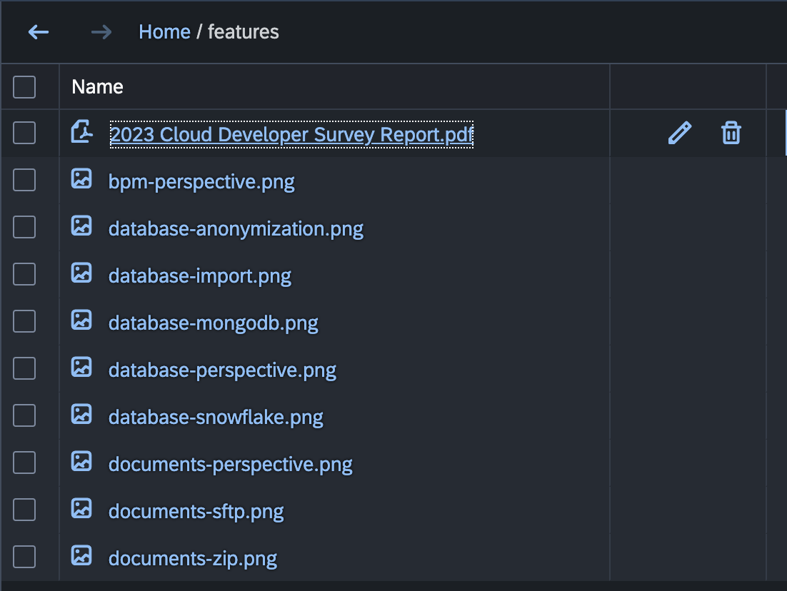
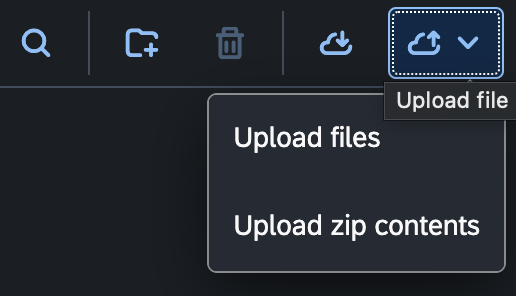
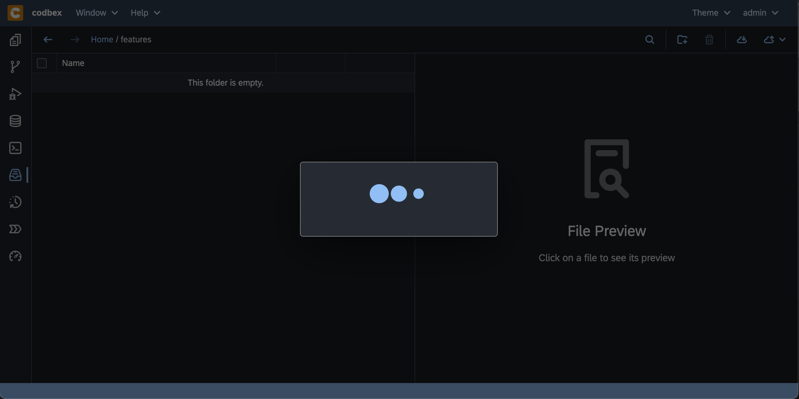

# Documents

The "Documents" perspective in the __codbex__ platform is a dedicated workspace for managing and organizing various types of files and documents related to your projects. This section provides an overview of key features and actions available in the Documents perspective, including support for the CMIS specification for CMS document repositories.

## Overview

1. **Accessing Documents Perspective:**
   - Navigate to the Documents perspective. This perspective serves as a central hub for managing documents, templates, and other project-related assets.

2. **Navigation:**
   - The Documents perspective provides an organized view of your documents structure. Navigate through folders, and files effortlessly.

## 1. [Documents Explorer](explorer.md):

Explore the hierarchical arrangement of content within the connected CMS repository.

{ style="width:400px"}

## 2. [Document Preview](preview.md):

Displays a preview of the content of the selected document.

{ style="width:400px"}

## Features

### 1. **File Management:**
   - Create, edit, and organize files within your project. The Documents perspective supports various file types, including templates, and text documents.

### 2. **Documents Explorer:**
   - Explore the structure of your project using the Documents Explorer. View and manage files and folders conveniently.

### 4. **Templates:**
   - Access and manage project templates. This feature enhances code reusability and accelerates development.

### 7. **Search and Filtering:**
   - Utilize search and filtering options to quickly locate specific files or content within your repository.

## Advanced Document Management

1. **Document Collaboration:**
   - Collaborate with team members by sharing and managing project documents. Support for concurrent editing enhances team productivity.

2. **Project Templates:**
   - Define and utilize project templates to enforce consistent project structures and configurations.

3. **Document Properties:**
   - Access and manage properties associated with documents. Set metadata, such as authorship, creation date, and modification history.

## CMIS Specification Support for CMS Document Repositories

1. **CMIS Integration:**
   - The platform supports the CMIS (Content Management Interoperability Services) specification for seamless integration with CMS document repositories.

2. **Connect to CMIS Repositories:**
   - Establish connections to CMS document repositories using the CMIS protocol. This enables direct access to and management of documents stored in compatible content management systems.

3. **Retrieve and Manipulate Documents:**
   - Retrieve documents from CMIS repositories, view metadata, and perform actions such as create, update, and delete directly from the Documents Perspective.

4. **Versioning and Collaboration:**
   - Leverage CMIS versioning capabilities for document management. Collaborate with team members using standard CMIS features for enhanced content collaboration.

## File Upload and Unpacking

1. **Upload Single Files:**
   - Easily upload individual files directly to your project in the Documents perspective. Use the intuitive interface to select files and initiate the upload process.

{ style="width:300px"}

2. **Upload ZIP Files:**
   - For convenience, upload ZIP files containing multiple documents or an entire project structure. The ZIP upload feature simplifies the process of transferring multiple files at once.

3. **Unpack ZIP Files:**
   - Opt to unpack ZIP files upon upload. This feature automatically extracts the contents of the ZIP file, maintaining the folder structure within your project.

{ style="width:400px"}

4. **Efficient Organization:**
   - Streamline your document organization workflow by utilizing the upload and unpack features. This is particularly beneficial when transferring entire projects or when dealing with complex folder structures.

## Conclusion

The "Documents" perspective in the __codbex__ platform provides a comprehensive environment for managing project documents, and templates. Navigate through your repository, edit files, and streamline collaboration with team members. With support for the CMIS specification, the platform extends its capabilities to seamlessly integrate with CMS document repositories.
