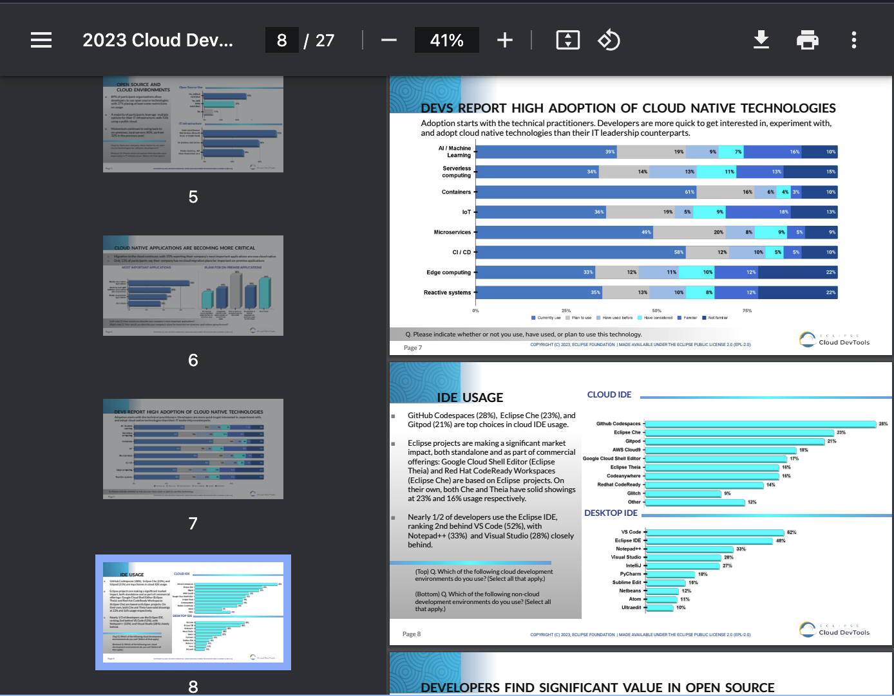

# Document Preview

The "Document Preview" view in the platform provides a convenient way to preview the content of documents directly within the integrated development environment. This view enhances your document management experience by allowing you to quickly inspect the contents of various file types without opening external applications.

## Accessing the Document Preview View

1. **Navigate to the Documents Perspective:**
   - Access the Documents perspective in the __codbex__ platform.

2. **Open the Document Preview View:**
   - Within the Documents perspective, locate the "Document Preview" view on the right side. This view displays a preview of the content of the selected document.

{ style="width:400px"}

## Features

### 1. **Content Preview:**
   - The Document Preview view offers a preview of the content within the selected document. This is particularly useful for quickly reviewing the contents of text-based files, such as source code, scripts, or markdown documents.

### 2. **Rich Text and Markup Support:**
   - Enjoy support for rich text and markup languages. The Document Preview View renders formatted text, allowing you to view the document's structure and styling.

### 3. **Multi-Format Support:**
   - Preview various file formats, including but not limited to text files, source code files, markdown documents, and other text-based formats. The view dynamically adjusts to the content type.

### 4. **Interactive Preview:**
   - Interact with the previewed content by scrolling, zooming, and navigating through the document. This provides a comprehensive view of the entire document.

### 5. **Code Syntax Highlighting:**
   - For source code files, benefit from syntax highlighting in the preview. This enhances code readability and makes it easier to identify language-specific elements.

## Advanced Functionality

1. **Document Metadata Display:**
   - Access metadata information associated with the document directly from the Document Preview view. This may include details such as authorship, creation date, and modification history.

2. **Integration with CMS Features:**
   - Depending on the CMS integration in use (e.g., CMIS-compliant repositories), the Document Preview view may offer integration with CMS-specific features. This could include versioning, metadata editing, and more.

3. **Quick Navigation to Editor:**
   - Conveniently transition from the Document Preview view to the document's editor for advanced editing and modification. This seamless integration streamlines your workflow.

## Conclusion

The "Document Preview" view the __codbex__ platform enhances your document management experience by providing a quick and interactive preview of document content. Whether reviewing source code, reading text documents, or inspecting markdown files, this view offers a convenient way to explore document contents directly within the IDE.
