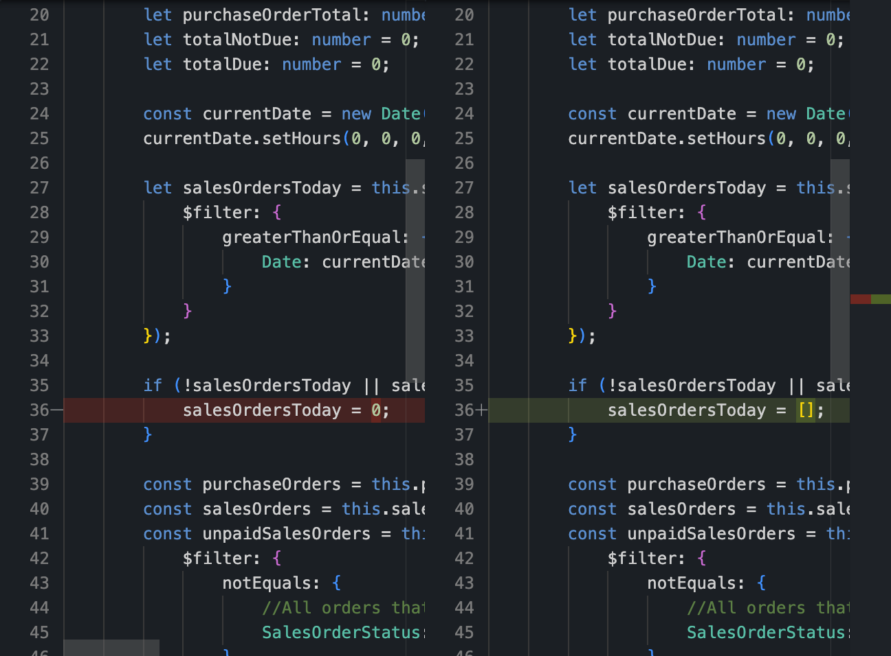

# Diff Editor

The "Diff Editor" in the Git perspective provides a powerful and intuitive interface for visualizing and comparing changes between different versions of your files. This section provides an overview of the key features and actions available in the "Diff Editor".

{ style="width:700px"}

## Navigating the Diff Editor

1. **Open the Diff Editor:**
   - To open the Diff Editor, navigate to the Git perspective, select a file in the "Staging" views, and choose "Show Differences".

2. **Visualize Changes:**
   - The Diff Editor displays a side-by-side or inline comparison of the selected file, highlighting added, modified, and deleted lines.

3. **Inline Comments:**
   - Add comments directly in the Diff Editor to provide feedback or discuss changes with collaborators.

4. **Navigate Between Changes:**
   - Use navigation buttons to move between different changes and focus on specific modifications in the file.

5. **Toggle Changes Highlighting:**
   - Toggle highlighting of changes to quickly identify modifications in the code.

## Actions in the Diff Editor

### 1. **Save Changes:**
   - Save changes made in the Diff Editor by clicking the "Save" button.

### 2. **Revert Changes:**
   - Revert changes to the original state by clicking the "Revert" button.

### 3. **Open in External Compare Tool:**
   - Open the file in an external compare tool for a more detailed and customized comparison.

### 4. **Close Diff Editor:**
   - Close the Diff Editor when you've finished reviewing or making changes by clicking the "Close" button.

### 5. **Switch Between Files:**
   - If comparing multiple files, switch between them using the file dropdown menu in the Diff Editor toolbar.

## Conclusion

The "Diff Editor" in the Git perspective provides a comprehensive and user-friendly way to visualize and analyze changes in your codebase. Whether reviewing modifications between revisions or branches, the Diff Editor enhances your understanding of the code evolution.
