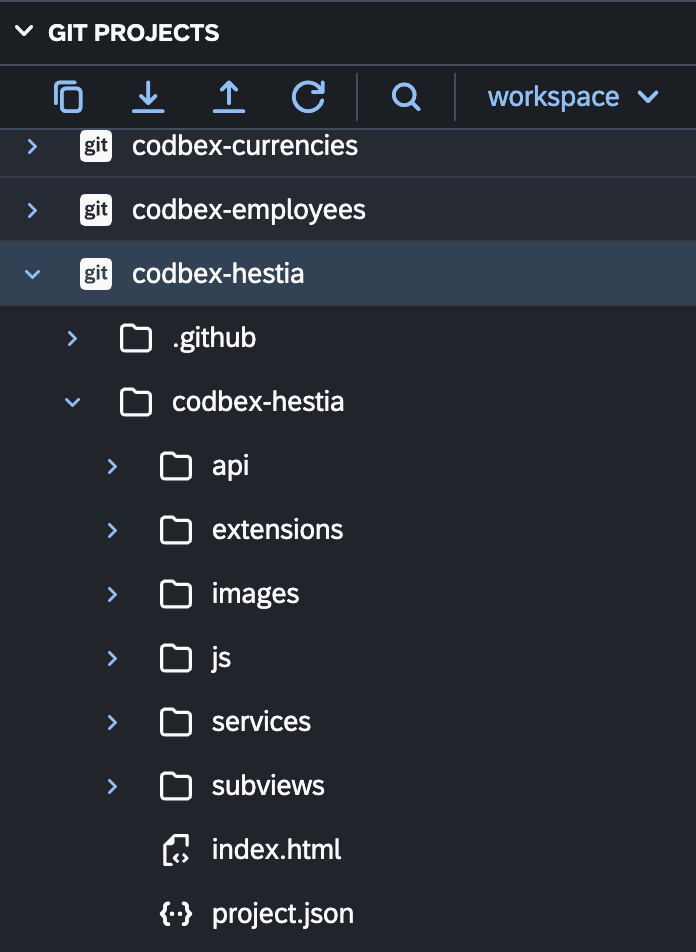

# Git Projects

The "Git Projects" view in the Git perspective provides a centralized interface for managing Git repositories. This view allows you to perform essential Git operations such as cloning, pulling, pushing, and sharing projects. Below is an overview of key features and actions available in the "Git Projects" view.

{ style="width:400px"}

## Cloning a Git Repository

1. **Open the Git Projects View:**
   - To open the Git Projects view, switch to the Git perspective by selecting it from the perspective switcher.

2. **Click on "Clone a Git Repository":**
   - In the Git Projects view, click on the "Clone a Git Repository" button in the toolbar.

3. **Enter Repository URL:**
   - Provide the URL of the Git repository you want to clone.

4. **Configure Clone Options:**
   - Configure additional cloning options such as credentials and branch.

5. **Click "Clone":**
   - Click the "Clone" button to initiate the cloning process.

## Pulling Changes from a Remote Repository

1. **Select the Project:**
   - In the Git Projects view, select the project for which you want to pull changes.

2. **Click on "Pull":**
   - Click the "Pull" button in the toolbar to fetch and merge changes from the remote repository.

3. **Choose Pull Options:**
   - Choose pull options such as the remote branch and merge strategy.

4. **Click "Finish":**
   - Click the "Finish" button to complete the pull operation.

## Pushing Changes to a Remote Repository

1. **Select the Project:**
   - In the Git Projects view, select the project for which you want to push changes.

2. **Click on "Push":**
   - Click the "Push" button in the toolbar to push local changes to the remote repository.

3. **Configure Push Options:**
   - Configure push options such as the remote branch.

4. **Click "Finish":**
   - Click the "Finish" button to complete the push operation.

## Sharing a Project as a Git Repository

1. **Select the Project:**
   - In the Git Projects view, select the project you want to share as a Git repository.

2. **Click on "Share":**
   - Click the "Share" button in the toolbar.

3. **Choose Git:**
   - Choose "Git" as the repository type and click "Next".

4. **Configure Repository:**
   - Configure the repository details and click "Finish" to share the project as a Git repository.

## Additional Actions

- **Refresh:** Use the "Refresh" button to refresh the Git Projects view and see the latest repository status.

- **Repository Properties:** View additional Git repository structure and properties.

Explore the "Git Projects" view to seamlessly manage your Git repositories within the __codbex__ environment.
