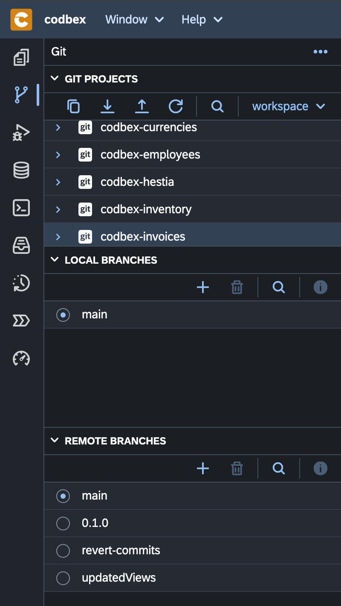
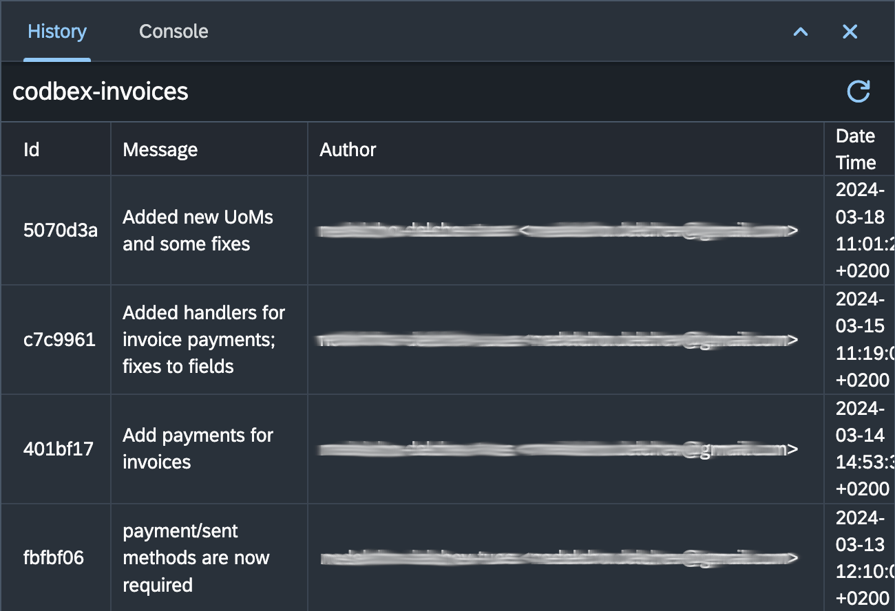

# Git

Welcome to the Git perspective in the __codbex__ platform, your dedicated workspace for efficient version control and collaboration. This index provides an overview of key views and functionalities available in the Git perspective.

## 1. [Git Projects](git-projects.md)

The "Git Projects" view is your gateway to managing Git repositories. Clone, create, and explore repositories, view branches, tags, and remotes, and perform various Git operations.

## 2. [Local Branches](local-branches.md)

The "Local Branches" view allows you to manage and interact with local branches in your Git projects. Create, switch, rename, and delete local branches, and compare changes between branches.

{ style="width:300px"}

## 3. [Remote Branches](remote-branches.md)

The "Remote Branches" view centralizes the management of remote branches in your Git projects. Fetch updates from remotes, create local branches based on remotes, and compare changes with remote branches.

## 4. [History](history.md)

The "History" view provides a chronological list of commits made in your Git repository. Analyze commit details, compare changes, and navigate through the evolution of your codebase.

{ style="width:500px"}

## 6. [Staging](staging.md)

The "Staging" view streamlines the process of staging and committing changes. Stage, unstage, and discard changes, view diffs, and commit changes with ease.

{ style="width:300px"}

## 7. [Diff Editor](diff-editor.md)

The "Diff Editor" in the Git perspective provides a comprehensive and user-friendly way to visualize and analyze changes in your codebase. 

Explore these views and functionalities to enhance your Git workflow in the platform.

{ style="width:700px"}

