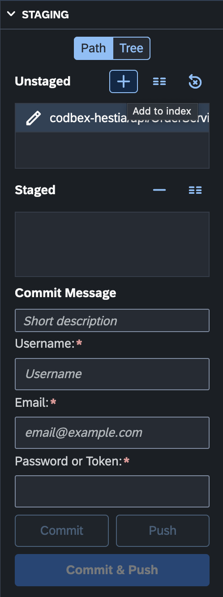

# Git Staging

The "Staging" view in the Git perspective provides a centralized location to stage and commit changes to your Git repository. This section provides an overview of the key features and actions available in the "Staging" view.

{ style="width:300px"}

## Staging Changes

1. **Open the Git Staging View:**
   - To open the Git Staging view, navigate to the Git perspective and select "Staging" tab.

2. **View Unstaged and Staged Changes:**
   - The Git Staging view displays a list of changes in your working directory categorized as "Unstaged Changes" and "Staged Changes".

3. **Stage Changes:**
   - Stage specific changes for commit by selecting them and clicking the "Add to Index" button.

4. **Unstage Changes:**
   - Unstage changes that were previously staged by selecting them and clicking the "Remove from Index" button.

5. **View Diffs:**
   - View the differences between the working directory, staged changes, and the last commit by selecting files and clicking the "Show Difference" button.

## Actions in the Git Staging View

### 1. **Refresh Staging Area:**
   - Use the "Refresh" button in the Git Staging toolbar to update the list of changes and their staging status.

### 2. **Commit Staged Changes:**
   - Commit the staged changes by entering a commit message and clicking the "Commit" button in the Git Staging toolbar.

### 3. **Push Committed Changes:**
   - Push the committed changes by clicking the "Push" button in the Git Staging toolbar.

### 4. **Commit and Push Staged Changes:**
   - Commit and Push the staged changes by entering a commit message and clicking the "Commit & Push" button in the Git Staging toolbar.

### 5. **Revert to Last Commit:**
   - Use the "Revert to Last Commit" button in the Git Staging toolbar to revert to the state of the last commit.

## Conclusion

The "Staging" view in the Git perspective provides a streamlined workflow for staging and committing changes to your Git repository. Familiarize yourself with the available actions and staging features to efficiently manage your version control.
