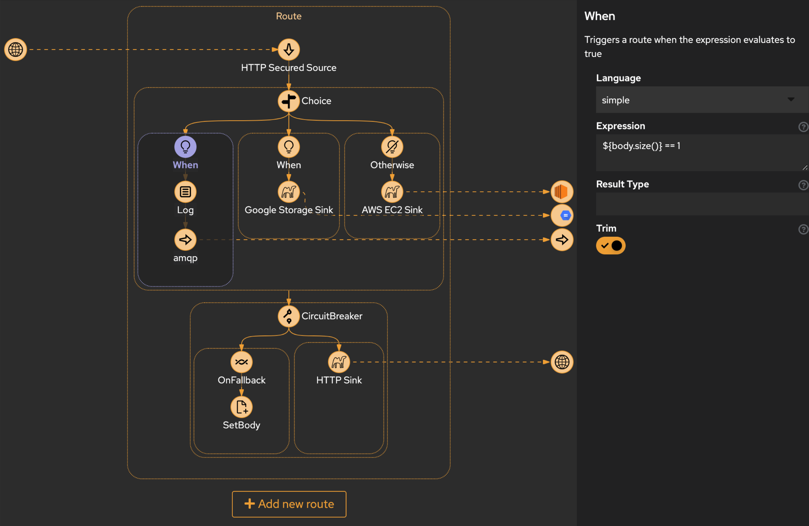

# Integrations

## Overview

The Integrations Editor in the platform, powered by Apache Karavan, provides a visual environment for modeling integration flows. This powerful tool enables developers to design, configure, and manage integration processes seamlessly. The underlying Apache Camel-based Integration Engine processes the defined flows, facilitating the creation of robust and scalable integration solutions.

## Key Features

### 1. **Visual Modeling**

   - The editor offers a visual modeling interface, allowing developers to design integration flows using a drag-and-drop approach. This visual representation enhances understanding and collaboration among team members. Routes Modeller tool allows users to design, configure, and deploy ETL (Extract, Transform, Load) routes using a visual interface. The Routes Modeller enables users to define data integration workflows, specify data sources and destinations, and configure data transformation and routing rules. Users can visually map data fields, apply business logic, and define error handling strategies within their ETL routes.

### 2. **Apache Camel Integration Engine**

   - Integration flows modeled in the editor are processed by the built-in Apache Camel Integration Engine. Apache Camel provides a powerful and extensible framework for implementing Enterprise Integration Patterns (EIP), ensuring reliable and efficient integration execution. The integration engine supports a wide range of integration patterns, protocols, and data formats, enabling seamless communication and data exchange between disparate systems, applications, and services. Users can leverage Camel's extensive library of components and connectors to integrate with various data sources, APIs, databases, and cloud services.

### 3. **Component Palette**

   - A rich component palette is available, featuring a variety of pre-built connectors, processors, and endpoints. These components simplify the integration process by providing ready-made building blocks for common integration tasks. These connectors cover a wide range of technologies and platforms, including databases (SQL, NoSQL), enterprise applications (ERP, CRM), cloud services (AWS, Azure, Google Cloud), messaging systems (MQ, Kafka), file formats (CSV, XML), and web services (REST, SOAP). Users can easily configure and deploy these connectors to streamline data integration and migration tasks.

### 4. **Data Transformation and Enrichment**

   - The editor supports data transformation and enrichment through the use of Camel's Data Format and Content Enricher components. Developers can define how data is transformed and enriched as it flows through the integration process.

### 5. **Error Handling**

   - Robust error handling capabilities are integrated into the editor. Developers can define error handling strategies, such as redelivery policies and error queues, to ensure the reliability of integration processes.

### 6. **Integration Testing**

   - The Integrations Editor facilitates integration testing by providing tools to simulate and test integration flows within the development environment. This ensures that integration processes behave as expected before deployment.

### 7. **Comprehensive Admin User Interface**
   
   - The platform provides a comprehensive administrative user interface for managing ETL routes, connectors, data transformations, and integration workflows. The admin interface offers intuitive tools for configuring route parameters, monitoring route performance, troubleshooting integration issues, and managing data flows. Administrators can monitor data throughput, latency, and error rates, and take proactive actions to optimize ETL processes and ensure data quality and integrity.

## Workflow

1. **Flow Design:**
   - Developers use the visual modeling interface to design integration flows, dragging and dropping components from the palette onto the canvas.

2. **Configuration:**
   - Each component in the flow is configured through a user-friendly interface. Developers set parameters, define data transformation rules, and specify endpoint details.

3. **Apache Camel Processing:**
   - Once the integration flow is defined, it is processed by the Apache Camel Integration Engine. Camel executes the flow according to the specified configuration.

4. **Monitoring and Debugging:**
   - The editor provides tools for monitoring and debugging integration flows. Developers can inspect message exchanges, view log outputs, and identify issues in real-time.

## Benefits

- **Accelerated Development:**
  - The visual modeling approach accelerates development by simplifying the creation of complex integration flows.

- **Reuse of Components:**
  - The component palette promotes the reuse of pre-built connectors and processors, reducing development effort and ensuring consistency.

- **Scalability:**
  - Apache Camel's inherent scalability ensures that integration processes can handle varying workloads and scale horizontally.

- **Reliability:**
  - Robust error handling features enhance the reliability of integration processes, ensuring smooth operation in production environments.

- **Extensibility:**
  - Developers can extend the functionality of integration flows by leveraging the wide range of Camel components and incorporating custom components as needed.

## Conclusion

The Integrations Editor based on Apache Karavan is a powerful tool for designing and managing integration flows within the platform. By leveraging the capabilities of the Apache Camel Integration Engine, developers can create scalable, reliable, and extensible integration solutions seamlessly.
