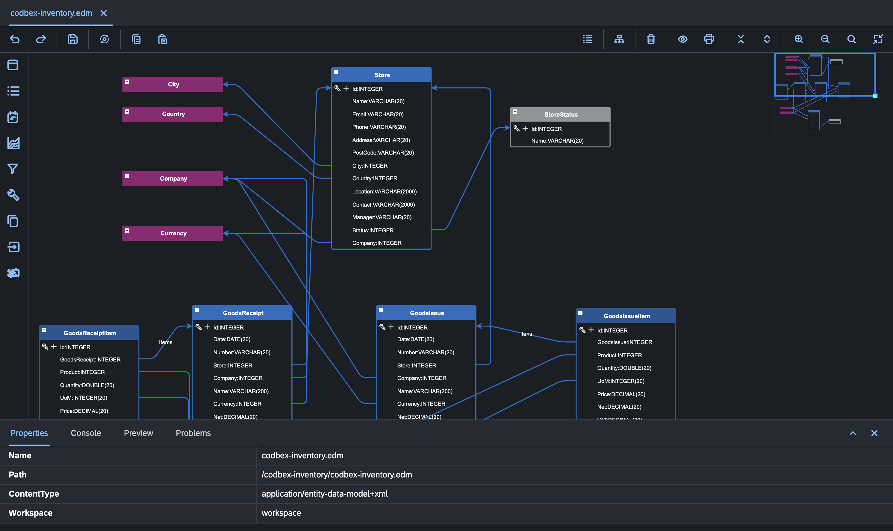

# Entity Data Modeler (EDM)

## Overview
The Entity Data Modeler (EDM) is a component within the MDA framework that focuses on designing the data model of an application. It allows developers to graphically create, visualize, and modify domain objects (entities) and their relationships.

## Key Features

1. **Graphical Modeling:**
   - EDM provides a visual environment for creating domain objects and defining their attributes. Developers can design the data model by dragging and dropping entities, specifying properties, and establishing relationships.

2. **Properties for Various Aspects:**
   - Developers can assign properties to entities for different purposes, such as defining database-related settings (e.g., table names, constraints), user interface attributes, security configurations, and other relevant metadata.

3. **Relationships and Dependencies:**
   - EDM allows users to model relationships between entities, specifying associations, cardinalities, and dependencies. This ensures a clear representation of how different parts of the system are connected.

4. **Code Generation Templates:**
   - Predefined templates and rules for code generation are associated with the EDM. These templates guide the transformation process, automatically generating code based on the graphical models created by developers.

5. **Consistency and Maintainability:**
   - By centralizing the data model in a visual environment, EDM promotes consistency and maintainability. Changes made to the model are reflected in the generated code, reducing the chances of inconsistencies.

6. **Template Customization:**
   - Advanced users can customize code generation templates to tailor the generated code to specific project requirements. This flexibility allows developers to adapt the generated artifacts to the unique needs of their applications.
