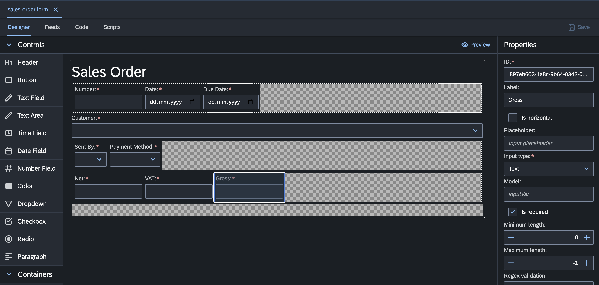

# Modeling

## Model-Driven Architecture (MDA) and Model-Driven Development (MDD)

### Definition
Model-Driven Architecture (MDA) is a software design and development approach that focuses on creating and utilizing models to represent different aspects of a system. It is an initiative by the Object Management Group (OMG) to promote a standardized way of developing software systems using models as primary artifacts.

### Key Features

* **[Entity Data Modeler](edm.md)**: __codbex__ provides a powerful Entity Data Modeler tool that allows users to visually design data models for their applications. Users can define entities, attributes, relationships, and constraints using an intuitive graphical interface. The Entity Data Modeler simplifies the process of designing and managing complex data structures, enabling developers to focus on higher-level application logic.

* **[Form Designer](form.md)** in the __codbex__ platform, users have access to a versatile and user-friendly solution for crafting input forms. This empowers them to effortlessly create visually captivating and functionally robust forms tailored to their applications. Whether they're developing straightforward data entry forms or intricate multi-step workflows, the Form Designer equips users with the necessary tools and functionalities to build engaging and intuitive interfaces suitable for various business scenarios.

* **Generation and Application Templates**: __codbex__ offers built-in generation capabilities and a library of application templates to accelerate development. Users can generate application code, including database schema, backend logic, and frontend components, based on predefined templates and configurations. This reduces the time and effort required to build new applications, ensuring consistency and quality across projects.

* **[Predefined Reference and Master Data Modules](../../modules/reference-data/)**: The __codbex__ platform includes a repository of predefined reference and master data modules that cover common business domains and industries. These modules contain standard data structures, rules, and workflows that can be easily integrated into applications. By leveraging these predefined modules, developers can expedite development and ensure compliance with industry standards and best practices.

* **[Application Building Blocks Modules](../../modules/)**: __codbex__ provides a library of reusable application building blocks, such as authentication, authorization, user management, and reporting modules. These building blocks encapsulate common functionality and business logic, allowing developers to quickly assemble custom applications from pre-existing components. This modular approach promotes code reuse, simplifies maintenance, and accelerates time-to-market for new applications.

### Key Concepts

1. **Platform-Independent Model (PIM):**
   - A PIM represents the system's functionality independently of any specific technology or platform. It is a high-level abstraction that captures the essential aspects of the system.

2. **Platform-Specific Model (PSM):**
   - A PSM represents the system's functionality in terms of a specific technology or platform. It serves as a bridge between the high-level abstraction of the PIM and the concrete implementation details.

3. **Transformation:**
   - Transformation processes are used to convert models from a higher abstraction level (PIM) to a lower one (PSM). This process involves applying rules and templates to generate code or artifacts for a particular platform.

4. **Code Generation:**
   - Automated code generation is a key aspect of MDA. It involves transforming models into executable code for a specific technology stack. This can significantly reduce the manual coding effort and improve consistency.

5. **Reusability:**
   - MDA encourages the reuse of models and transformations across projects, promoting consistency and efficiency in software development.

## Benefits

- **Efficiency:**
  - EDM accelerates the development process by providing a visual and centralized way to design the data model.

- **Consistency:**
  - Models and generated code remain consistent, reducing the likelihood of errors caused by manual changes.

- **Adaptability:**
  - Developers can adapt the generated code to meet specific project requirements while leveraging predefined templates.

- **Collaboration:**
  - Teams can collaborate more effectively by working with a common visual representation of the data model.

**In conclusion,** the Entity Data Modeler within the Model-Driven Architecture framework empowers developers to design robust data models visually and efficiently generate code based on those models. This approach enhances consistency, maintainability, and collaboration in software development projects.
