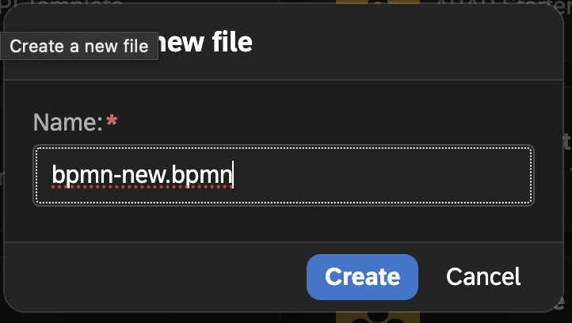

# BPMN Modeler

The BPMN Modeler in the __codbex__ platform is a powerful visual tool based on the Oryx Editor project, used for creating, editing, and visualizing BPMN (Business Process Model and Notation) diagrams. This modeler is seamlessly integrated into the platform, providing a collaborative environment for designing business processes.

## Features

### 1. **Intuitive Drag-and-Drop Interface:**
   - The BPMN Modeler offers an intuitive drag-and-drop interface, allowing users to easily add and arrange BPMN elements on the canvas. This simplicity enhances the modeling experience for both beginners and experienced users.

### 2. **Comprehensive BPMN Element Palette:**
   - Access a comprehensive palette of BPMN elements, including tasks, gateways, events, and connectors. The BPMN Modeler supports the full BPMN 2.0 specification, ensuring that users can accurately represent their business processes.

### 3. **Interactive Canvas:**
   - Interact with the BPMN diagram canvas to create and modify process flows. The interactive canvas supports zooming, panning, and alignment tools for precise control over the diagram layout.

### 4. **Real-time Collaboration:**
   - Leverage the real-time collaboration features of the BPMN Modeler. Multiple users can work on the same BPMN diagram simultaneously, enabling collaborative modeling sessions.

### 5. **Version Control Integration:**
   - Seamlessly integrate with version control systems to manage revisions and track changes to BPMN diagrams. This integration enhances traceability and supports collaborative development practices.

### 6. **Validation and Error Highlighting:**
   - Benefit from built-in validation checks that highlight errors or inconsistencies in the BPMN diagram. The BPMN Modeler provides instant feedback to users, ensuring that diagrams adhere to BPMN standards.

### 7. **Export and Import Functionality:**
   - Export BPMN diagrams in standard BPMN XML format for compatibility with other tools and platforms. Import existing BPMN files into the BPMN Modeler to continue modeling or analyzing processes.

### 8. **Integration with Platform Features:**
   - Seamlessly integrate the BPMN Modeler with other platform features. For example, transition from modeling to process deployment or view real-time process metrics directly within the platform.

## Advanced Functionality

1. **Execution Simulation:**
   - Simulate the execution of BPMN processes directly within the BPMN Modeler. This feature provides insights into process behavior and allows users to identify potential bottlenecks or issues.

2. **Flowable Integration:**
   - The BPMN Modeler is based on the Oryx Editor project and is compatible with the Flowable BPM platform. This ensures consistency and interoperability between the modeling tool and the execution runtime.

3. **Custom Extensions and Plugins:**
   - Extend the functionality of the BPMN Modeler by developing custom extensions or plugins. This extensibility allows organizations to tailor the modeling experience to their specific requirements.

## Getting Started

To start using the BPMN Modeler in the platform, follow these steps:

1. **Navigate to the BPMN Modeler:**
   - Access the BPMN Modeler within the platform. The modeler is available within the BPMN-related perspectives and views.

2. **Create or Open a BPMN Diagram:**
   - Create a new BPMN diagram or open an existing one. Use the intuitive interface to design and refine the process flow.

3. **Collaborate and Validate:**
   - Collaborate with team members in real-time and validate the BPMN diagram using built-in error checking features. Ensure that the diagram adheres to BPMN standards and best practices.

4. **Save and Deploy:**
   - Save the BPMN diagram in BPMN XML format and deploy it to the execution runtime, such as the Flowable BPM platform, for execution.

## Tips & Tricks
### How to create an empty BPM process
Follow these steps to create a new, empty process in your project:
- Right-click on a project or folder
- Select `New` -> `Business Process Model`
  
- Enter a name for the process file
- Click the `Create` button
  
- Double-click on the newly created file to open it
- The BPMN Modeler will launch
  
- By default, the process identifier is set to `myprocess`. You can edit this to match your naming conventions or project needs.
  
- You can now design your process visually using the drag-and-drop modeler interface.

Next step: [add a JavaScript task](#how-to-add-javascript-task-to-a-process) to embed logic into your process flow.

### How to add JavaScript task to a process
Once you’ve created an empty BPM process, you can add executable logic using a JavaScript/TypeScript task. This lets you trigger custom code as part of your process flow.

- Prerequisites:
   - A BPMN file in your project (you can use the one created in the [How to create an empty BPM process](#how-to-create-an-empty-bpm-process)).
   - To start clean, delete any default elements in the diagram so you can build from scratch.

1. Add a Start Event
   - In the `Start Events` panel, drag and drop a `Start event` onto the canvas.
     
2. Create a TypeScript File for the Task
   - Right-click on your project or a folder
   - Select `New` -> `File`
     
   - Set a file name, e.g., `mytask.ts`
     
   - Open the file and define your task logic inside
     You can use the [codbex SDK](/documentation/platform/sdk/) to implement your logic and [BPM API](/documentation/platform/sdk/bpm/) to interact with the process engine.
     
3. Add a Service Task
   - In the `Activities` panel, drag and drop a `Service task`
     
   - Set task properties:
      - `Id`, e.g., `my-task`
      - `Name`, e.g., `My Task`
        
     - `Delegate expression`: `${JSTask}`
       
     - Configure the JavaScript Handler
        - Click on the `Class fields` property
          
        - Click `Add` button
       - Add a field:
          - `Name`: `handler`
          - `String value`: the path to your file, e.g., `bpm-demo/mytask.ts`
            
         - Click the `Save` button
4. Connect the Flow
   - Draw a sequence flow from the Start event to the Service task
     
     
   - In the `End Events` panel, drag and drop an `End event`
     
   - Connect the `Service task` to the `End event` using another sequence flow
     
   - Save the model

Once the project is published, the process definition will be automatically deployed and ready for execution.
You can trigger it programmatically using the [Process API](/documentation/platform/sdk/bpm/process).

## Conclusion

The BPMN Modeler in the __codbex__ platform, based on the Oryx Editor project and integrated with Flowable, provides a robust and user-friendly environment for BPMN modeling. Whether designing new processes, collaborating with team members, or simulating process execution, this modeler streamlines the BPMN lifecycle within the platform.
