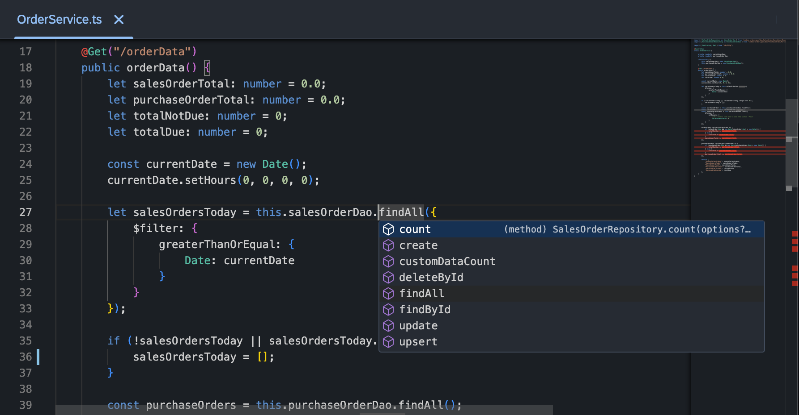

# Code Editor

The "Code Editor" in the "Workbench" is powered by the "Monaco" editor, which is the same editor used in "Visual Studio Code" (VSCode). This powerful and feature-rich editor provides a comfortable environment for writing, editing, and managing your code. This section provides an overview of the key features and actions available in the "Code Editor".

## Key Features

### 1. **Syntax Highlighting**

- The Code Editor provides syntax highlighting for various programming languages, making it easy to visually distinguish between different code elements.

### 2. **Code Completion**

- Enjoy intelligent code completion suggestions as you type, helping you write code more efficiently and accurately.

### 3. **Code Navigation**

- Navigate through your code effortlessly with features like Go to Definition, Find References, and more.

### 4. **Code Folding**

- Collapse and expand code sections to focus on specific parts of your code and improve readability.

### 5. **Code Formatting**

- Use automatic code formatting or format selected code to adhere to coding standards.

### 6. **Multiple Tabs**

- Open multiple files simultaneously with tabs, allowing you to switch between files seamlessly.

### 7. **Themes and Color Schemes**

- Customize the appearance of the Code Editor with various themes and color schemes.

## Actions in the Code Editor

### 1. **Save Changes**

- Save your code changes by clicking the "Save" button or using the keyboard shortcut ("Ctrl + S" or "Cmd + S").

### 2. **Undo and Redo**

- Undo or redo your actions with the "Undo" and "Redo" buttons or keyboard shortcuts ("Ctrl + Z" or "Cmd + Z", "Ctrl + Y" or "Cmd + Y").

### 3. **Find and Replace**

- Use the "Find" and "Replace" functionalities to search for specific text and replace it with ease.

### 4. **Toggle Word Wrap**

- Toggle word wrap to control how long lines of code are displayed in the editor.

### 5. **Zoom In and Out**

- Adjust the font size with the "Zoom In" and "Zoom Out" options for better readability.

### 6. **Toggle Sidebar**

- Toggle the visibility of the sidebar to show or hide file explorer and other navigation options.

### 7. **Toggle Full Screen**

- Make the "Code Editor" full screen for a distraction-free coding experience.

## Conclusion

The "Code Editor" in the Workbench, powered by the Monaco editor, provides a sophisticated and feature-rich environment for coding. Explore the various features and actions to enhance your coding productivity and efficiency.
