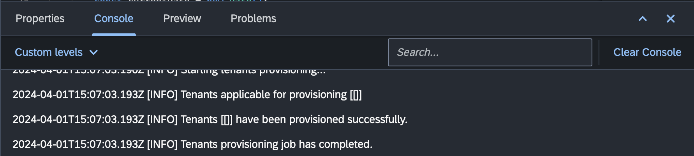

# Console

The "Console" view in the Workbench provides real-time feedback, logs, and outputs from various processes, enabling developers to monitor and troubleshoot their applications. This section provides an overview of the key features and actions available in the "Console" view.

{ style="width:700px"}

## Use Cases

- The "Console" displays the output of server-side scripts executed in the platform.

- View real-time logs, errors, and outputs generated by server-side script executions.

- The "Console" is used during the debugging of server-side scripts, providing insights into the execution flow, variables, and breakpoints.

- Examine debugging information, breakpoints status, and step through script executions.

- The "Console" displays information related to the build and compilation processes.

- Monitor build progress, errors, and other build-related information.

## Actions

### 1. **Clear Console**

- Use the "Clear Console" button in the "Console" toolbar to clear the contents of the currently active console.

- This action helps maintain a clean and focused console view.

### 2. **Search Console Output**

- Utilize the "Search" options to narrow down the console output based on specific keywords, log levels, or other criteria.

- The search input is available in the "Console" toolbar.

### 3. **Copy and Paste**

- Copy and paste content from the console view for sharing, documentation, or analysis.

- Right-click on the console output to access copy and paste options.

## Conclusion

The "Console" view in the "Workbench" is a valuable tool for developers to monitor, debug, and analyze various processes and script executions. Familiarize yourself with the different console types and utilize the available actions for an efficient development experience.

