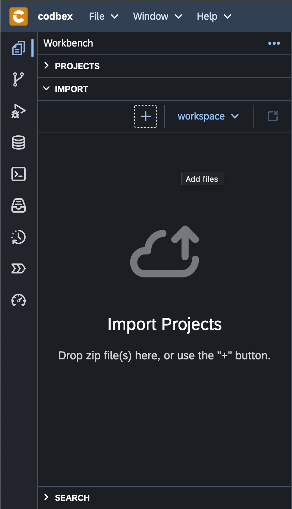

# Import

The "Import" feature in the "Workbench" allows you to bring external projects and artifacts into your development environment. This section provides a guide on how to use the "Import" functionality efficiently.

{ style="width:300px"}

## Importing a Project

To import an existing project into the Workbench, follow these steps:

1. Click on the "Import" tab in the "Workbench".

2. Drag&drop a project zip file the "Import" drop area.

3. Click "Add" to complete the import process.

## Importing Artifacts

You can also import specific artifacts into your project, such as tables, views, scripts, and more:

1. Click on the "Projects" tab in the Workbench.

2. Click the "Import" button on the toolbar.

3. Choose the type of artifact you want to import (e.g., Database Table, Script).

4. Follow the wizard to select the source and configure import options.

5. Click "Finish" to complete the import of the artifact.

## Configuring Import Options

During the import process, you may encounter configuration options specific to the type of import. These options allow you to customize how the import should be handled, such as project name, source location, and more.

## Conclusion

The "Import" feature in the "Workbench" simplifies the process of bringing external projects and artifacts into your development environment. Utilize the flexibility of import sources and options to seamlessly integrate external content with your projects.
