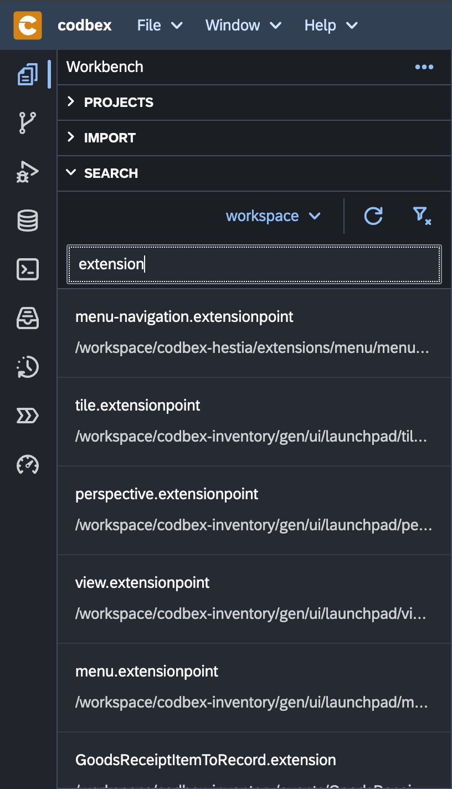

# Workbench

Welcome to the "Workbench", your central hub for developing and managing projects, artifacts, and processes. This index provides an overview of key views and functionalities available in the Workbench.

## 1. [Projects](projects.md)

The "Projects" area is where you manage your development projects. Create, import, and organize projects to structure your work efficiently.

{ style="width:300px"}

## 2. [Import](import.md)

The "Import" area allows you to bring external projects and artifacts into your development environment. Import local file systems, or other platform instances.

{ style="width:300px"}

## 3. [Search](search.md)

Efficiently locate projects and files within the Workbench using the "Search" feature. Search for specific content, projects, or artifacts with advanced filtering options.

{ style="width:300px"}

## 4. [Properties](properties.md)

Explore the properties of projects and artifacts using the "Properties" area. Customize settings such as project nature, dependencies, and validation rules.

{ style="width:500px"}

## 5. [Console](console.md)

The "Console" view provides real-time feedback, logs, and outputs from various processes, scripts, and debugging activities. Access scripting, debug, and build consoles for streamlined development.

{ style="width:700px"}

## 6. [Code Editor](code-editor.md)

Powered by the Monaco editor, the "Code Editor" provides a feature-rich environment for writing, editing, and managing your code. Enjoy syntax highlighting, code completion, and integrated terminal support.

## 7. [Preview](preview.md)

The "Preview" view allows you to preview and interact with various document types, including HTML, Markdown, and more. Toggle views, zoom in/out, and utilize other features for a comprehensive preview experience.

## 8. [Logs](logs.md)

The "Logs" view centralizes logs generated by scripts, system events, and debugging activities. Clear, filter, and analyze logs to streamline troubleshooting and monitoring.

## 9. [Loggers](loggers.md)

The "Loggers" view enables you to configure and manage logging levels for different components and modules. Add, remove, and reset loggers to control the logging behavior of your application.

Explore these views and functionalities to enhance your development experience.
