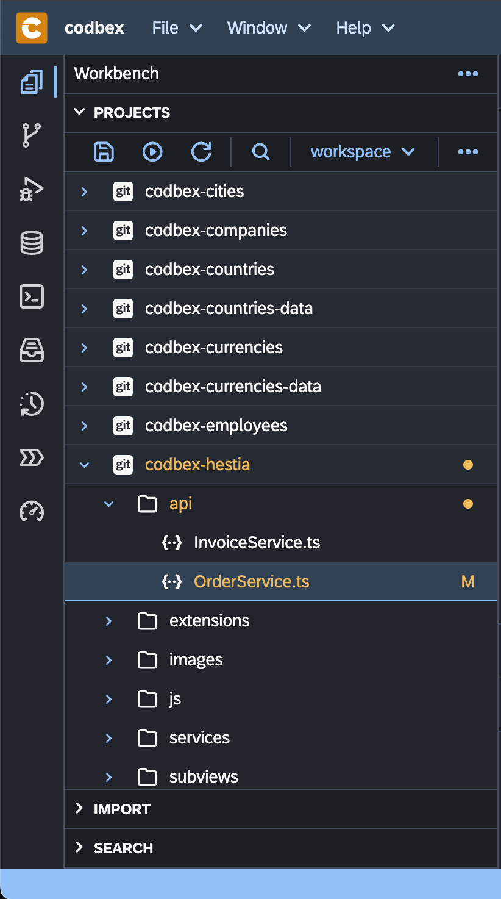
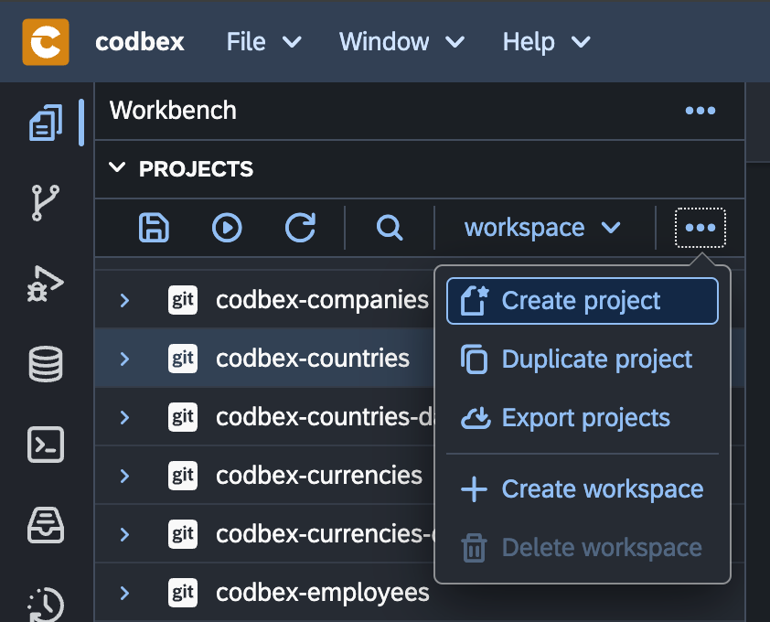
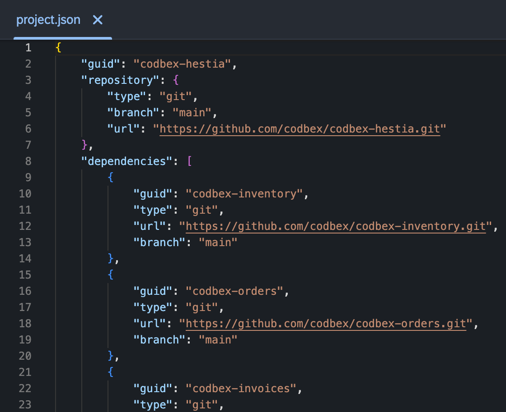

# Projects

The "Projects" area in the "Workbench" serves as a central hub for managing and organizing your development projects. This section provides an overview of the key features and actions available in the "Projects" area.

{ style="width:300px"}

## Create a New Project

To create a new project, follow these steps:

{ style="width:300px"}

1. Click on the "..." button or right-click in the "Projects" tab in the Workbench.

2. Click the "Create Project" button.

3. Enter a "name" for your project and choose a project template if applicable.

4. Click "Create" to initialize the new project.

## Project Structure

Once a project is created, it follows a standard structure:

- **"/project.json":** Optional artifact for custom actions and dependencies.

- **"/lib":** External libraries and dependencies (optional).

- **"/scripts":** Project-specific server-side scripts (optional).

- **"/web":** Web content and resources (optional).

## Manage Project Dependencies

You can manage project dependencies in the "Projects" area:

1. Double-click on the "project.json" file.

2. Open the file in the "Editor".

3. Navigate to the "dependencies" element.

4. Add or remove dependencies as needed.

{ style="width:500px"}

## Import and Export Projects

To import an existing project or export a project:

1. Right-click on the "Project" element from the tree.

2. Select "Import" or "Export" on the toolbar.

3. Follow the wizard to select projects or specify the export destination.

## Version Control Integration

The platform supports version control integration for projects. If your project is under version control (e.g., Git), you can inspect version control statuses directly from the "Projects" area.

## Conclusion

The "Projects" area in the "Workbench" provides a centralized workspace for managing your development projects efficiently. Use the available features to create, organize, and configure your projects seamlessly.
