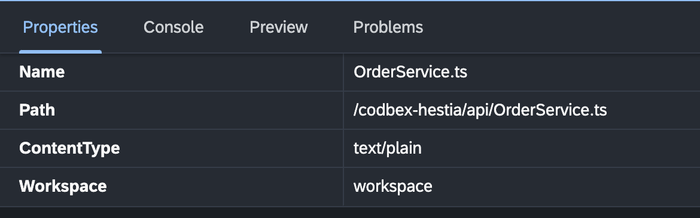

# Properties

The "Properties" area in the "Workbench" provides a centralized location to inspect the properties of projects and artifacts. This section provides an overview of the key features and actions available in the "Properties" area.

{ style="width:500px"}

## Project Properties

To access and configure properties for a project, follow these steps:

1. Click on the project artefact in the "Projects" area of the "Workbench".

3. Navigate through the various lines to inspect artefact-specific settings:

   - **Name:** Name of the artefact.
   
   - **Path:** Location of the artefact.

   - **ContentType:** The content type of the artefact.

   - **Workspace:** The workspace where the artefact is located.

   - More artefact specific properties.

## Conclusion

The "Properties" area in the "Workbench" serves as a comprehensive tool for inspecting the properties of projects and artifacts. Utilize the available tabs and settings tailored your development environment according to your specific requirements.

