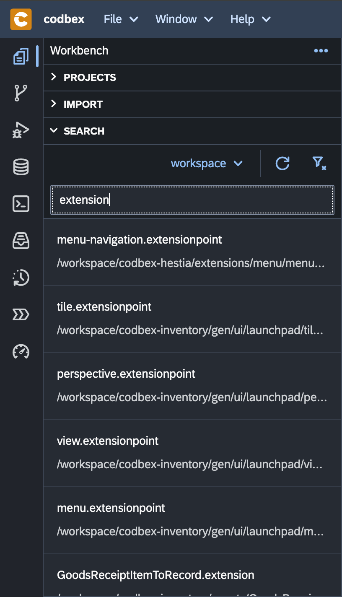

# Search

The "Search" feature in the "Workbench" allows you to efficiently search for projects, files, and content within your development environment. This section provides a guide on how to use the "Search" functionality effectively.

{ style="width:300px"}

## Search for Projects

To search for projects within the Workbench, follow these steps:

1. Click on the "Search" tab in the "Workbench".

2. Enter the project name or keywords in the search bar.

3. Press "Enter" or click the search icon.

4. Review the search results for matching projects.

5. Click on a project artefact to navigate directly to it.

## Search for Files

To search for specific files within the "Workbench", follow these steps:

1. Click on the "Search" tab in the Workbench.

2. Enter the file name or keywords in the search bar.

3. Press "Enter" or click the search icon.

4. Review the search results for matching files.

5. Click on a file to open it or perform additional actions.

## Quick Navigation

The search results provide a quick and convenient way to navigate to the desired project or file. Use the keyboard arrows to navigate through the results, and press "Enter" to open the selected item.

## Conclusion

The "Search" feature in the "Workbench" enhances your productivity by providing a quick and efficient way to locate projects and files. Experiment with different search queries and options to streamline your development workflow.
