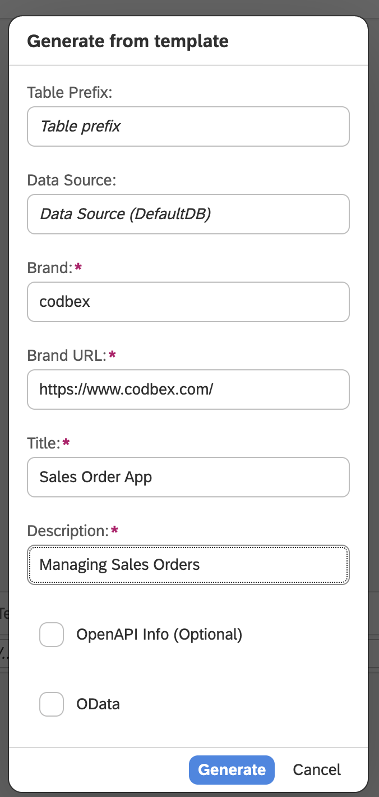

# How "Depends On" feature in Rhea Simplifies App Development

## Introduction

In today’s fast-paced business world, low-code platforms are revolutionizing app development, enabling users to create powerful applications with minimal coding. Rhea Edition simplifies application modeling by offering a robust environment for designing domain models and custom forms. One standout feature of Rhea is **"Depends On"**, which enables that data coming from different entities is seamlessly interconnected. This unique feature automatically adjusts related elements, making it easier to manage complex app relationships and build scalable solutions faster in the No-Code manner.

## Case I - Country-City Dependency

### Entities

#### Create a New Project
- Create a new project and name it **`sales-orders-app`**.
- Right-click on **Project → New → Entity Data Model** and name it **`sales-order-app.edm`**.

#### Country Entity

- Add Perspective for **`Country`**

- Create an entity and set its name to **`Country`**

- Right-click on the entity and open **`Properties`**
- In the **User Interface** section:
    - Set **Layout type** to **`Manage Master Entities`**
    - Choose the already defined **perspective**: **`Country`**

- Add text field for **`Name`**

#### City Entity

- Create entity and set its name to **`City`**
- Right-click on the entity
    - From the **General** tab, set **Entity Type** to **`Dependent`**
    - Open **Properties**
    - In the **User Interface** section:
        - Set **Layout type** to **`Manage Details Entity`**
        - Choose the already defined perspective - **`Country`**
- Add text field for **`Name`**
- Add relationship to **`Country`** and set its properties

- From **User Interface** view, choose:
    - **`Dropdown`** for widget type
    - **`Id`** for dropdown key
    - **`Name`** for dropdown value

#### Customer Entity
- Add perspective for **`Customer`**
- Create entity **`Customer`**
- Open **Properties**
- In the **User Interface** section:
    - Set **Layout type** to **`Manage Master Entity`**
    - Choose the already defined perspective - **`Customer`**
- Add text field for **`Name`**
- Add relationship to **`Country`**
    - From **User Interface** view, choose:
        - **`Dropdown`** for widget type
        - **`Id`** for dropdown key
        - **`Name`** for dropdown value
- Add relationship to **`City`**
    - From **User Interface** view, choose:
        - **`Dropdown`** for widget type
        - **`Id`** for dropdown key
        - **`Name`** for dropdown value
- Add text field for **`Address`**

### Configuration:

- Depends on Property: **`Country`**
- Depends on Entity: **`Country`**
- Value From: **`Id`**
- Filter By: **`Country`**

### Case I - Country-City Dependency - Showcase

> **Note:** This is the so-called **“Country-City Dependency”**, which represents the relation via the **Id** of the referred entity. This configuration selects a **Country**, and the **City dropdown** will then display only the cities that belong to the chosen **Country**.

## Case II - Product-UoM

### Entities

#### Customer Payment Entity
- Create entity **`CustomerPayment`**
- Right-click on the entity. From **General** tab, set **Entity Type** to *Dependent*.
- Open **Properties**
- In the **User Interface** section:
    - Set **Layout type** to **`Manage Details Entity`**
    - Choose the already defined perspective - **`Customer`**
- Add text field for **`Title`**
- Add relationship to **`Customer`** and set its properties:

- From **User Interface** view, choose:
    - **`Dropdown`** for widget type
    - **`Id`** for dropdown key
    - **`Name`** for dropdown value
- Add number field for **`Amount`**

#### Unit Of Measurement Entity
- Add perspective for **`UoM`**
- Create entity **`UoM`** (Unit of Measurement)
- Open **Properties**
- In the **User Interface** section:
    - Set **Layout type** to **`Manage Master Entity`**
    - Choose the already defined perspective - **`UoM`**
- Add text field for **`Name`**

#### Product Entity
- Add perspective for **`Product`**
- Create entity **`Product`**
- Open **Properties**
- In the **User Interface** section:
    - Set **Layout type** to **`Manage Master Entity`**
    - Choose the already defined perspective - **`Product`**
- Add text field for **`Name`**
- Add relationship to **`UoM`**
    - From **User Interface** view, choose:
        - **`Dropdown`** for widget type
        - **`Id`** for dropdown key
        - **`Name`** for dropdown value
- Add decimal field for **`Price`**

#### Sales Order Entity
- Add perspective for **`SalesOrder`**
- Create entity **`SalesOrder`**
- Open **Properties**
- In the **User Interface** section:
    - Set **Layout type** to **`Manage Master Entity`**
    - Choose the already defined perspective - **`Product`**
- Add relationship to **`SalesOrder`**
    - From **User Interface** view, choose:
        - **`Dropdown`** for widget type
        - **`Id`** for dropdown key
        - **`Name`** for dropdown value
- Add date field for **`Date`**

#### Sales Order Item Entity
- Create entity **`SalesOrderItem`**
- Right-click on the entity. From **General tab**, set **Entity Type** to **`Dependent`**.
- Open **Properties**
- In the **User Interface** section:
    - Set **Layout type** to **`Manage Details Entity`**
    - Choose the already defined perspective - **`SalesOrder`**
- Add relationship to **`SalesOrder`** and set its properties.
- Add relationship to **`Product`**
    - From **User Interface** view, choose:
        - **`Dropdown`** for widget type
        - **`Id`** for dropdown key
        - **`Name`** for dropdown value
- Add relationship to **`UoM`**
    - From **User Interface** view, choose:
        - **`Dropdown`** for widget type
        - **`Id`** for dropdown key
        - **`Name`** for dropdown value

### Configuration

- Depends on Property: **`Product`**
- Depends on Entity: **`Product`**
- Value From: **`UoM`**
- Filter By: **`Id`**

### Case II - Product-UoM - Showcase

> **Note:** This configuration selects the chosen **Product**, retrieves its **UoM**, and automatically sets it for the **Sales Order Item**.

## Case III - Product-Price

### Entities

In this case we will reuse the entities from the previous section, just will add one more configuration for the user interface:

### Configuration

- Add decimal field for **`Price`**
  Another use of the **"Depends On"** feature. Fill the widgets with:
- Depends on Property: **`Product`**
- Depends on Entity: **`Product`**
- Value From: **`Price`**

### Case III - Product-Price - Showcase

> **Note:** This configuration selects the chosen **Product**, retrieves its **Price**, and automatically sets it for the **Sales Order Item**.

> The **"Depends On"** function ensures that two fields are **automatically populated** based on values from other entities.

## Case IV - Order-Customer

### Entities

#### Sales Order Payment Entity
- Create entity **`SalesOrderPayment`**
- Right-click on the entity. From **General tab**, set **Entity Type** to **`Dependent`**.
- Open **Properties**
- In the **User Interface** section:
    - Set **Layout type** to **`Manage Details Entity`**
    - Choose the already defined perspective - **`SalesOrder`**
- Add relationship to **`SalesOrder`** and set its properties.
- Add relationship to **`Customer`**
    - From **User Interface** view, choose:
        - **`Dropdown`** for widget type
        - **`Id`** for dropdown key
        - **`Name`** for dropdown value

### Configuration:

- Depends on Property: **`SalesOrder`**
- Depends on Entity: **`SalesOrder`**
- Value From: **`Customer`**
- Filter By: **`Id`**

> **Note:** This configuration selects **Sales Order**, and the **Customer dropdown** will then display only the **Customers** that belong to the chosen **Sales Order**.

- Add relationship to **`CustomerPayment`**
    - From **User Interface** view, choose:
        - **`Dropdown`** for widget type
        - **`Id`** for dropdown key
        - **`Title`** for dropdown value

Another use of the **"Depends On"** feature. Fill the widgets with:
- Depends on Property: **`Customer`**
- Depends on Entity: **`CustomerPayment`**
- Value From: **`Id`**
- Filter By: **`Customer`**
> **Note:** This configuration retrieves the **Customer**, and the **CustomerPayment dropdown** will then display only the **CustomerPayments** that belong to the chosen **Customer**.

- Add decimal field for **`Amount`**
  Another use of the **"Depends On"** feature. Fill the widgets with:
- Depends on Property: **`CustomerPayment`**
- Depends on Entity: **`CustomerPayment`**
- Value From: **`Amount`**
> **Note:** This configuration retrieves the **CustomerPayment** and automatically sets the **Payment Amount**.

These three configurations ensure that:
1. We retrieve only the **Customer** from the **Sales Orders**.
2. We include their respective **Payments**.
3. We automatically set the **Payment Amounts**.

## **Final EDM**

1. Right-click on **EDM file → Generate** and choose **Entity Data to JSON Transformer Model**.

2. **Right-click on `.model` file**, choose **Application - Full stack**, fill fields in the next window with your details, and click **Generate**.

## Conclusion
In this guide, we’ve shown how [Rhea](https://www.codbex.com/products/rhea) by codbex simplifies building a Sales Order App. With features like the "Depends On" functionality, businesses can easily create dynamic apps with minimal coding.
- **`Case I`** - Country-City Dependency -  represents the relation via the “Id” of the referred entity.

- **`Case II`** - Field auto-population - This case retrieves the field from another entity and automatically populates it in our entity.

- **`Case III`** - Multi-step process that combines multiple uses of **`"Depends On"`** to achieve a final result.

- **`Case IV`** - Entity Configuration: Managing Master and Dependent Entities

Ready to build your own? [Click here](https://github.com/codbex/codbex-sample-model-depends-on) to learn more or access the Sales Order App code.
Rhea by codbex helps organizations turn complex visions into fully-functional apps quickly, without heavy technical expertise. The **`"Depends On"`** feature ensures seamless data flow between related entities, keeping your app consistent and efficient. For businesses looking to stay ahead, Rhea by codbex offers a flexible, cost-effective solution to build tailored applications and manage data with ease.

