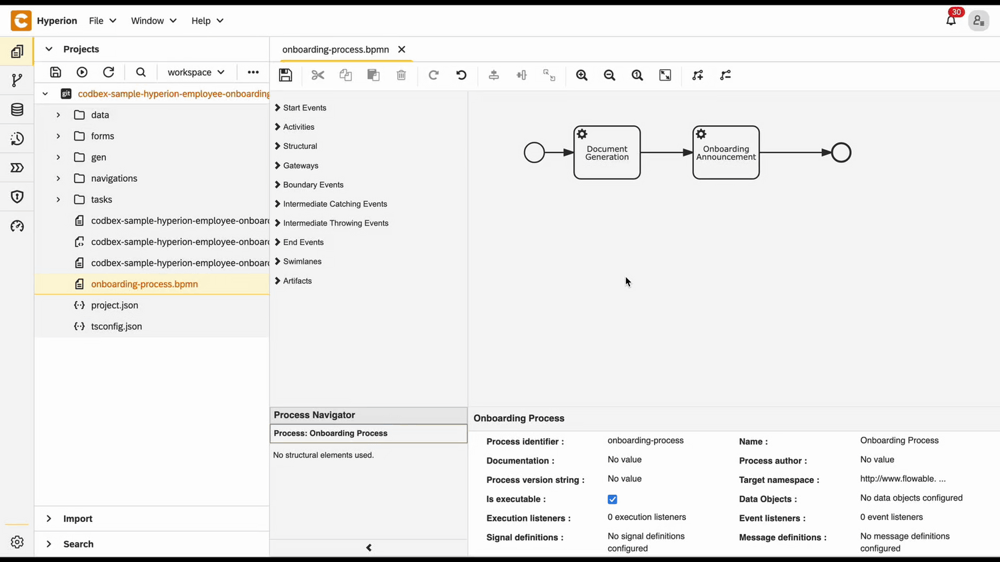
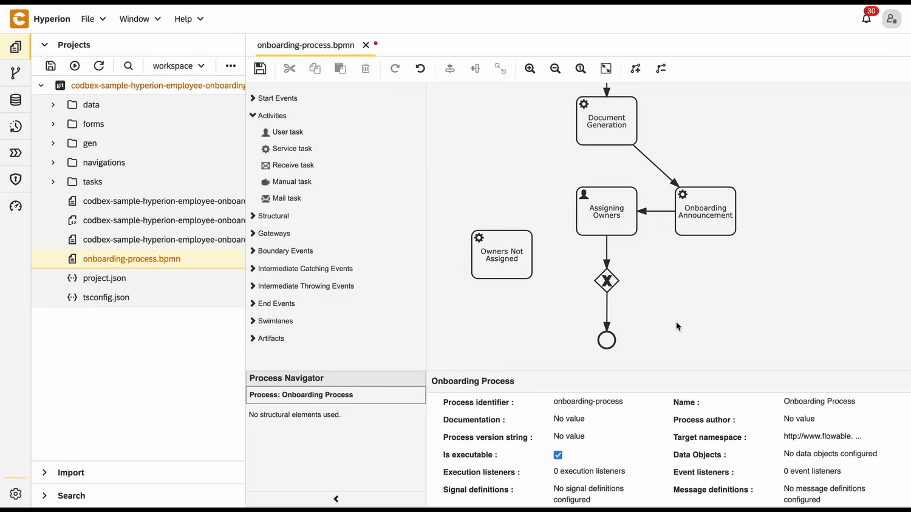

# Onboarding Process Tutorial 4: User Task Definition and Logical Gateways

## Introduction

In today’s flexible business environments, workflows must balance automation with human input and smart decision-making. **Hyperion Edition** addresses this need through the powerful **BPMN** features **User Tasks** and **Logical Gateways**.
With **User Tasks**, processes can pause at defined points to wait for human actions—such as approvals, reviews, or data entry—before automatically resuming, ensuring that critical decisions are made by the right people at the right time.
Complementing this, **Logical Gateways** such as exclusive, inclusive, and parallel branches allow workflows to intelligently adapt based on conditions, outcomes, or data.
These elements work together to create dynamic, responsive processes that reflect real-world operations—all within Hyperion’s No-Code, visually intuitive platform.

## Designing the Process Flow

### User Task

**User Tasks** allow you to define jobs for the users of the platform in the space of the **BPMN**. When the execution of the process encounters an **user task** it waits until the task is resumed, which typically happens in an outside action (i.e. filling a form).

-   Open the **BPMN** file
-	From **Activities** grab an **User Task** (the one with the face silhouette) and place it in the diagram space
-	Connect the **Onboarding Announcement** task to the new one



-	Click on the user task to open its properties
-	In the **Id** field type **`assigning-owners`**
-	In the **Name** field type **`Assigning Owners`**


### Logical Gateway

Now that there is an **user task** we have to cover the cases in which the user who's doing the task doesn't complete it fully. This could be done with **Logical Gateway**. These elements of the **BPMN** allow you to add another level of complexity to the process by enabling **branching** of the flow. That way **different scenarios** could be covered in one singular process.

#### Creating Logical Gateway

-   Open the **BPMN** file
-	From **Gateways** grab an **Exclusive Gateway** and place it in the diagram space
-	Connect the **Assigning Owners** user task to the gateway


#### Defining the cases

When the task is completely done the process will simply end. So the **end event** will be the first connection. In any other case the user will have to redo the task. But if something isn't good with the task completion the user will have to be informed. So the other connection of the **gateway** will be with a new **service task** that sends an email to notify the user about the problem. The new task should be connected to **Assigning Owners**. That way the process will loop through the user task until it's completely fulfilled.

-	Connect the **gateway** to the **end event**


-	From **Activities** grab a Service Task and place it in the diagram space
-	Click on the new task to open its properties
-	In the **Id** field type **`owners-not-assigned`**
-	In the **Name** field type **`Owners Not Assigned`**
-	In the **Delegate Expression** field type **`${JSTask}`**
-	Click on the **Class** field → the **+** button to add handler entry
-	In the **Name** field type **`handler`**
-	In the **String value** field type the link to the task definition **`codbex-sample-hyperion-employee-onboarding/tasks/owners-not-assingned.ts`**


-	Connect the **gateway** to the new service task
-	Connect **Owners Not Assigned** to **Assigning Owners**



#### Logically separating the cases

Now that the two cases are defined there needs to be a way to tell them apart. That happens by defining a parameter that will serve as a **flag**. Then based on this flag the **gateway** chooses which connection to execute. This parameter's value will be set outside the process and then pushed to the **execution context.**

- Click on the **connection** between the **gateway** and the **end event**
- In the **Flow condition** filed type **`${tasksAssigned}`** - the flag parameter
- Click on the connection between the **gateway** and **Owners Not Assigned**
- Check the **Default flow** checkbox


## Assigning Owners Form

### Form Configuration

Follow these steps to create the necessary folder structure and file:

1. Inside the **`forms`** folder, create another folder named **`ManagerReview`**.

2. Within the **`forms`** folder, create a new file named **`manager-review-form.html`** and place the required code inside it.

<details>
  <summary>📄 View code</summary>
  
```
<!DOCTYPE html>
<html lang="en" xmlns="http://www.w3.org/1999/xhtml" ng-app="templateApp" ng-controller="templateController">

    <head>
        <meta charset="utf-8" />
        <meta name="viewport" content="width=device-width, initial-scale=1">
        <link rel="icon" sizes="any" href="data:;base64,iVBORw0KGgo=">
        <title config-title></title>
        <script type="text/javascript" src="manager-review-generate.js"></script>
        <script type="text/javascript" src="/services/js/platform-core/services/loader.js?id=view-js"></script>
        <link type="text/css" rel="stylesheet" href="/services/js/platform-core/services/loader.js?id=view-css" />
        <script src="manager-review-form-controller.js"></script>
    </head>

    <body class="bk-vbox">
        <h2 bk-title class="bk-padding--sm bk-center" wrap="true" header-size="2" aria-label="title" ng-if="hasAvailableTasks">Manager Review</h2>
        <bk-scrollbar class="bk-full-height bk-padding--sm bk-center--horizontal">
            <bk-fieldset ng-form="forms.details" class="bk-restrict-width--sm bk-full-width" ng-if="hasAvailableTasks">
                <bk-form-group name="entityForm">
                    <bk-form-item horizontal="false" ng-repeat="task in taskList track by task.Id">
                        <bk-form-label for="assignee-{{ $index }}" ng-required="true" colon="true">{{task.Name}}</bk-form-label>
                        <bk-combobox-input input-id="assignee-{{ $index }}" ng-required="true" ng-model="entity.assignees[task.Id]" dropdown-items="assigneeOptions" placeholder="Choose Assignee ..."
                            btn-aria-label="show/hide Assignee options" list-aria-label="Assignee options"></bk-combobox-input>
                    </bk-form-item>
                </bk-form-group>
            </bk-fieldset>
            <bk-message-page glyph="sap-icon--message-information" ng-if="!hasAvailableTasks">
                <bk-message-page-title>There are no tasks to assign at the moment</bk-message-page-title>
                <bk-message-page-subtitle>It looks like all the tasks have been completed or there are no new tasks to assign right now.</bk-message-page-subtitle>
            </bk-message-page>
        </bk-scrollbar>
        <bk-bar bar-design="footer" class="bk-margin-top--md" ng-if="hasAvailableTasks">
            <bk-bar-right>
                <bk-bar-element>
                    <bk-button label="Submit" state="emphasized" ng-click="submitAssignees()" ng-disabled="!(forms.details.$valid)"></bk-button>
                </bk-bar-element>
            </bk-bar-right>
        </bk-bar>
        <theme></theme>
    </body>

</html>

```
</details>

> 💡 **Note**  
> This is the **HTML layout** of the view. It includes a **form**  
> that must be filled out to assign tasks.

3. Within the **`forms`** folder, create a new file named **`manager-review-form-controller.js`** and place the required code inside it.


<details>
  <summary>📄 View code</summary>

```
angular.module('templateApp', ['blimpKit', 'platformView']).controller('templateController', ($scope, $http) => {

    const employeeId = new URLSearchParams(window.location.search).get('employeeId');
    const processInstanceId = new URLSearchParams(window.location.search).get('processId');

    $scope.entity = {
        assignees: {}
    };
    $scope.forms = {
        details: {},
    };

    const tasksUrl =
        "/services/ts/codbex-sample-hyperion-employee-onboarding/forms/ManagerReview/api/ManagerReviewFormService.ts/tasksData/" + employeeId;
    const employeeUrl =
        "/services/ts/codbex-sample-hyperion-employee-onboarding/forms/ManagerReview/api/ManagerReviewFormService.ts/employeeData";
    const updateAssigneeUrl =
        "/services/ts/codbex-sample-hyperion-employee-onboarding/forms/ManagerReview/api/ManagerReviewFormService.ts/updateAssignee";
    const completeTaskUrl =
        "/services/ts/codbex-sample-hyperion-employee-onboarding/forms/ManagerReview/api/ManagerReviewFormService.ts/completeTask/" + processInstanceId;

    $scope.hasAvailableTasks = false;

    $http.get(tasksUrl).then(response => {
        $scope.taskList = response.data;
        $scope.hasAvailableTasks = response.data.length > 0;
        $http.get(employeeUrl).then(response => {
            $scope.assigneeOptions = response.data;
        }).catch((error) => {
            console.error("Error getting employees data: ", error);
        });

    }).catch((error) => {
        console.error("Error getting tasks data: ", error);
    });

    $scope.submitAssignees = () => {
        $scope.taskList.forEach((task) => {

            const assigneeId = $scope.entity.assignees[task.Id];

            if (assigneeId) {
                const updateData = {
                    taskId: task.Id,
                    assigneeId: assigneeId,
                };

                $http.post(updateAssigneeUrl, updateData).then(response => {
                    console.log("Assignee updated successfully for task", task.Id, response.data);
                }).catch(function (error) {
                    console.error("Error updating assignee for task", task.Id, error);
                });
            } else {
                console.log("No assignee selected for task with ID: ", task.Id);
            }
        });

        const assigneeIds = Object.values($scope.entity.assignees);

        $http.post(completeTaskUrl, assigneeIds).then(response => {
            console.log("Tasks completed: ", response.data);
            $http.get(tasksUrl).then(response => {
                $scope.taskList = response.data;
                $scope.entity.assignees = {};
                $scope.hasAvailableTasks = response.data.length > 0;
            }).catch((error) => {
                console.error("Error refreshing task list", error);
            });
        }).catch((error) => {
            console.error("Error completing tasks list", error);
        });
    };

});
```
</details>

> 💡 **Note**  
> The **controller** acts as an intermediary between the frontend and the backend. It receives data from the frontend, then passes it to a TypeScript service. The service, in turn, processes the data and interacts with the database to fetch or manipulate the required information.


4. Inside the `forms` folder, create a new folder named **`api`**, then create a file called **`ManagerReviewFormService.ts`** within it. Place the following code inside this file:


<details>
  <summary>📄 View code</summary>

```
import { OnboardingTaskRepository as OnboardingTaskDao } from "codbex-sample-hyperion-employee-onboarding/gen/codbex-sample-hyperion-employee-onboarding/dao/OnboardingTask/OnboardingTaskRepository";
import { EmployeeRepository as EmployeeDao } from "codbex-sample-hyperion-employee-onboarding/gen/codbex-sample-hyperion-employee-onboarding/dao/Employee/EmployeeRepository";

import { Controller, Get, Post } from "sdk/http";
import { tasks, process } from "sdk/bpm";

@Controller
class ManagerReviewFormService {

    private readonly onboardingTaskDao;
    private readonly employeeDao;

    constructor() {
        this.onboardingTaskDao = new OnboardingTaskDao();
        this.employeeDao = new EmployeeDao();
    }

    @Get("/tasksData/:employeeId")
    public tasksData(_: any, ctx: any) {
        const employeeId = ctx.pathParameters.employeeId;

        const tasks = this.onboardingTaskDao.findAll({
            $filter: {
                equals: {
                    Employee: employeeId
                }
            }
        });

        const unassignedTasks = tasks.filter(t => typeof t.Assignee !== 'number');

        return unassignedTasks;
    }

    @Get("/employeeData")
    public employeeData() {
        return this.employeeDao.findAll({
            $filter: {
                equals: {
                    OnboardingStatus: 3
                }
            }
        }).map(function (value) {
            return {
                value: value.Id,
                text: value.Name
            };
        });
    }

    @Get("/newHireData")
    public newHireData() {
        return this.employeeDao.findAll({
            $filter: {
                equals: {
                    OnboardingStatus: 1
                }
            }
        }).map(function (value) {
            return {
                value: value.Id,
                text: value.Name
            };
        });
    }

    @Post("/updateAssignee")
    public updateAssignee(body: any) {

        let task = this.onboardingTaskDao.findById(body.taskId);

        task.Assignee = body.assigneeId;
        task.Status = 2; 

        this.onboardingTaskDao.update(task);
    }

    @Post("/completeTask/:processInstanceId")
    public completeTask(body: any, ctx: any) {
        const processInstanceId = ctx.pathParameters.processInstanceId;

        const task = tasks.list().filter(task => task.data.processInstanceId === processInstanceId);

        let assigneeTasks = process.getVariable(processInstanceId, "tasks");

        let finalTasks = [];

        for (let i = 0; i < assigneeTasks.length; i++) {
            const taskData = JSON.parse(assigneeTasks[i]);

            const task = {
                "Employee": taskData.Employee,
                "Name": taskData.Name,
                "Status": taskData.Status,
                "Link": taskData.Link,
                "Assignee": body[i]
            };

            finalTasks.push(task);
        }

        tasks.complete(task[0].data.id, {
            TaskAssignees: finalTasks,
            tasksAssigned: true
        });
    }

}
```

</details>

> 💡 **Note**  
> This service handles communication with the database. It processes the data passed from the controller and interacts with the database to perform the necessary operations, such as fetching, inserting, or updating records.
> The **complete task** endpoint sends the boolean parameter for the logical gateway as well as list of the assignees (for the next step) to the execution context


## Owners not Assigned Service Task Definition

- In the tasks folder create a file called **`owners-not-assigned.ts`**
- Paste the following code in the file:

<details>
  <summary>📄 View code</summary>

```typescript
import { EmployeeRepository  as  EmployeeDao } from  "codbex-sample-hyperion-employee-onboarding/gen/codbex-sample-hyperion-employee-onboarding/dao/Employee/EmployeeRepository";
import { DepartmentRepository  as  DepartmentDao } from  "codbex-sample-hyperion-employee-onboarding/gen/codbex-sample-hyperion-employee-onboarding/dao/Department/DepartmentRepository";

import { process } from  "sdk/bpm";
import { sendMail } from  "./mail-util";

const employeeDao = new  EmployeeDao();
const departmentDao = new  DepartmentDao();

const execution = process.getExecutionContext();
const executionId = execution.getId();

const managerId = process.getVariable(executionId, "Manager");
let managerLink = process.getVariable(executionId, "ManagerLink");
const employeeId = process.getVariable(executionId, "Employee");

const manager = employeeDao.findById(managerId);
if (!manager) {
throw  new  Error(`Employee with ID ${managerId} not found!`);
}

const employee = employeeDao.findById(employeeId);
if (!employee) {
throw  new  Error(`Employee with ID ${employeeId} not found!`);
}

const departmentName = departmentDao.findById(employee.Department).Name;

const subject = "No Assignees to Onboarding Tasks";
const processInstanceId = execution.getProcessInstanceId();

managerLink = `${managerLink}&processId=${processInstanceId}`;

const content = `
<div style="font-family: Arial, sans-serif; line-height: 1.6; color: #333; max-width: 600px; margin: auto; padding: 20px; border: 1px solid #ddd; border-radius: 10px;">
	<div style="text-align: left; margin-bottom: 20px;">
	
	</div>
	<h2 style="color: #2c3e50; text-align: center;">Action Needed: Assign Onboarding Tasks</h2>
	<p>Dear ${manager.Name},</p>
	<p>The onboarding process for <strong>${employee.Name}</strong> (Department: <strong>${departmentName}</strong>) has been approved, but some onboarding tasks still do not have assigned team members.</p>
	<p>To ensure a smooth onboarding experience, please review the tasks and assign the appropriate assignees as soon as possible.</p>
	<div style="text-align: center; margin: 20px 0;">
    	<a href="${managerLink}" target="_blank" style="
        	display: inline-block;
        	padding: 12px 24px;
        	font-size: 16px;
        	color: #fff;
        	background-color: #007bff;
        	text-decoration: none;
        	border-radius: 5px;
    	">Review & Assign Tasks</a>
	</div>
	<p style="text-align: center; font-size: 14px; color: #555;">
    	Alternatively, you can access it here:
    	<a href="${managerLink}" target="_blank" style="color: #007bff; text-decoration: underline;">
        	Review and Assign Onboarding Tasks
    	</a>
	</p>
	<p>If you have any questions or need assistance, please contact the HR team.</p>
	<p>Best regards.</p>
</div>
`;

sendMail(manager.Email, subject, content);

```

</details>

> 💡 **Note** 
> This script sends a reminder email to the manager when onboarding tasks for a new employee have been approved but still lack assigned team members. It retrieves relevant data from the BPM process and database—including the manager, employee, department, and process instance—then builds a styled HTML email with a dynamic link to the task review page. The email urges the manager to assign responsible personnel to pending tasks and is sent using the mail utility.

## Test BPMN Process
