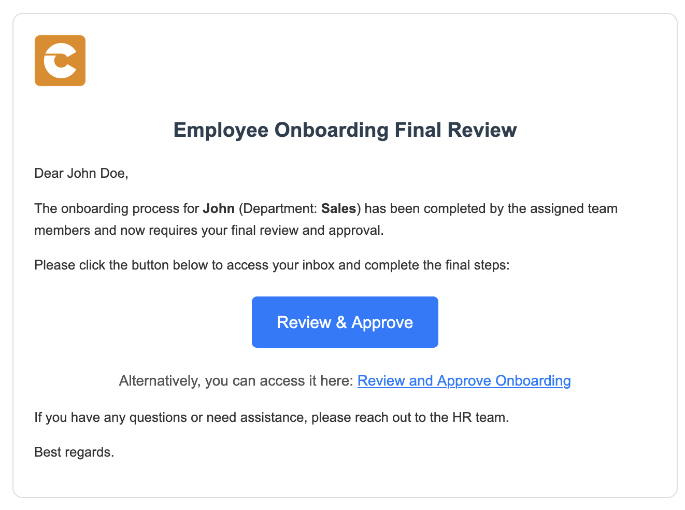
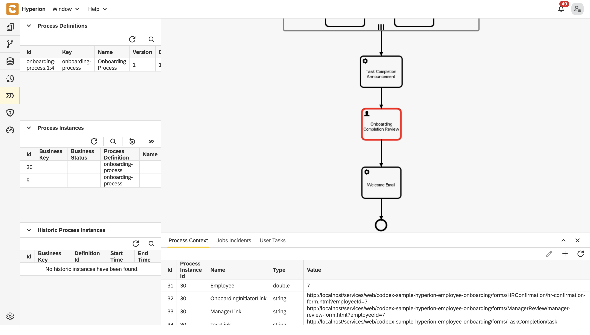
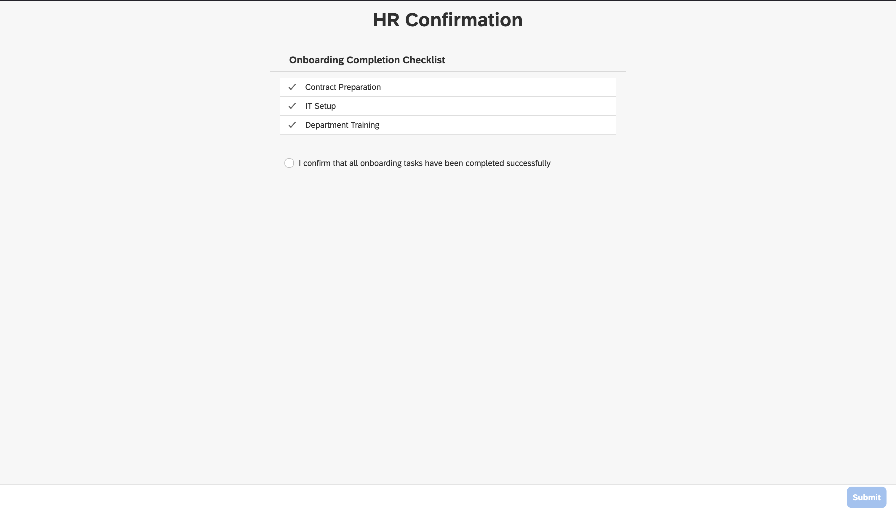
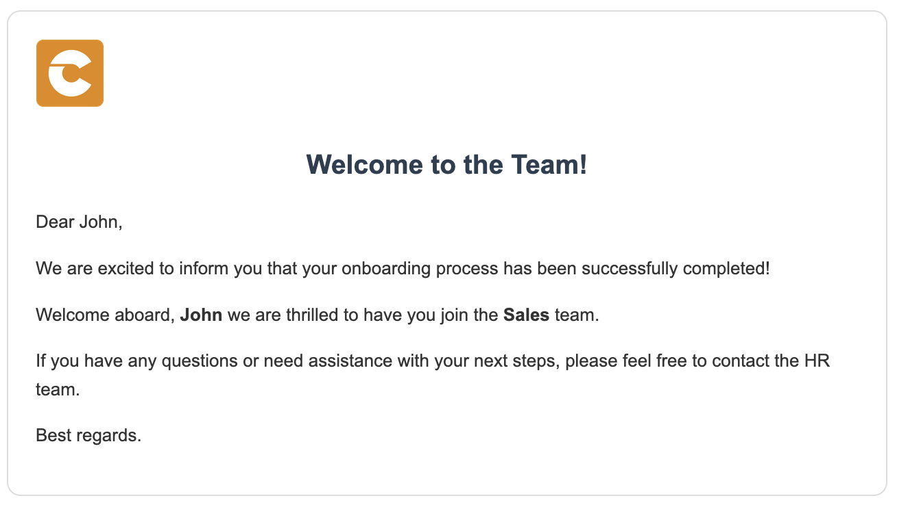

# Onboarding Process Tutorial 6: Completing Onboarding Process

## Introduction

From triggering email notifications through **SMTP** service tasks, to assigning **User Tasks** for collecting inputs or approvals, and guiding flow with intelligent **Logical Gateways**, every step is seamlessly modeled. Modular design with **Subprocesses** executed in parallel keeps the process clean and adaptable, while **BPMN** ensures visual transparency and standardization across teams. The result is a robust onboarding workflow that combines automation with human interaction, decision logic, and scalability—all built visually, with no code. With **Hyperion**, organizations can deliver faster, smarter onboarding experiences that evolve effortlessly with business needs.

To complete the onoarding process the HR initiator must review the tasks that have been done. That implies that when they are done an email should be send to notify. After the HR approval the news should be announced to the new employee. So there are three more tasks left to do.

## Task Completion Announcement

### Service task configuration

- Open the **BPMN** file
- From **Activities** grab a **Service Task** and place it in the diagram space
- Connect the **subprocess** to the new task
- Click on the new task to open its properties
- In the **Id** field type **`task-completion-announcement`**
- In the **Name** field type **`Task Completion Announcement`**
- In the **Delegate Expression** field type **`${JSTask}`**
- Click on the **Class** field → the **+** button to add handler entry
- In the **Name** field type **`handler`**
- In the **String value** field type the link to the task definition **`codbex-sample-hyperion-employee-onboarding/tasks/task-completion-announcement.ts`**


### Service task definition

- In the tasks folder create a file called **`task-completion-announcement.ts`**
- Paste the following code in the file

<details>
  <summary>📄 View code</summary>

```typescript
import { EmployeeRepository as EmployeeDao } from "codbex-sample-hyperion-employee-onboarding/gen/codbex-sample-hyperion-employee-onboarding/dao/Employee/EmployeeRepository";
import { DepartmentRepository as DepartmentDao } from "codbex-sample-hyperion-employee-onboarding/gen/codbex-sample-hyperion-employee-onboarding/dao/Department/DepartmentRepository";

import { process } from "sdk/bpm";
import { sendMail } from "./mail-util";

const employeeDao = new EmployeeDao();
const departmentDao = new DepartmentDao();

const execution = process.getExecutionContext();
const executionId = execution.getId();

const onboardingInitiatorId = process.getVariable(executionId, "OnboardingInitiator");
let onboardingInitiatorLink = process.getVariable(executionId, "OnboardingInitiatorLink");
const employeeId = process.getVariable(executionId, "Employee");

const onboardingInitiator = employeeDao.findById(onboardingInitiatorId);
if (!onboardingInitiator) {
  throw new Error(`Employee with ID ${onboardingInitiatorId} not found!`);
}

const newHire = employeeDao.findById(employeeId);
if (!newHire) {
  throw new Error(`Employee with ID ${employeeId} not found!`);
}

const departmentName = departmentDao.findById(newHire.Department).Name;

const subject = "Employee Onboarding Review";
const processInstanceId = execution.getProcessInstanceId();

onboardingInitiatorLink = `${onboardingInitiatorLink}&processId=${processInstanceId}`;

const content = `
  <div style="font-family: Arial, sans-serif; line-height: 1.6; color: #333; max-width: 600px; margin: auto; padding: 20px; border: 1px solid #ddd; border-radius: 10px;">
    <div style="text-align: left; margin-bottom: 20px;">
      
    </div>
    <h2 style="color: #2c3e50; text-align: center;">Employee Onboarding Final Review</h2>
    <p>Dear ${onboardingInitiator.Name},</p>
    <p>The onboarding process for <strong>${newHire.Name}</strong> (Department: <strong>${departmentName}</strong>) has been completed by the assigned team members and now requires your final review and approval.</p>
    <p>Please click the button below to access your inbox and complete the final steps:</p>
    <div style="text-align: center; margin: 20px 0;">
      <a href="${onboardingInitiatorLink}" target="_blank" style="
        display: inline-block;
        padding: 12px 24px;
        font-size: 16px;
        color: #fff;
        background-color: #007bff;
        text-decoration: none;
        border-radius: 5px;
      ">Review & Approve</a>
    </div>
    <p style="text-align: center; font-size: 14px; color: #555;">
      Alternatively, you can access it here: 
      <a href="${onboardingInitiatorLink}" target="_blank" style="color: #007bff; text-decoration: underline;">
        Review and Approve Onboarding
      </a>
    </p>
    <p>If you have any questions or need assistance, please reach out to the HR team.</p>
    <p>Best regards.</p>
  </div>
`;

sendMail(onboardingInitiator.Email, subject, content);

```

</details>

> 💡 **Note**  
> This script sends a final review email to the onboarding initiator once all assigned onboarding tasks for a new hire have been completed. It gathers relevant details such as the initiator, new employee, department, and process instance from the BPM context and repositories, then generates a styled HTML email containing a call-to-action link for approval. The email is dispatched using a mail utility to prompt the initiator to complete the final onboarding step.

## Onboarding Completion Review

### User task configuration

-   Open the **BPMN** file
-	From **Activities** grab an **User Task** and place it in the diagram space
-	Connect the **Task Completion Announcement** task to the new one
-	Click on the user task to open its properties
-	In the **Id** field type **`onboarding-completion-review`**
-	In the **Name** field type **`Onboarding Completion Review`**


### HR Confirmation form

Follow these steps to create the necessary folder structure and file:

1. Inside the **`forms`** folder, create another folder named **`HRConfirmation`**.

2. Within the **`forms`** folder, create a new file named **`hr-confirmation-form.html`** and place the required code inside it.

<details>
  <summary>📄 View code</summary>
  
```
<!DOCTYPE html>
<html lang="en" xmlns="http://www.w3.org/1999/xhtml" ng-app="templateApp" ng-controller="templateController">

    <head>
        <meta charset="utf-8" />
        <meta name="viewport" content="width=device-width, initial-scale=1">
        <link rel="icon" sizes="any" href="data:;base64,iVBORw0KGgo=">
        <title dg-view-title></title>
        <script type="text/javascript" src="hr-confirmation-generate.js"></script>
        <script type="text/javascript" src="/services/js/platform-core/services/loader.js?id=view-js"></script>
        <link type="text/css" rel="stylesheet" href="/services/js/platform-core/services/loader.js?id=view-css" />
        <script src="hr-confirmation-form-controller.js">
        </script>
    </head>

    <body class="bk-vbox">
        <h2 bk-title class="bk-padding--sm bk-center" wrap="true" header-size="2" aria-label="title" ng-if="!isCompleted"> HR Confirmation</h2>
        <bk-scrollbar class="bk-full-height bk-padding--sm bk-center--horizontal">
            <bk-message-page glyph="sap-icon--message-information" ng-if="isCompleted">
                <bk-message-page-title>Onboarding Complete</bk-message-page-title>
                <bk-message-page-subtitle>The onboarding tasks for the employee have been completed. There is no further HR confirmation work needed.</bk-message-page-subtitle>
            </bk-message-page>
            <bk-panel ng-if="!isCompleted" expanded="true" compact="true" class="bk-restrict-width--sm bk-full-width">
                <bk-panel-header>
                    <h3 aria-label="title" class="fd-margin--md">Onboarding Completion Checklist</h3>
                </bk-panel-header>
                <bk-panel-content aria-label="Panel Content">
                    <bk-list>
                        <bk-list-item ng-repeat="next in taskList">
                            <bk-list-icon glyph="sap-icon sap-icon--accept"></bk-list-icon>
                            <bk-list-title>{{ next.Name }}</bk-list-title>
                        </bk-list-item>
                    </bk-list>
                    <bk-form-group ng-if="!isEmpty" class="fd-margin-top--md">
                        <bk-form-item>
                            <bk-checkbox id="confirmed" compact="false" ng-model="checkboxes.model"></bk-checkbox>
                            <bk-checkbox-label for="confirmed"> I confirm that all onboarding tasks have been completed successfully</bk-checkbox-label>
                        </bk-form-item>
                    </bk-form-group>
                </bk-panel-content>
            </bk-panel>
        </bk-scrollbar>
        <bk-bar bar-design="footer" class="bk-margin-top--md bk-padding--sm" ng-if="!isCompleted">
            <bk-bar-right>
                <bk-bar-element>
                    <bk-button label="Submit" state="emphasized" ng-click="completeOnboarding()" ng-disabled="!checkboxes.model">
                    </bk-button>
                </bk-bar-element>
            </bk-bar-right>
        </bk-bar>

        <theme></theme>
    </body>


</html>

```
</details>

> 💡 **Note**  
> This is the **HTML layout** of the view. It includes a **form**  
> that must be filled out to confirm that all onboarding tasks for the employee have been completed.

3. Within the **`forms`** folder, create a new file named **`hr-confirmation-form-controller.js`** and place the required code inside it.


<details>
  <summary>📄 View code</summary>

```
angular.module('templateApp', ['blimpKit', 'platformView']).controller('templateController', ($scope, $http) => {

    const employeeId = new URLSearchParams(window.location.search).get('employeeId');
    const processInstanceId = new URLSearchParams(window.location.search).get('processId');

    $scope.entity = {};
    $scope.forms = {
        details: {},
    };
    $scope.checkboxes = {
        model: false
    };
    $scope.isCompleted = false;

    const tasksUrl =
        "/services/ts/codbex-sample-hyperion-employee-onboarding/forms/HRConfirmation/api/HRConfirmationFormService.ts/tasksData/" + employeeId;
    const completeTaskUrl =
        "/services/ts/codbex-sample-hyperion-employee-onboarding/forms/HRConfirmation/api/HRConfirmationFormService.ts/completeTask/" + processInstanceId;

    $http.get(tasksUrl)
        .then(response => {
            $scope.taskList = response.data.Tasks;
            $scope.isEmpty = $scope.taskList.length == 0;
        })
        .catch((error) => {
            console.error("Error getting task data: ", error);
        });

    $scope.completeOnboarding = () => {
        $http.post(completeTaskUrl)
            .then(response => {
                console.log(response);
                $scope.isCompleted = true;
            })
            .catch((error) => {
                console.error("Error completing tasks or refreshing task list", error);
            });
    }

});

```
</details>

> 💡 **Note**  
> The **controller** acts as an intermediary between the frontend and the backend. It receives data from the frontend, then passes it to a TypeScript service. The service, in turn, processes the data and interacts with the database to fetch or manipulate the required information.


4. Inside the `forms` folder, create a new folder named **`api`**, then create a file called **`HRConfirmationFormService.ts`** within it. Place the following code inside this file:


<details>
  <summary>📄 View code</summary>

```
import { OnboardingTaskRepository as OnboardingTaskDao } from "codbex-sample-hyperion-employee-onboarding/gen/codbex-sample-hyperion-employee-onboarding/dao/OnboardingTask/OnboardingTaskRepository";
import { EmployeeRepository as EmployeeDao } from "codbex-sample-hyperion-employee-onboarding/gen/codbex-sample-hyperion-employee-onboarding/dao/Employee/EmployeeRepository";

import { Controller, Get, Post } from "sdk/http";
import { tasks } from "sdk/bpm";

@Controller
class HRConfirmationService {

    private readonly onboardingTaskDao;
    private readonly employeeDao;

    constructor() {
        this.onboardingTaskDao = new OnboardingTaskDao();
        this.employeeDao = new EmployeeDao();
    }

    @Get("/tasksData/:employeeId")
    public tasksData(_: any, ctx: any) {
        const employeeId = ctx.pathParameters.employeeId;

        const tasks = this.onboardingTaskDao.findAll({
            $filter: {
                equals: {
                    Employee: employeeId,
                    Status: 3
                }
            }
        });

        const employees = this.employeeDao.findAll({
            $filter: {
                equals: {
                    Id: employeeId
                }
            }
        });

        return {
            "Tasks": tasks,
            "Employee": employees[0].Status
        };
    }

    @Post("/completeTask/:processInstanceId")
    public completeTask(_: any, ctx: any) {
        const processInstanceId = ctx.pathParameters.processInstanceId;

        const processTask = tasks.list().filter(task => task.data.processInstanceId === processInstanceId);

        tasks.complete(processTask[0].data.id);
    }

}
```

</details>

> 💡 **Note**  
> This service handles communication with the database. It processes the data passed from the controller and interacts with the database to perform the necessary operations, such as fetching, inserting, or updating records.

## Welcome email

### Service task configuration

- Open the **BPMN** file
- From **Activities** grab a **Service Task** and place it in the diagram space
- Connect the **Onboarding Completion Review** task to the new one
- Click on the new task to open its properties
- In the **Id** field type **`welcome-email`**
- In the **Name** field type **`Welcome Email`**
- In the **Delegate Expression** field type **`${JSTask}`**
- Click on the **Class** field → the **+** button to add handler entry
- In the **Name** field type **`handler`**
- In the **String value** field type the link to the task definition **`codbex-sample-hyperion-employee-onboarding/tasks/welcome-email.ts`**


### Service task definition

- In the tasks folder create a file called **`welcome-email.ts`**
- Paste the following code in the file

<details>
  <summary>📄 View code</summary>

```typescript
import { EmployeeRepository as EmployeeDao } from "codbex-sample-hyperion-employee-onboarding/gen/codbex-sample-hyperion-employee-onboarding/dao/Employee/EmployeeRepository";
import { DepartmentRepository as DepartmentDao } from "codbex-sample-hyperion-employee-onboarding/gen/codbex-sample-hyperion-employee-onboarding/dao/Department/DepartmentRepository";

import { process } from "sdk/bpm";
import { sendMail } from "./mail-util";

const employeeDao = new EmployeeDao();
const departmentDao = new DepartmentDao();

const execution = process.getExecutionContext();
const executionId = execution.getId();

const employeeId = process.getVariable(executionId, "Employee");

const employee = employeeDao.findById(employeeId);
if (!employee) {
  throw new Error(`Employee with ID ${employeeId} not found!`);
}

const departmentName = departmentDao.findById(employee.Department).Name;

const subject = "Welcome to the Team";

const content = `
  <div style="font-family: Arial, sans-serif; line-height: 1.6; color: #333; max-width: 600px; margin: auto; padding: 20px; border: 1px solid #ddd; border-radius: 10px;">
    <div style="text-align: left; margin-bottom: 20px;">
      
    </div>
    <h2 style="color: #2c3e50; text-align: center;">Welcome to the Team!</h2>
    <p>Dear ${employee.Name},</p>
    <p>We are excited to inform you that your onboarding process has been successfully completed!</p>
    <p>Welcome aboard, <strong>${employee.Name}</strong> we are thrilled to have you join the <strong>${departmentName}</strong> team.</p>
    <p>If you have any questions or need assistance with your next steps, please feel free to contact the HR team.</p>
    <p>Best regards.</p>
  </div>
`;

sendMail(employee.Email, subject, content);

```

</details>

> 💡 **Note**  
> This script sends a welcome email to a newly onboarded employee after their onboarding process is complete. It retrieves the employee and their department details using repository classes, constructs a personalized HTML email with a warm welcome message, and uses a mail utility to deliver it to the employee's email address.

## Test final BPMN process

- Go to the **Dashboard** of the application at http://localhost/services/web/dashboard/ → Click the **New Hire Navigation**
- Enter the details of the new hire
- After some time the tasks of the onboarding process will be created. To view them go to the **Dashboard** of the application at http://localhost/services/web/dashboard/ → Click the **Onboarding Tasks Navigation**
- Check the email of the manager and click on the button from there
- If you check the **Process Workspace** you'll see that the process has stop at the user task and waits for it to be completed
- After that complete the **form** by assigning employees to the tasks.
- All the employees should recieve an email
- If you check the **Process Workspace** you'll see that the process has stop at the subprocess
- Now click on the button from a mail send to an assignee to open the form and complete the task
- After completing the onboarding task a mail should be sent to the email of the process initiator - the initial HR



- If you check the **Process Workspace** you'll see that the process has stop at the **Onboarding Completion Review** task



- Complete the form to continue with the process



- After completing the for a welcome email should be sent to the new employee



::: details Other blogs
- [Onboarding Process Tutorial 1: EDM Configuration](https://codbex.com/technology/2025/05/07/onboarding-process-1-edm-configuration)
- [Onboarding Process Tutorial 2: BPMN Configuration - Service Task Definition](https://codbex.com/technology/2025/05/07/onboarding-process-2-services-task)
- [Onboarding Process Tutorial 3: SMTP Connection](https://codbex.com/technology/2025/05/07/onboarding-process-3-smtp)
- [Onboarding Process Tutorial 4: User Task Definition and Logical Gateways](https://codbex.com/technology/2025/05/07/onboarding-process-4-user-task-logical-gateways)
- [Onboarding Process Tutorial 5: Configuring-Subprocess](https://codbex.com/technology/2025/05/07/onboarding-process-5-subprocess)
- [Onboarding Process Tutorial 6: Completing Onboarding Process](https://codbex.com/technology/2025/05/07/onboarding-process-6-final-steps)
:::