# Onboarding Process Tutorial 1: EDM Configuration

## Introduction

Designing a solid data structure is one of the first and most important steps in building any application. In this blog post, we'll walk through how to create an Entity Data Model (EDM) using **codbex Rhea** with a simple, real-world sample project called **Sample Employee Onboarding Process**. Whether you're new to data modeling or just looking to brush up your skills, this guide will help you understand how entities, relationships, and data types come together to form the foundation of your application's data layer. By the end, you'll have a working example you can build on and adapt to your own projects.

### Create a New Project
- Create a new project and name it **`employee-onboarding`**.

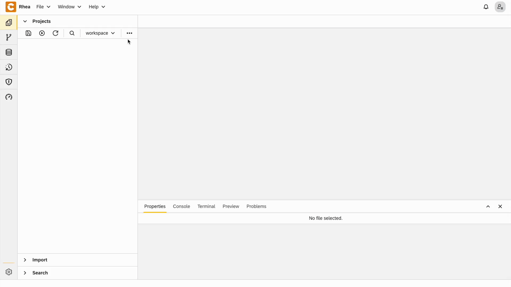

- Right-click on **Project → New → Entity Data Model** and name it **`employee-onboarding.edm`**.


### Navigations
- Add **`Employees`**, **`Tasks`** and **`EmployeeOnboarding`** navigations

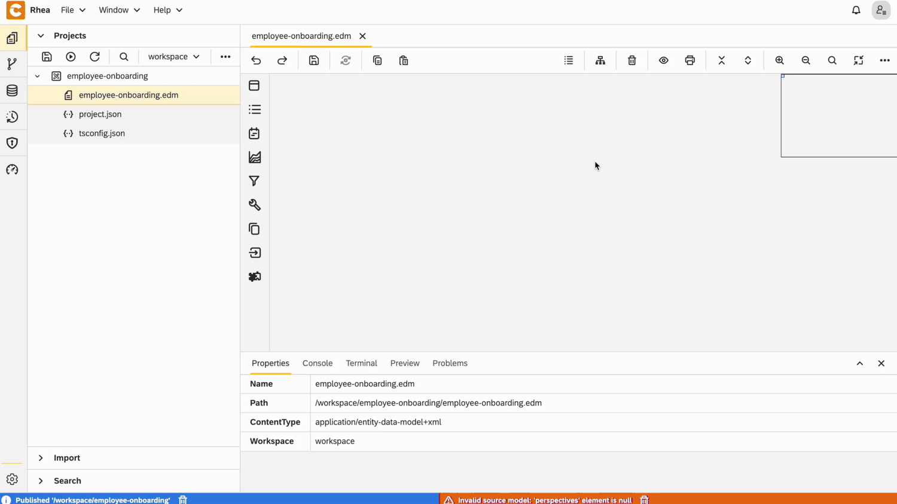

### Entities

#### 1. Department Entity

- Create an entity
- Right-click on the entity and open **`Properties`**
- In the **General** section:
        - Set **Name** to **`Department`**
        - Set **Type** to **`Setting Entity`**

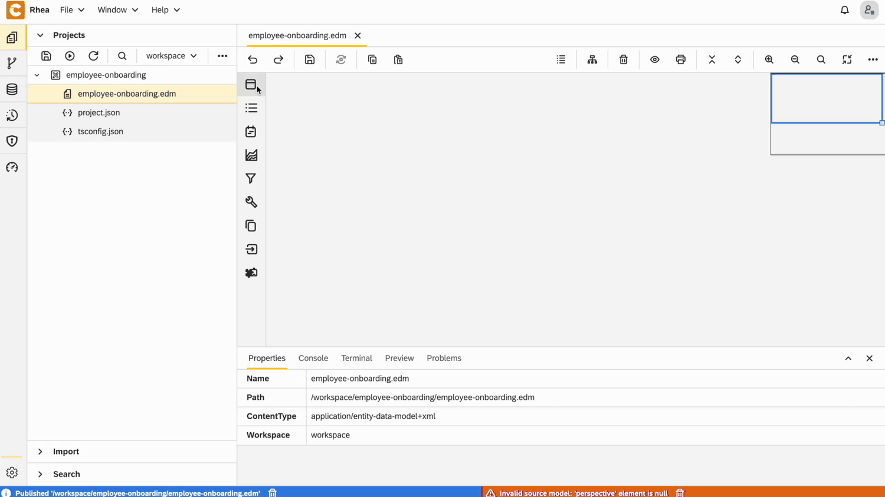

- Add text field for **`Name`**, make it **required** and set its length to be 100 characters

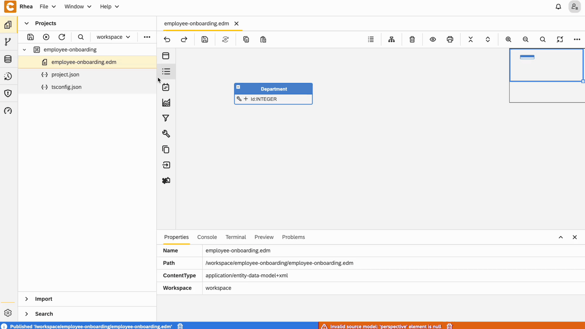

#### 2. Onboarding Status Entity

- Create an entity and set its name to **`Onboarding Status`**
- Right-click on the entity and open **`Properties`**
- In the **General** section:
        - Set **Type** to **`Setting Entity`**

- Add text field for **`Name`**, make it **required** and set its length to be 30 characters

#### 3. Employee Entity

- Add Perspective for **`Employee`** this way

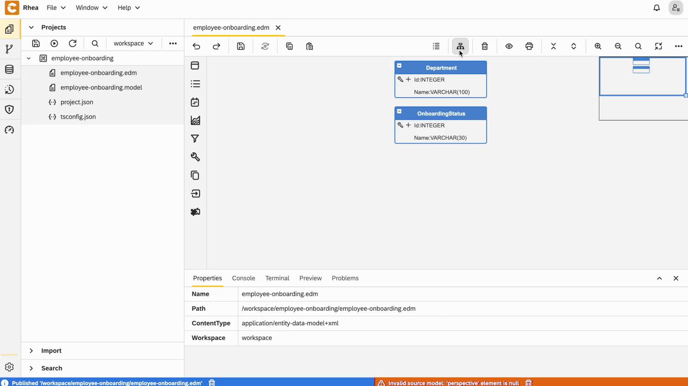

- Create an entity and set its name to **`Employee`**

- Right-click on the entity and open **`Properties`**
- In the **User Interface** section:
        - Set **Layout type** to **`Manage Master Entity`**
        - Choose the already defined perspective - **`Employee`**

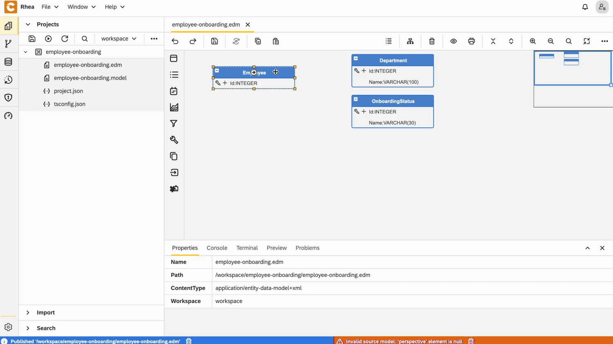

- Add text field for **`Name`**, make it **required** and set its length to be 100 characters

- Add field for **`Email`**, make it **required** and set its length to be 150 characters
- Right-click on the entity and open field **`Properties`**
- In the **User Interface** section:
    - Choose **Widget type** to be **`e-mail`**

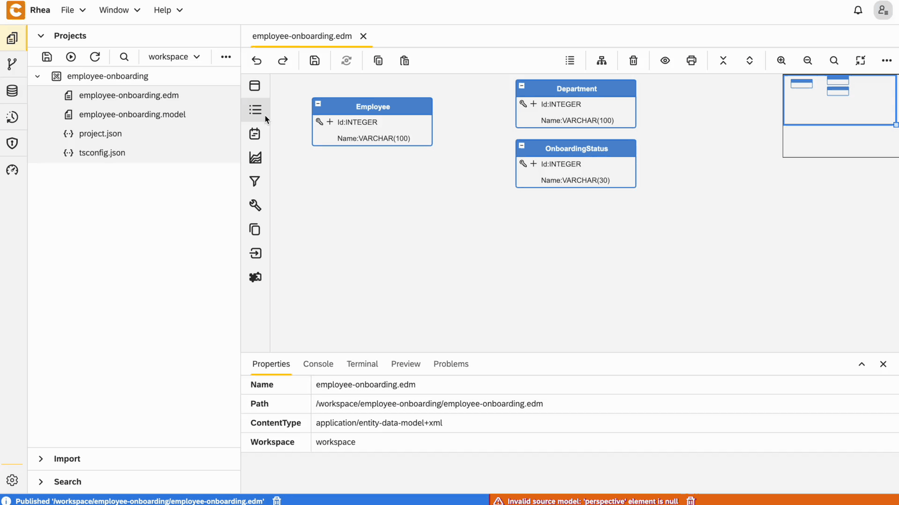

- Add field for **`StartDate`** and make it **required**
- Right-click on the entity and open field **`Properties`**
- In the **Data** section:
    - Choose **Data type** to be **`DATE`**
- In the **User Interface** section:
    - Choose **Widget type** to be **`Date picker`**
    


- Add relationship to **`Department`** and make it **required**

Configuration for **`Department`** field

 - From **User Interface** view, choose:
   - **`Dropdown`** for widget type
   - **`Id`** for dropdown key
   - **`Name`** for dropdown value

   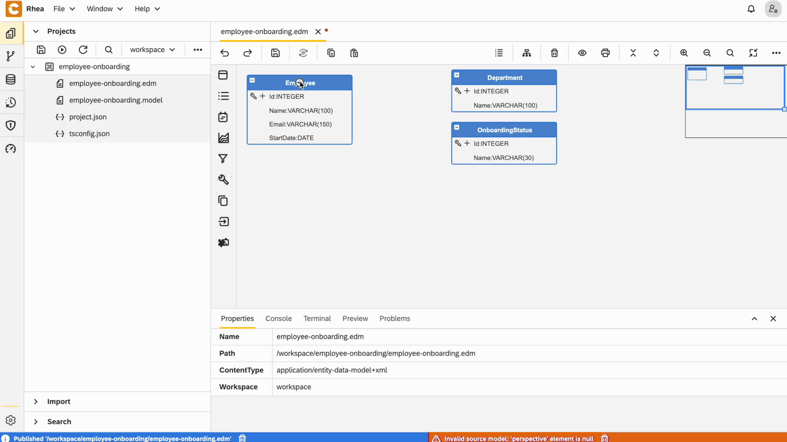

- Add relationship to **`Onboarding Status`** and make it **required**

Configuration for **`Onboarding Status`** field

 - From **User Interface** view, choose:
   - **`Dropdown`** for widget type
   - **`Id`** for dropdown key
   - **`Name`** for dropdown value


#### 4. Onboarding Task Entity

- Add Perspective for **`Onboarding Task`**

- Create an entity and set its name to **`Onboarding Task`**

- Right-click on the entity and open **`Properties`**
- In the **User Interface** section:
        - Set **Layout type** to **`Manage Master Entity`**
        - Choose the already defined perspective - **`Onboarding Task`**

- Add relationship to **`Employee`** and make it **required**

Configuration for **`Employee`** field

 - From **User Interface** view, choose:
   - **`Dropdown`** for widget type
   - **`Id`** for dropdown key
   - **`Name`** for dropdown value

- Add relationship to **`Employee`**, set field name to be **`Assignee`** and make it **required**

Configuration for **`Assignee`** field

 - From **User Interface** view, choose:
   - **`Dropdown`** for widget type
   - **`Id`** for dropdown key
   - **`Name`** for dropdown value

- Add relationship to **`Onboarding Status`**, set field name to be **`Status`** and make it **required**

Configuration for **`Status`** field

 - From **User Interface** view, choose:
   - **`Dropdown`** for widget type
   - **`Id`** for dropdown key
   - **`Name`** for dropdown value

- Add field for **`CompletedAt`** and make it **required**
- Right-click on the entity and open field **`Properties`**
- In the **Data** section:
    - Choose **Data type** to be **`DATE`**
- In the **User Interface** section:
    - Choose **Widget type** to be **`Date picker`**

### **Final EDM**

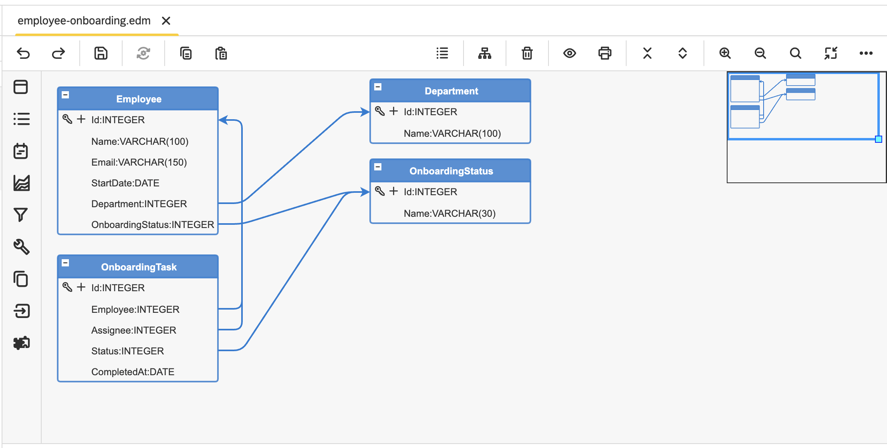

1. Right-click on **EDM file → Generate** and choose **Entity Data to JSON Transformer Model**.

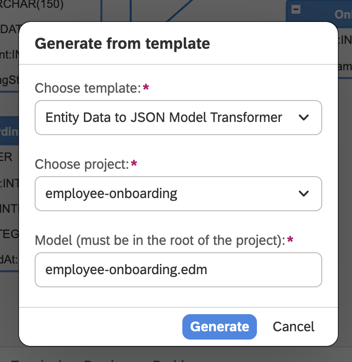

2. **Right-click on `.model` file**, choose **Application - Full stack**, fill fields in the next window with your details, and click **Generate**.

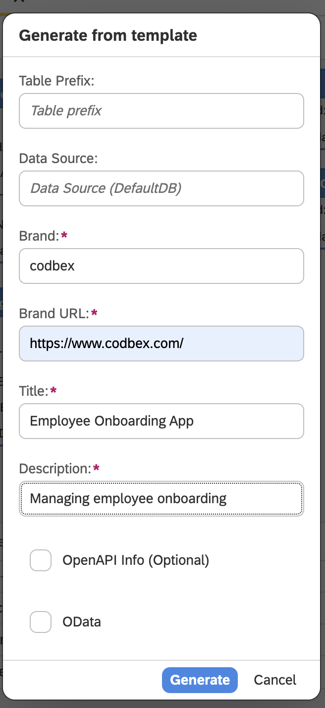

### Addind Data
- Right-click on **Project → New → Folder** and name it **`data`**.
- Right-click on **data → New → CSVFile** and name it **`onboarding-task-status.csv`**.
- Open it and paste the following code:

```
ONBOARDINGSTATUS_ID,ONBOARDINGSTATUS_NAME
1,Pending
2,In Progress
3,Completed
```

- Right-click on **data → New → CSV Import Model** and name it **`employee-onboarding.csvim`**.
- Open it and paste the following code
```
{
  "files": [
    {
      "table": "CODBEX_ONBOARDINGSTATUS",
      "schema": "PUBLIC",
      "file": "/employee-onboarding/data/onboarding-task-status.csv",
      "header": true,
      "useHeaderNames": true,
      "delimField": ",",
      "delimEnclosing": "'",
      "distinguishEmptyFromNull": true,
      "version": ""
    }
  ]
}
```

### Publishing

- Publish the project
- Open [Dashboard](http://localhost:80/services/web/dashboard/index.html) and now you can see the application

### Adding to GitHub

- Open the **`Git`** perspective.
- Right-click your project and select **Share**.
- Enter the required details and click **`Share`**
- Your project is now shared to **GitHub**

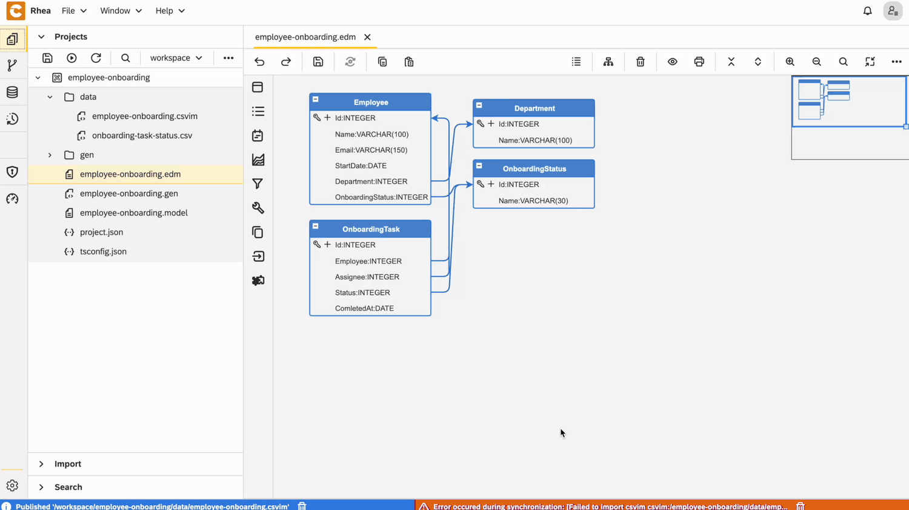

## Conclusion

Ready to build your own? [Click here](LINK) to learn more or access the Employee Onboarding Sample App.
By following this guide, you've taken the first steps in building a well-structured Entity Data Model using **`codbex Rhea`**. Through the **`Sample Employee Onboarding Process`**, we've demonstrated how to define entities, set up relationships, and create a model that accurately represents your data. Whether you're scaling this up for a larger system or just experimenting to learn, this foundation will serve you well in any project. Keep exploring, keep modeling—and don’t forget, a well-designed data model is the backbone of a successful application.

::: details Other blogs
- [Onboarding Process Tutorial 1: EDM Configuration](https://codbex.com/technology/2025/05/08/onboarding-process-1-edm-configuration)
- [Onboarding Process Tutorial 2: BPMN Configuration - Service Task Definition](https://codbex.com/technology/2025/05/09/onboarding-process-2-services-task)
- [Onboarding Process Tutorial 3: SMTP Connection](https://codbex.com/technology/2025/05/10/onboarding-process-3-smtp)
- [Onboarding Process Tutorial 4: User Task Definition and Logical Gateways](https://codbex.com/technology/2025/05/11/onboarding-process-4-user-task-logical-gateways)
- [Onboarding Process Tutorial 5: Configuring-Subprocess](https://codbex.com/technology/2025/05/12/onboarding-process-5-subprocess)
- [Onboarding Process Tutorial 6: Completing Onboarding Process](https://codbex.com/technology/2025/05/13/onboarding-process-6-final-steps)
:::

