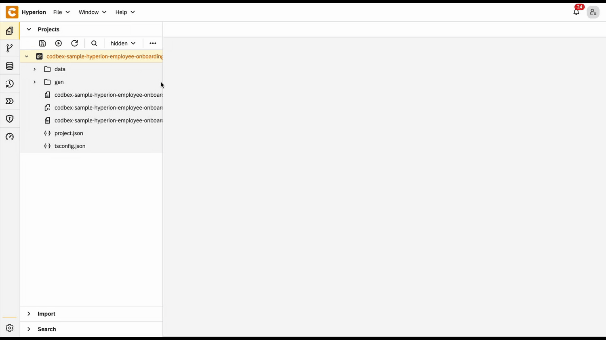
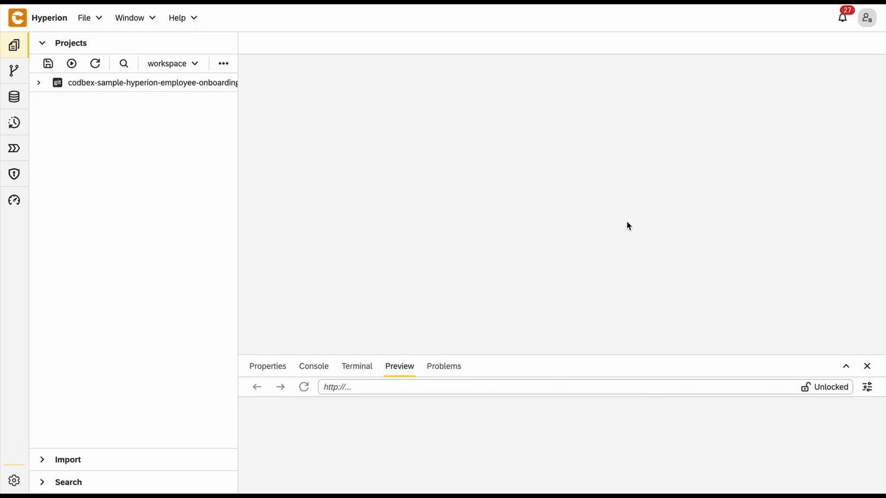
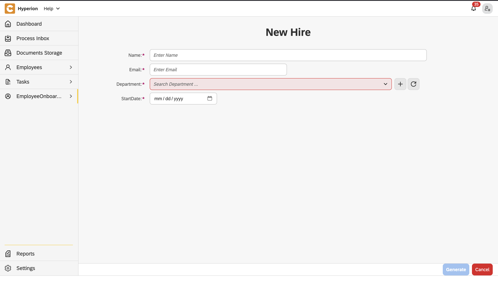

# Onboarding Process Tutorial 2: BPMN Configuration - Service Task Definition

## Introduction

In today’s dynamic digital landscape, building efficient and adaptable business processes is crucial for organizational success. **Hyperion Edition** gives users the ability to model and automate workflows with ease through its intuitive, low-code tools. Its key feature is **BPMN (Business Process Model and Notation)**, which brings visual clarity and precision to process modeling. With BPMN in Hyperion, users can design, execute, and optimize complex workflows using a standardized graphical notation. This powerful capability bridges the gap between business and IT, ensuring that even the most intricate processes are easy to visualize, manage, and refine.

## BPMN File

### Creating BPMN File

To start the implementation of a process a BPMN file needs to be created. In the same project from the previous tutorial create a file with **.bpmn** extension:

 - Right click on the **Project Name** → **New** → **Business Process Model**
 - Type the **`onboarding-process.bpmn`** as a name
 - Click **create**



### Configuring BPMN

For the configuration of the BPMN to be finished a **process id** and **name** must be provided. By default they are specified as **"myprocess"** and **"MyProcess"** respectively.

- Open the BPMN file
- In the **Process Identifier** field type **`onboarding-process`**
- In the **Name** field type **`Onboarding Process`**
- Save the changes


## Service Tasks

Tasks are elements of the BPMN that allow you to define a single step in the execution of the process. There are different kinds of tasks. **Service Tasks** define an operation done internally (only on the **server side** of the platform) by the process. They don't require resources by other services nor supervision by users. They are marked by a **cogwheel** in the upper left corner.

### Configuring Service Task

The recently created BPMN file has a diagram of two circles connected to a rectangle. The left circle is a **start event** - signalizing where the process starts - and the second one is **end event**. The rectangle is the **service task**.
To configure it we not only need to give it **Id** and **Name** but also define what it would do. This is done by writing a **TypeScript** file and connecting it to the task.

- Create a folder for the definitions of the tasks called **`tasks`**
- In the new folder create a file called **`document-generation.ts`**
- Paste the following code in the file

<details>
  <summary>📄 View code</summary>

```typescript
import { OnboardingTaskRepository as OnboardingTaskDao } from "codbex-sample-hyperion-employee-onboarding/gen/codbex-sample-hyperion-employee-onboarding/dao/OnboardingTask/OnboardingTaskRepository";
import { EmployeeRepository as EmployeeDao } from "codbex-sample-hyperion-employee-onboarding/gen/codbex-sample-hyperion-employee-onboarding/dao/Employee/EmployeeRepository";

import { process } from "sdk/bpm";

const onboardingTaskDao = new OnboardingTaskDao();
const employeeDao = new EmployeeDao();

const execution = process.getExecutionContext();
const executionId = execution.getId();

const employeeId = process.getVariable(executionId, "Employee");
const taskLink = process.getVariable(executionId, "TaskLink");

const employee = employeeDao.findById(employeeId);
if (!employee) {
	throw new Error(`Employee with ID ${employeeId} not found!`);
}

const hrTaskSteps = `1. Gather required employee information.
2. Draft and review the employment contract.
3. Share the finalized contract with the new hire for signature.`;

let hrTaskBody = {
	"Employee": employeeId,
	"Name": "Contract Preparation",
	"Description": hrTaskSteps,
	"Status": 1,
	"Link": taskLink,
};

const itSetupSteps = `1. Request necessary hardware and software for the new hire.
2. Set up user accounts, email, and access permissions.
3. Test and confirm all systems are working before the start date.`;

let itTaskBody = {
	"Employee": employeeId,
	"Name": "IT Setup",
	"Description": itSetupSteps,
	"Status": 1,
	"Link": taskLink,
};

const departmentTrainingSteps = `1. Schedule training sessions with the relevant team or manager.
2. Provide access to training materials and documentation.
3. Monitor progress and address any questions or support needs.`;

let managerTaskBody = {
	"Employee": employeeId,
	"Name": "Department Training",
	"Description": departmentTrainingSteps,
	"Status": 1,
	"Link": taskLink,
};

let tasks = [hrTaskBody, itTaskBody, managerTaskBody];

tasks.forEach(task => {
	const newTask = onboardingTaskDao.create(task);

	if (!newTask) {
    	throw new Error("Task creation failed!");
	}
})

execution.setVariable("tasks", tasks);

employee.Status = 2;

employeeDao.update(employee);
```

</details>

> 💡 **Note**   
> This code uses the generated **DAO** from the **EDM model**. It retrieves the current process context and employee ID from the BPM system, verifies if employee exists, and then creates three onboarding tasks: **`HR contract preparation`**, **`IT setup`** and **`Department training`**. Each task is structured with details like **name**, **description**, **status** and a **tracking link**, then saved to the database. The tasks are also stored in the **process context** for reference, and the employee's onboarding status is updated to **`"In Progress"`** to reflect the workflow's advancement.

- Open the BPMN again
- Click on the **service task**
- In the **Id** field type **`document-generation`**
- In the **Name** field type **`Document Generation`**
- Click on the **Class** field → the **+** button to add handler entry
- In the **Name** field type **`handler`**
- In the **String value** field type the link to the task definition **`codbex-sample-hyperion-employee-onboarding/tasks/document-generation.ts`**
- Click **Save**
- Save the changes to the file


## HR Initiation Form

Now that the **BPMN** is configured there needs to be a way to start it. In the business logic of the onboarding process this would happen when a HR of the company enters the details of the new hire.
For this to happen there needs to be a **form** where the information can be submitted.

### Form Configuration

Follow these steps to create the necessary folder structure and file:

1. Create a folder named **`forms`**.

2. Inside the **`forms`** folder, create another folder named **`NewHireDetails`**.

3. Still within the **`forms`** folder, create a new file named **`new-hire-details-generate.js`** and place the required code inside it.

<details>
  <summary>📄 View code</summary>

```
const viewData = {
    id: 'NewHire',
    label: 'NewHire',
    path: '/services/web/codbex-sample-hyperion-employee-onboarding/forms/NewHireDetails/new-hire-details-form.html',
    groupId: 'EmployeeOnboarding',
    order: 1,
    icon: '/services/web/resources/unicons/users-alt.svg'
};
if (typeof exports !== 'undefined') {
    exports.getPerspective = () => viewData;
}
```
</details>


> 💡 **Note**  
> This code creates a **perspective**, sets the **view** within that perspective, and specifies **where in the navigation** that perspective should appear.


4. Within the **`forms`** folder, create a new file named **`new-hire-details-form.html`** and place the required code inside it.

<details>
  <summary>📄 View code</summary>
  
```
<!DOCTYPE html>
<html lang="en" xmlns="http://www.w3.org/1999/xhtml" ng-app="templateApp" ng-controller="templateController">

    <head>
        <meta charset="utf-8" />
        <meta name="viewport" content="width=device-width, initial-scale=1">
        <link rel="icon" sizes="any" href="data:;base64,iVBORw0KGgo=">
        <title config-title></title>
        <script type="text/javascript" src="new-hire-details-generate.js"></script>
        <script type="text/javascript" src="/services/js/platform-core/services/loader.js?id=view-js"></script>
        <link type="text/css" rel="stylesheet" href="/services/js/platform-core/services/loader.js?id=view-css" />
        <script src="new-hire-details-form-controller.js"></script>
    </head>

    <body class="bk-vbox">
        <h2 bk-title class="bk-padding--md bk-center" wrap="true" header-size="2" aria-label="title">New Hire</h2>
        <bk-scrollbar class="bk-full-height">
            <bk-fieldset class="bk-padding-begin-end--sm bk-margin-top--lg" ng-form="forms.details">
                <bk-form-group label="{{formHeaders[action]}}" name="entityForm" transclude-classes="fd-container fd-form-layout-grid-container">
                    <bk-form-item class="fd-row">
                        <div class="fd-col fd-col-md--2">
                            <bk-form-label for="idName" ng-required="true" colon="true">Name</bk-form-label>
                        </div>
                        <div class="fd-col  fd-col-md--8 ">
                            <bk-form-input-message state="{{ forms.details['Name'].$valid ? '' : 'error' }}" message="'The value doesn\'t match the required pattern: '">
                                <bk-input id="idName" name="Name" state="{{ forms.details['Name'].$valid ? '' : 'error' }}" ng-required="true" ng-model="entity.Name" ng-readonly="action === 'select'" ng-maxlength="100.0"
                                    input-rules="{ patterns: [''] }" type="text" placeholder="Enter Name">
                                </bk-input>
                            </bk-form-input-message>
                        </div>
                    </bk-form-item>
                    <bk-form-item class="fd-row">
                        <div class="fd-col fd-col-md--2">
                            <bk-form-label for="idEmail" ng-required="true" colon="true">Email</bk-form-label>
                        </div>
                        <div ng-show="action === 'select'" style="margin: 4px 0px; padding: 0px 10px" class="fd-col  fd-col-md--8 ">
                            <bk-link href="mailto:{{entity.Email}}">{{entity.Email}}</bk-link>
                        </div>
                        <div ng-show="action !== 'select'" class="fd-col  fd-col-md--4 ">
                            <bk-form-input-message state="{{ forms.details['Email'].$valid ? '' : 'error' }}" message="'The value doesn\'t match the required pattern: '">
                                <bk-input id="idEmail" name="Email" state="{{ forms.details['Email'].$valid ? '' : 'error' }}" ng-required="true" ng-model="entity.Email" ng-readonly="action === 'select'" ng-maxlength="80.0"
                                    input-rules="{ patterns: [''] }" type="email" placeholder="Enter Email">
                                </bk-input>
                            </bk-form-input-message>
                        </div>
                    </bk-form-item>
                    <bk-form-item class="fd-row">
                        <div class="fd-col fd-col-md--2">
                            <bk-form-label for="idDepartment" ng-required="true" colon="true">Department</bk-form-label>
                        </div>
                        <div class="fd-col  fd-col-md--7 ">
                            <bk-combobox-input input-id="idDepartment" name="Department" state="{{ forms.details['Department'].$valid ? '' : 'error' }}" ng-required="true" ng-model="entity.Department" is-readonly="action === 'select'"
                                dropdown-items="optionsDepartment" placeholder="Search Department ..." btn-aria-label="show/hide Department options" list-aria-label="Department options">
                            </bk-combobox-input>
                        </div>
                        <div class="fd-col fd-col--full">
                            <bk-button glyph="sap-icon--add" aria-label="Add" ng-click="createDepartment()" ng-hide="action === 'select'"></bk-button>
                            <bk-button glyph="sap-icon--refresh" aria-label="Refresh" ng-click="refreshDepartment()" ng-hide="action === 'select'"></bk-button>
                        </div>
                    </bk-form-item>
                    <bk-form-item class="fd-row">
                        <div class="fd-col fd-col-md--2">
                            <bk-form-label for="idStartDate" ng-required="true" colon="true">StartDate</bk-form-label>
                        </div>
                        <div class="fd-col  fd-col-md--2 ">
                            <bk-form-input-message state="{{ forms.details['StartDate'].$valid ? '' : 'error' }}" message="'Incorrect Input'">
                                <bk-input id="idStartDate" name="StartDate" state="{{ forms.details['StartDate'].$valid ? '' : 'error' }}" ng-required="true" ng-model="entity.StartDate" ng-readonly="action === 'select'" type="date">
                                </bk-input>
                            </bk-form-input-message>
                        </div>
                    </bk-form-item>
                </bk-form-group>
            </bk-fieldset>
        </bk-scrollbar>
        <bk-bar bar-design="footer" class="bk-margin-top--md">
            <bk-bar-right>
                <bk-bar-element>
                    <bk-button label="Generate" state="emphasized" ng-click="createNewHire()" ng-disabled="!(entity.Name && entity.Email && entity.Department && entity.StartDate)"></bk-button>
                </bk-bar-element>
                <bk-bar-element>
                    <bk-button label="Cancel" state="negative" ng-click="resetForm()"></bk-button>
                </bk-bar-element>
            </bk-bar-right>
        </bk-bar>
        <theme></theme>
    </body>
</html>
```
</details>

> 💡 **Note**  
> This is the **HTML layout** of the view. It consists of a **form**  
> that must be filled out to register a new onboarding employee.


5. Within the **`forms`** folder, create a new file named **`new-hire-details-form-controller.js`** and place the required code inside it.


<details>
  <summary>📄 View code</summary>

```
angular.module('templateApp', ['blimpKit', 'platformView']).controller('templateController', ($scope, $http) => {

    $scope.entity = {};
    $scope.forms = {
        details: {},
    };

    const departmentsUrl =
        "/services/ts/codbex-sample-hyperion-employee-onboarding/forms/NewHireDetails/api/NewHireDetailsFormService.ts/departmentData";
    const employeeUrl =
        "/services/ts/codbex-sample-hyperion-employee-onboarding/forms/NewHireDetails/api/NewHireDetailsFormService.ts/createEmployee";

    $http.get(departmentsUrl)
        .then(response => {
            $scope.optionsDepartment = response.data;
        })
        .catch((error) => {
            console.error("Error getting departments data: ", error);
            $scope.resetForm();
        });

    $scope.createNewHire = () => {

        const employeeBody = {
            Name: $scope.entity.Name,
            Email: $scope.entity.Email,
            Department: $scope.entity.Department,
            StartDate: new Date($scope.entity.StartDate),
            Status: 1
        }

        $http.post(employeeUrl, employeeBody)
            .then(response => {
                if (response.status == 201) {
                    $scope.resetForm();
                }
                else {
                    console.error("Error creating Employee: ", response.data);
                }
            })
            .catch((error) => {
                console.error("Error creating Employee: ", error.data);
                $scope.resetForm();
            });
    }

    $scope.resetForm = () => {
        $scope.entity = {};
    };

});
```
</details>

> 💡 **Note**  
> The **controller** acts as an intermediary between the frontend and the backend. It receives data from the frontend, then passes it to a TypeScript service. The service, in turn, processes the data and interacts with the database to fetch or manipulate the required information.


6. Inside the `forms` folder, create a new folder named **`api`**, then create a file called **`NewHireDetailsFormService.ts`** within it. Place the following code inside this file:


<details>
  <summary>📄 View code</summary>

```
import { EmployeeRepository as EmployeeDao } from "codbex-sample-hyperion-employee-onboarding/gen/codbex-sample-hyperion-employee-onboarding/dao/Employee/EmployeeRepository";
import { DepartmentRepository as DepartmentDao } from "codbex-sample-hyperion-employee-onboarding/gen/codbex-sample-hyperion-employee-onboarding/dao/Settings/DepartmentRepository";

import { Controller, Get, Post, response, request } from "sdk/http";
import { process } from "sdk/bpm";
import { user } from "sdk/security";

@Controller
class NewHireDetailsFormService {

    private readonly employeeDao;
    private readonly departmentDao;

    constructor() {
        this.employeeDao = new EmployeeDao();
        this.departmentDao = new DepartmentDao();
    }

    @Get("/departmentData")
    public departmentData() {
        return this.departmentDao.findAll().map(function (value) {
            return {
                value: value.Id,
                text: value.Name
            };
        });
    }

    @Post("/createEmployee")
    public createEmployee(body: any) {

        try {
            ["Name", "Email", "Department", "StartDate"].forEach(elem => {
                if (!body.hasOwnProperty(elem)) {
                    response.setStatus(response.BAD_REQUEST);
                    return;
                }
            })

            const newEmployee = this.employeeDao.create(body);

            if (!newEmployee) {
                response.setStatus(500);
                return { message: "Failed to create Employee!" };
            }

            this.startProcess(newEmployee);

            response.setStatus(response.CREATED);
            return { message: "Employee created!" };

        } catch (e: any) {
            response.setStatus(response.BAD_REQUEST);
            return { error: e.message };
        }
    }

    private startProcess(employeeId: number) {
        const users = this.employeeDao.findAll({
            $filter: {
                equals: {
                    Email: user.getName()
                }
            }
        });

        const protocol = request.getScheme() + "://";
        const domain = request.getHeader("Host")

        const taskLink = `${protocol}${domain}/services/web/codbex-sample-hyperion-employee-onboarding/forms/TaskCompletion/task-completion-form.html?employeeId=${employeeId}`;
        const managerLink = `${protocol}${domain}/services/web/codbex-sample-hyperion-employee-onboarding/forms/ManagerReview/manager-review-form.html?employeeId=${employeeId}`;
        const onboardingInitiatorLink = `${protocol}${domain}/services/web/codbex-sample-hyperion-employee-onboarding/forms/HRConfirmation/hr-confirmation-form.html?employeeId=${employeeId}`;

        const processInstanceId = process.start("onboarding-process", {
            Employee: employeeId,
            TaskLink: taskLink,
            Manager: 1, 
            ManagerLink: managerLink,
            OnboardingInitiator: users[0].Id,
            OnboardingInitiatorLink: onboardingInitiatorLink
        });

        if (!processInstanceId) {
            throw new Error("Failed to start onboarding process!");
        }
    }

}
```

</details>

> 💡 **Note**  
> This service handles communication with the database. It processes the data passed from the controller and interacts with the database to perform the necessary operations, such as fetching, inserting, or updating records.


## Test BPMN Process

### Configuring HR User

For the process to start new hire details need to be submitted. For that to happen there needs to be a registered employee to act as the HR.

- Go to the **Dashboard** of the application at http://localhost/services/web/dashboard/ → Click the **Employee Navigation**
- Create an employee with all needed fields
- Go to the **Security editor** and create a user


- Set the username of the user the same as the email of the employee created in the previous step
- Set the tenant as default

### Starting the process

Now everything is ready to start the process.

- To simulate the start of the onboarding process you need to **logout** of the **admin user** and login with the HR user



- Go to the **Dashboard** of the application at http://localhost/services/web/dashboard/ → Click the **New Hire Navigation**



- Enter the details of the new hire
- After some time the tasks of the onboarding process will be created. To view them go to the **Dashboard** of the application at http://localhost/services/web/dashboard/ → Click the **Onboarding Tasks Navigation**


::: details Other blogs
- [Onboarding Process Tutorial 1: EDM Configuration](https://codbex.com/technology/2025/05/08/onboarding-process-1-edm-configuration)
- [Onboarding Process Tutorial 2: BPMN Configuration - Service Task Definition](https://codbex.com/technology/2025/05/09/onboarding-process-2-services-task)
- [Onboarding Process Tutorial 3: SMTP Connection](https://codbex.com/technology/2025/05/10/onboarding-process-3-smtp)
- [Onboarding Process Tutorial 4: User Task Definition and Logical Gateways](https://codbex.com/technology/2025/05/11/onboarding-process-4-user-task-logical-gateways)
- [Onboarding Process Tutorial 5: Configuring Subprocess](https://codbex.com/technology/2025/05/12/onboarding-process-5-subprocess)
- [Onboarding Process Tutorial 6: Completing Onboarding Process](https://codbex.com/technology/2025/05/13/onboarding-process-6-final-steps)
:::