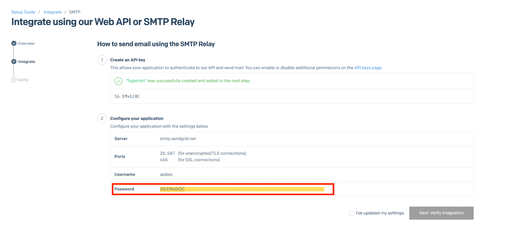
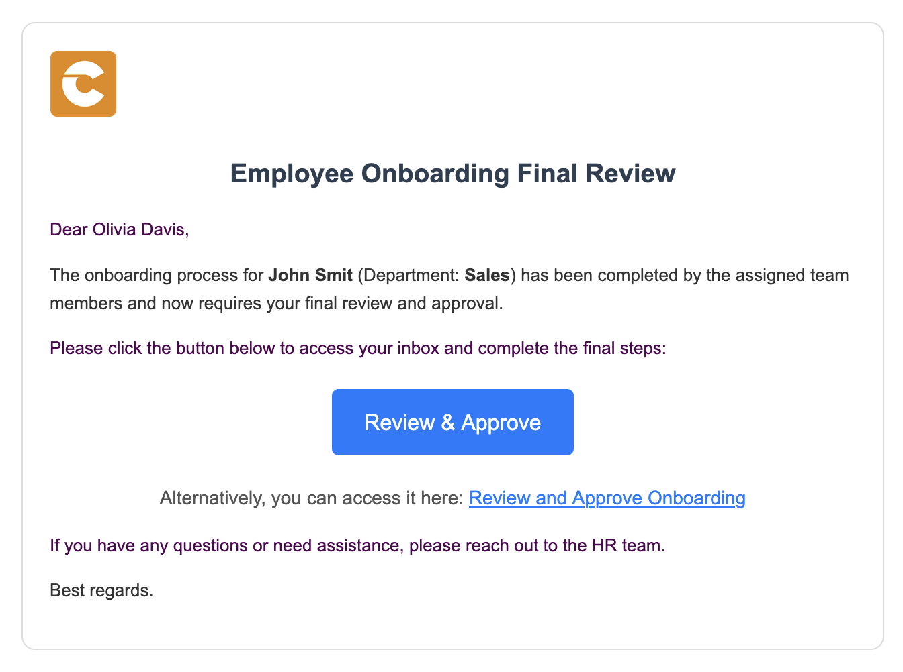

# Onboarding Process Tutorial 3: SMTP Connection

## Introduction

In the era of automation and seamless communication, integrating messaging capabilities into business processes is more essential than ever. **Hyperion Edition** takes this a step further by enabling users to automate email workflows directly within BPMN models. By configuring **SMTP connection**, users can configure automated email sending as part of any process, whether it’s sending confirmations, alerts, or reports. This feature eliminates the need for external tools, allowing emails to be triggered dynamically based on process logic — all within a fully No-Code environment.

## SendGrid Configuration

Twilio SendGrid's SMTP Relay feature enables you to send emails with your personal gmail account. That's the service that will be used for the purposes of this tutorial.

### Verifying a Single Sender

-   Create a SendGrid account at [https://sendgrid.com](https://sendgrid.com).
-   Login at [https://app.sendgrid.com](https://app.sendgrid.com/).
-   Click **Settings** → **Sender Authentication** → **Verify a Single Sender**.
-   Enter the details of the email address that will send all automated mails.


### Setup SMTP Relay

-   Click **Email API** → **Integration Guide** → **SMTP Relay**.
-   Enter an API Key Name and click **Create Key** to get an API Key for your SendGrid SMTP Relay.
-   Notice the **Configure your application** section, the credentials from it will be used to configure the mail client.



## Hyperion Configuration

For **Hyperion** to connect to **SendGrids' Service** it needs some **Environment Variables**. Full list of them can be found in the [Environment Variables](https://www.dirigible.io/help/setup/setup-environment-variables/) section.

These are the needed **envs**:
```
DIRIGIBLE_MAIL_USERNAME=apikey
DIRIGIBLE_MAIL_PASSWORD=<YOUR_API_KEY_HERE>
DIRIGIBLE_MAIL_TRANSPORT_PROTOCOL=smtp
DIRIGIBLE_MAIL_SMTP_HOST=smtp.sendgrid.net
DIRIGIBLE_MAIL_SMTP_PORT=587
DIRIGIBLE_MAIL_SMTP_AUTH=true
ONBOARDING_EMAIL=<YOUR_VERIFIED_SENDGRID_EMAIL>
```
These **envs** must be added to the **starting command** of **Hyperion**. For **Docker image start** it will look like this:

```
docker run --name hyperion \
-p 80:80 \
-e DIRIGIBLE_MAIL_USERNAME=apikey \
-e DIRIGIBLE_MAIL_PASSWORD=<YOUR_API_KEY_HERE> \
-e DIRIGIBLE_MAIL_TRANSPORT_PROTOCOL=smtp \
-e DIRIGIBLE_MAIL_SMTP_HOST=smtp.sendgrid.net \
-e DIRIGIBLE_MAIL_SMTP_PORT=587 \
-e DIRIGIBLE_MAIL_SMTP_AUTH=true \
-e ONBOARDING_EMAIL=<YOUR_VERIFIED_SENDGRID_EMAIL> \
ghcr.io/codbex/codbex-hyperion:latest
```

## Onboarding Announcement Service Task

Now that **Hyperion** is prepared to use **SendGrids SMTP services** we can implement email automation in the process.

### Creating Service Task

- Open the **BPMN** file
- From **Activities** grab a **Service Task** and place it in the diagram space
- Connect the **Document Generation** task to the new one
- The new one connect to the end event


- Click on the new task to open its properties
- In the **Id** field type **`onboarding-announcement`**
- In the **Name** field type **`Onboarding Announcement`**
- In the **Delegate Expression** field type **`${JSTask}`**
- Click on the **Class** field → the **+** button to add handler entry
- In the **Name** field type **`handler`**
- In the **String value** field type the link to the task definition **`codbex-sample-hyperion-employee-onboarding/tasks/onboarding-announcement.ts`**


### Mail Util

Throughout the process many services will be sending automated emails. To avoid code repetition a simple mail utility file can be created.

- In the tasks folder create a file called **`mail-util.ts`**
- In the new file paste the following code:

<details>
  <summary>📄 View code</summary>

```typescript
import { configurations } from  "sdk/core";
import { logging } from  "sdk/log";
import { client as mailClient } from  "sdk/mail";

const logger = logging.getLogger("mail-util.ts");

function isMailConfigured() {
	return configurations.get("DIRIGIBLE_MAIL_USERNAME") &&
    	configurations.get("DIRIGIBLE_MAIL_PASSWORD") &&
    	configurations.get("DIRIGIBLE_MAIL_TRANSPORT_PROTOCOL") &&
    	(
        	(configurations.get("DIRIGIBLE_MAIL_SMTPS_HOST") && configurations.get("DIRIGIBLE_MAIL_SMTPS_PORT") && configurations.get("DIRIGIBLE_MAIL_SMTPS_AUTH"))
        	||
        	(configurations.get("DIRIGIBLE_MAIL_SMTP_HOST") && configurations.get("DIRIGIBLE_MAIL_SMTP_PORT") && configurations.get("DIRIGIBLE_MAIL_SMTP_AUTH"))
    	);

}

export  function sendMail(reciever: string, subject: string, content: string) {

const sender = configurations.get("ONBOARDING_EMAIL");

if (isMailConfigured()) {
	logger.info("Sending mail to [{}] with subject [{}] and content: [{}]...", reciever, subject, content);
	mailClient.send(sender, reciever, subject, content, 'html');
} else {
	logger.error(`Mail to: ${reciever} with subject: ${subject} and content: ${content} will NOT be send because the mail client is not configured!`);
	throw  new  Error(`Mail to: ${reciever} with subject: ${subject} and content: ${content} will NOT be send because the mail client is not configured!`);
	}
}

```

</details>

> 💡 **Note**  
> This code defines the **utility to send emails** in **Hyperion** by first checking if the **mail client** is properly configured using the required **environment variables** (username, password, protocol, and SMTP/SMTPS details). If configuration is valid, it logs the action and sends an **HTML email** using the **inner mail library**; otherwise, it logs and throws an error indicating the email could not be sent due to **missing configuration**.

### Onboarding Announcement Definition

- In the tasks folder create a file called **`onboarding-announcement.ts`**
- Paste the following code in the file:

<details>
  <summary>📄 View code</summary>

```typescript
import { EmployeeRepository  as  EmployeeDao } from  "codbex-sample-hyperion-employee-onboarding/gen/codbex-sample-hyperion-employee-onboarding/dao/Employee/EmployeeRepository";
import { DepartmentRepository  as  DepartmentDao } from  "codbex-sample-hyperion-employee-onboarding/gen/codbex-sample-hyperion-employee-onboarding/dao/Department/DepartmentRepository";

import { process } from  "sdk/bpm";
import { sendMail } from  "./mail-util";

const employeeDao = new  EmployeeDao();
const departmentDao = new  DepartmentDao();

const execution = process.getExecutionContext();
const executionId = execution.getId();

const managerId = process.getVariable(executionId, "Manager");
let managerLink = process.getVariable(executionId, "ManagerLink");
const employeeId = process.getVariable(executionId, "Employee");

const manager = employeeDao.findById(managerId);
if (!manager) {
throw  new  Error(`Employee with ID ${managerId} not found!`);
}

const employee = employeeDao.findById(employeeId);
if (!employee) {
throw  new  Error(`Employee with ID ${employeeId} not found!`);
}

const departmentName = departmentDao.findById(employee.Department).Name;

const subject = "Employee Onboarding Review";
const processInstanceId = execution.getProcessInstanceId();

managerLink = `${managerLink}&processId=${processInstanceId}`;

const content = `
<div style="font-family: Arial, sans-serif; line-height: 1.6; color: #333; max-width: 600px; margin: auto; padding: 20px; border: 1px solid #ddd; border-radius: 10px;">
	<div style="text-align: left; margin-bottom: 20px;">
    	
	</div>
	<h2 style="color: #2c3e50; text-align: center;">Action Required: Onboarding Task Assignment</h2>
	<p>Dear ${manager.Name},</p>
	<p>An onboarding request has been submitted for <strong>${employee.Name}</strong> (Department: <strong>${departmentName}</strong>), and it requires your attention.</p>
	<p>Please review the onboarding details and assign responsible team members to the relevant tasks.</p>
	<p>Once all assignments are completed, kindly approve the onboarding process to proceed.</p>
	<div style="text-align: center; margin: 20px 0;">
    	<a href="${managerLink}" target="_blank" style="
        	display: inline-block;
        	padding: 12px 24px;
        	font-size: 16px;
        	color: #fff;
        	background-color: #007bff;
        	text-decoration: none;
        	border-radius: 5px;
    	">Review & Assign Tasks</a>
	</div>
	<p style="text-align: center; font-size: 14px; color: #555;">
    	Alternatively, you can access it here:
        	<a href="${managerLink}" target="_blank" style="color: #007bff; text-decoration: underline;">
            	Review Onboarding Details
        	</a>
	</p>
	<p>If you have any questions or need assistance, please contact the HR team.</p>
	<p>Best regards.</p>
</div>
`;

sendMail(manager.Email, subject, content);

```

</details>

> 💡 **Note**  
> This script  retrieves the manager, employee, and department details from the database using their respective DAOs, constructs a personalized HTML email prompting the manager to review and assign onboarding tasks, and sends the email using a mail utility. It ensures the necessary data is present, generates a dynamic link to the onboarding process, and includes professional formatting to guide the manager's next steps.
The manager form will be created in the next tutorial

## Test BPMN Process

- Go to the **Dashboard** of the application at http://localhost/services/web/dashboard/ → Click the **New Hire Navigation**
- Enter the details of the new hire
- After some time the tasks of the onboarding process will be created. To view them go to the **Dashboard** of the application at http://localhost/services/web/dashboard/ → Click the **Onboarding Tasks Navigation**
- Check the manager's email. There should be a mail.



::: details Other blogs
- [Onboarding Process Tutorial 1: EDM Configuration](https://codbex.com/technology/2025/05/08/onboarding-process-1-edm-configuration)
- [Onboarding Process Tutorial 2: BPMN Configuration - Service Task Definition](https://codbex.com/technology/2025/05/09/onboarding-process-2-services-task)
- [Onboarding Process Tutorial 3: SMTP Connection](https://codbex.com/technology/2025/05/10/onboarding-process-3-smtp)
- [Onboarding Process Tutorial 4: User Task Definition and Logical Gateways](https://codbex.com/technology/2025/05/11/onboarding-process-4-user-task-logical-gateways)
- [Onboarding Process Tutorial 5: Configuring Subprocess](https://codbex.com/technology/2025/05/12/onboarding-process-5-subprocess)
- [Onboarding Process Tutorial 6: Completing Onboarding Process](https://codbex.com/technology/2025/05/13/onboarding-process-6-final-steps)
:::