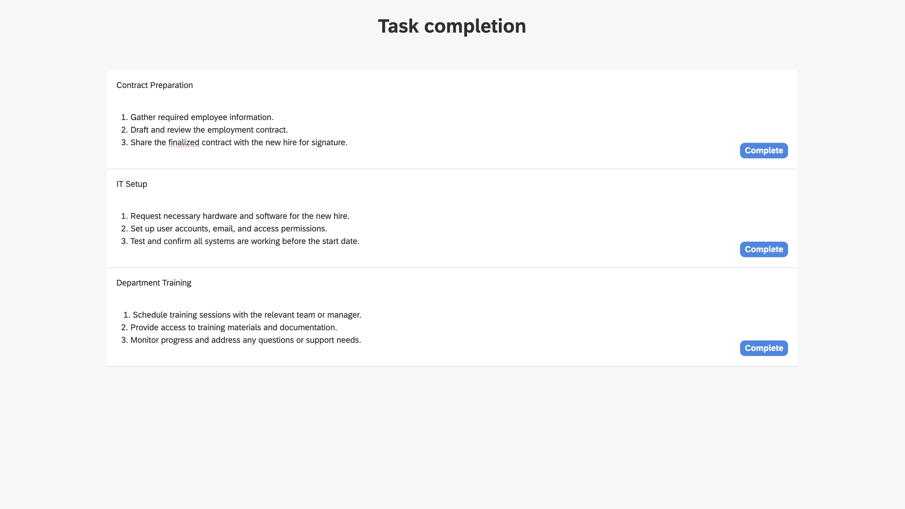

# Onboarding Process Tutorial 5: Configuring-Subprocess

## Introduction

As business processes grow more complex, the need for modular and scalable workflow design becomes essential. **Hyperion Edition** meets this challenge with its support for **Subprocesses in BPMN**, allowing users to group related tasks into self-contained units for better organization and reuse. These subprocesses can be configured for **parallel** or **sequential** execution, giving users full control over how tasks are handled within each block. Whether tasks need to run simultaneously to save time or in a strict order to maintain dependencies, this flexibility ensures that processes are both efficient and logically sound.

## Subprocess

To incorporate the onboarding task created by the first service - **Document Generation**, a subprocess can be used. It will notify the assignees via email and wait for them to complete their forms. The mail for each assignee should send at the same time and the subprocess should wait all of the forms to be fullfiled before continuing the executions. That would be accomplished by having a parallel execution of the tasks in the subprocess

### Subprocess definition

- Open the **BPMN** file
- Disconnect the **end event** of the **logical gateway**
- From **Structural** grab a **Sub process** and place it in the diagram field
- Connect the end of the **logical gateway** to the **subprocess**
- Connect the **subprocess** to the **end event**


### Subprocess configuration

To make the subprocess execution parallel there needs to be a variable holding the employees fow which we want the services in the subprocess to execute. The subprocess esentially iterates this array variable. We've created this variable in the **Manager Review form**, so it's already in the execution context.

- Click on the subprocess
- In the **Id** field type **`onboarding-tasks-implementation`**
- In the **Name** field type **`Onboarding Tasks Implementation`**
- In the **Multi-instance type** field choose **`Parallel`**
- In the **Collection (Multi-instance)** field type **$`{TaskAssignees}`**
- In the **Element variable (Multi-instance)** field type **$`task`**. This will be the current element of the array in the iteration.


### Subprocess tasks

There needs to be a service task to send emails to the assignees and a user task to wait for it's coresponding form to be fullfiled.

- Add a **start event** to the **subprocess**
- Add a **service task** and connect the **start event** to it
- Add a **user task** and connect the **service task** to it
- Add an **end event** and connect the **user task** to it


## Notifying Assignees

### Service task configuration

-	Click on the service task in the subprocess to open its properties
-	In the **Id** field type **`task-assignee-announcement`**
-	In the **Name** field type **`Task Assignee Announcement`**
-	In the **Delegate Expression** field type **`${JSTask}`**
-	Click on the **Class** field → the **+** button to add handler entry
-	In the **Name** field type **`handler`**
-	In the **String value** field type the link to the task definition **`codbex-sample-hyperion-employee-onboarding/tasks/task-assignee-announcement.ts`**


### Service task definition

- In the tasks folder create a file called **`task-assignee-announcement.ts`**
- Paste the following code in the file

<details>
  <summary>📄 View code</summary>

```typescript
import { EmployeeRepository as EmployeeDao } from "codbex-sample-hyperion-employee-onboarding/gen/codbex-sample-hyperion-employee-onboarding/dao/Employee/EmployeeRepository";
import { DepartmentRepository as DepartmentDao } from "codbex-sample-hyperion-employee-onboarding/gen/codbex-sample-hyperion-employee-onboarding/dao/Department/DepartmentRepository";

import { process } from "sdk/bpm";
import { sendMail } from "./mail-util";

const employeeDao = new EmployeeDao();
const departmentDao = new DepartmentDao();

const execution = process.getExecutionContext();
const executionId = execution.getId();
const processInstanceId = execution.getProcessInstanceId();

const task = process.getVariable(executionId, "task");
const employeeId = process.getVariable(executionId, "Employee");

const newHire = employeeDao.findById(employeeId);
if (!newHire) {
  throw new Error(`Employee with ID ${employeeId} not found!`);
}

const employee = employeeDao.findById(task.Assignee);
if (!employee) {
  throw new Error(`Employee with ID ${task.Assignee} not found!`);
}

const departmentName = departmentDao.findById(newHire.Department).Name;

const subject = task.Name;
console.log("Subject: ", subject);

const finalLink = `${task.Link}&processId=${processInstanceId}`;

const content = `
  <div style="font-family: Arial, sans-serif; line-height: 1.6; color: #333; max-width: 600px; margin: auto; padding: 20px; border: 1px solid #ddd; border-radius: 10px;">
    <div style="text-align: left; margin-bottom: 20px;">
      
    </div>
    <h2 style="color: #2c3e50; text-align: center;">New Onboarding Task Assigned</h2>
    <p>Dear ${employee.Name},</p>
    <p>You have been assigned a new onboarding task related to <strong>${newHire.Name}</strong> (Department: <strong>${departmentName}</strong>).</p>
    <p>Please click the button below to access your inbox and complete the required steps:</p>
    <div style="text-align: center; margin: 20px 0;">
      <a href="${finalLink}" target="_blank" style="
        display: inline-block;
        padding: 12px 24px;
        font-size: 16px;
        color: #fff;
        background-color: #007bff;
        text-decoration: none;
        border-radius: 5px;
      ">Fulfill Task</a>
    </div>
    <p style="text-align: center; font-size: 14px; color: #555;">
      Alternatively, you can access it here: 
      <a href="${finalLink}" target="_blank" style="color: #007bff; text-decoration: underline;">
        Fulfill Your Onboarding Task
      </a>
    </p>
    <p>If you have any questions or need support, please contact the HR team.</p>
    <p>Best regards.</p>
  </div>
`;

sendMail(employee.Email, subject, content);

```

</details>

> 💡 **Note**  
> This script sends a notification email to an employee when they are
> assigned a new onboarding task related to a recently hired colleague. It  
> retrieves the task, new hire, and assignee details from the BPM process
> and the database, constructs a professional HTML email containing task 
> information and a direct link to the task page, and sends it using a mail
> utility. The email prompts the assignee to take action promptly to support
> the onboarding process.

## Assignee User Task

To not create a separate **form** for each assignee a single **form** and **user task** will be used.

### User task configuration

-	In the **Id** field type **`generic-user-task`**
-	In the **Name** field type **`Generic User Task`**


### Assignee form

1. Inside the **`forms`** folder, create another folder named **`TaskCompletion`**.

2. Within the **`forms`** folder, create a new file named **`task-completion-form.html`** and place the required code inside it.

<details>
  <summary>📄 View code</summary>
  
```
<!DOCTYPE html>
<html lang="en" xmlns="http://www.w3.org/1999/xhtml" ng-app="templateApp" ng-controller="templateController">

    <head>
        <meta charset="utf-8" />
        <meta name="viewport" content="width=device-width, initial-scale=1">
        <link rel="icon" sizes="any" href="data:;base64,iVBORw0KGgo=">
        <title dg-view-title></title>
        <script type="text/javascript" src="task-completion-generate.js"></script>
        <script type="text/javascript" src="/services/js/platform-core/services/loader.js?id=view-js"></script>
        <link type="text/css" rel="stylesheet" href="/services/js/platform-core/services/loader.js?id=view-css" />
        <script src="task-completion-form-controller.js">
        </script>
    </head>

    <body class="bk-vbox">
        <h2 bk-title class="bk-padding--md bk-center" wrap="true" header-size="2" aria-label="title" ng-if="!completed"> Task completion</h2>
        <bk-scrollbar class="bk-full-height bk-padding--sm bk-center--horizontal">
            <bk-message-page glyph="sap-icon--message-information" ng-if="completed">
                <bk-message-page-title>All Employee Tasks Have Been Completed!</bk-message-page-title>
                <bk-message-page-subtitle>Great job! Every task in the list has been successfully completed.
                </bk-message-page-subtitle>
            </bk-message-page>
            <bk-panel ng-if="!completed" expanded="true" compact="true" style="max-width: 80%;" class=" bk-full-width">
                <bk-panel-content aria-label="Panel Content">

                    <bk-list byline="true">
                        <bk-list-item ng-repeat="next in taskList">
                            <bk-list-content item-title="{{ next.Name }}">
                                <bk-list-byline align="left">
                                    <bk-textarea style="height: 100px; max-width: 100%" class="bk-no-border">
                                        {{ next.Description }}
                                    </bk-textarea>
                                </bk-list-byline>
                                <bk-list-byline align="right">
                                    <bk-button ng-if="!next.isCompleted" label="Complete" state="emphasized" ng-click="completeTask(next)">
                                    </bk-button>
                                </bk-list-byline>
                            </bk-list-content>
                        </bk-list-item>
                    </bk-list>
                </bk-panel-content>
            </bk-panel>
        </bk-scrollbar>

        <theme></theme>
    </body>

</html>
```
</details>

> 💡 **Note**  
> This is the **HTML layout** of the view. It includes a **form**  
> that must be filled out to complete onboarding tasks.

3. Within the **`forms`** folder, create a new file named **`task-completion-form-controller.js`** and place the required code inside it.


<details>
  <summary>📄 View code</summary>

```
angular.module('templateApp', ['blimpKit', 'platformView']).controller('templateController', ($scope, $http) => {

    $scope.entity = {};
    $scope.forms = {
        details: {},
    };

    const employeeId = new URLSearchParams(window.location.search).get('employeeId');
    const processInstanceId = new URLSearchParams(window.location.search).get('processId');

    const tasksUrl =
        "/services/ts/codbex-sample-hyperion-employee-onboarding/forms/TaskCompletion/api/TaskCompletionFormService.ts/tasksData/" + employeeId;
    const completeTaskUrl =
        "/services/ts/codbex-sample-hyperion-employee-onboarding/forms/TaskCompletion/api/TaskCompletionFormService.ts/completeTask/" + processInstanceId;

    $http.get(tasksUrl)
        .then(response => {
            $scope.taskList = response.data;
            $scope.completed = response.data.length === 0;
        })
        .catch((error) => {
            console.error("Error getting task data: ", error);
        });

    $scope.completeTask = (task) => {
        $http.post(completeTaskUrl, task)
            .then(response => {
                console.log("Task updated successfully", task.Id, response.data);
                return $http.get(tasksUrl);
            })
            .then(response => {
                $scope.taskList = response.data;
                $scope.completed = response.data.length === 0;
            })
            .catch((error) => {
                console.error("Error completing or refreshing task", error);
            });
    };
});
```
</details>

> 💡 **Note**   
> The **controller** acts as an intermediary between the frontend and the backend. It receives data from the frontend, then passes it to a TypeScript service. The service, in turn, processes the data and interacts with the database to fetch or manipulate the required information.


4. Inside the `forms` folder, create a new folder named **`api`**, then create a file called **`TaskCompletionFormService.ts`** within it. Place the following code inside this file


<details>
  <summary>📄 View code</summary>

```
import { OnboardingTaskRepository as OnboardingTaskDao } from "codbex-sample-hyperion-employee-onboarding/gen/codbex-sample-hyperion-employee-onboarding/dao/OnboardingTask/OnboardingTaskRepository";
import { EmployeeRepository as EmployeeDao } from "codbex-sample-hyperion-employee-onboarding/gen/codbex-sample-hyperion-employee-onboarding/dao/Employee/EmployeeRepository";

import { Controller, Get, Post } from "sdk/http";
import { user } from "sdk/security";
import { tasks } from "sdk/bpm";

@Controller
class TaskCompletionFormService {

    private readonly onboardingTaskDao;
    private readonly employeeDao;

    constructor() {
        this.onboardingTaskDao = new OnboardingTaskDao();
        this.employeeDao = new EmployeeDao();
    }

    @Get("/tasksData/:employeeId")
    public tasksData(_: any, ctx: any) {
        const employeeId = ctx.pathParameters.employeeId;

        const users = this.employeeDao.findAll({
            $filter: {
                equals: {
                    Email: user.getName()
                }
            }
        });

        const tasks = this.onboardingTaskDao.findAll({
            $filter: {
                equals: {
                    Employee: employeeId,
                    Status: 2,
                    Assignee: users[0].Id
                }
            }
        });

        return tasks;
    }

    @Post("/completeTask/:processInstanceId")
    public completeTask(body: any, ctx: any) {
        const processInstanceId = ctx.pathParameters.processInstanceId;

        const processTask = tasks.list().filter(task => task.data.processInstanceId === processInstanceId);

        let task = this.onboardingTaskDao.findById(body.Id);
        task.Status = 3;
        this.onboardingTaskDao.update(task);

        tasks.complete(processTask[0].data.id);
    }
}
```

</details>

> 💡 **Note**   
> This service handles communication with the database. It processes the data passed from the controller and interacts with the database to perform the necessary operations, such as fetching, inserting, or updating records.

## Test BPMN Process

- Go to the **Dashboard** of the application at http://localhost/services/web/dashboard/ → Click the **New Hire Navigation**
- Enter the details of the new hire
- After some time the tasks of the onboarding process will be created. To view them go to the **Dashboard** of the application at http://localhost/services/web/dashboard/ → Click the **Onboarding Tasks Navigation**
- Check the email of the manager and click on the button from there
- If you check the **Process Workspace** you'll see that the process has stop at the user task and waits for it to be completed
- After that complete the **form** by assigning employees to the tasks.
- All the employees should recieve an email


- If you check the **Process Workspace** you'll see that the process has stop at the subprocess


- Now click on the button from a mail send to an assignee to open the form and complete the task



::: details Other blogs
- [Onboarding Process Tutorial 1: EDM Configuration](https://codbex.com/technology/2025/05/08/onboarding-process-1-edm-configuration)
- [Onboarding Process Tutorial 2: BPMN Configuration - Service Task Definition](https://codbex.com/technology/2025/05/09/onboarding-process-2-services-task)
- [Onboarding Process Tutorial 3: SMTP Connection](https://codbex.com/technology/2025/05/10/onboarding-process-3-smtp)
- [Onboarding Process Tutorial 4: User Task Definition and Logical Gateways](https://codbex.com/technology/2025/05/11/onboarding-process-4-user-task-logical-gateways)
- [Onboarding Process Tutorial 5: Configuring-Subprocess](https://codbex.com/technology/2025/05/12/onboarding-process-5-subprocess)
- [Onboarding Process Tutorial 6: Completing Onboarding Process](https://codbex.com/technology/2025/05/13/onboarding-process-6-final-steps)
:::