# NoSQL Database Management Simplified with Hades

As modern applications scale, NoSQL databases like MongoDB and its AWS counterpart, Amazon DocumentDB, have become essential for flexible, document-based data modeling. But while NoSQL brings speed and flexibility, managing this data—especially in large-scale deployments—can be challenging.

That’s where [Hades](https://www.codbex.com/products/hades) by __codbex__ steps in.

> Hades is a lightweight, open-source database management UI that can run as a container in your AWS environment—co-located with your services, inside your VPC, next to your MongoDB-compatible databases.


## What Is NoSQL and Why It Matters?

NoSQL databases store data in flexible, non-relational formats like JSON. Unlike traditional RDBMS systems, NoSQL allows you to:

* Work with schema-less or semi-structured data
* Store and retrieve complex nested documents
* Easily scale horizontally

With Hades, managing this data becomes as easy as browsing files—with intuitive collection views, smart editors, and built-in export/import tools.

## Why Run Hades Next to Your App Containers?

By running Hades as a container on AWS ECS in the same VPC as your backend services and DocumentDB instance, you get:

* Low-latency access to your databases
* No need for public exposure—secure and private by default
* Cost-effective operations inside your existing infrastructure

This architecture is especially useful for dev/test environments, data engineers, or even production use cases with strict data privacy policies.

### Step 1: Configure ECS Task for Hades

1. Go to Amazon ECS → Task Definitions → Create New Task Definition
1. Choose Fargate
1. Set container image: `ghcr.io/codbex/codbex-hades:latest`
1. Set container port: 80
1. Allocate memory: e.g., 512 MiB, CPU: 0.5 vCPU
1. Attach your existing VPC and subnet configuration
1. Deploy service in ECS or test locally with docker run

### Step 2: Connect to Amazon DocumentDB

1. Ensure your DocumentDB cluster is up and running
1. Add Hades ECS task to the same VPC/subnet
1. In Hades UI:
* Add a new MongoDB connection
* Use your cluster endpoint, username, and password
* Example: `mongodb://admin:<password>@docdb-cluster.cluster-xxxxx.us-east-1.docdb.amazonaws.com:27017/shop?replicaSet=rs0&readPreference=secondaryPreferred&retryWrites=false`

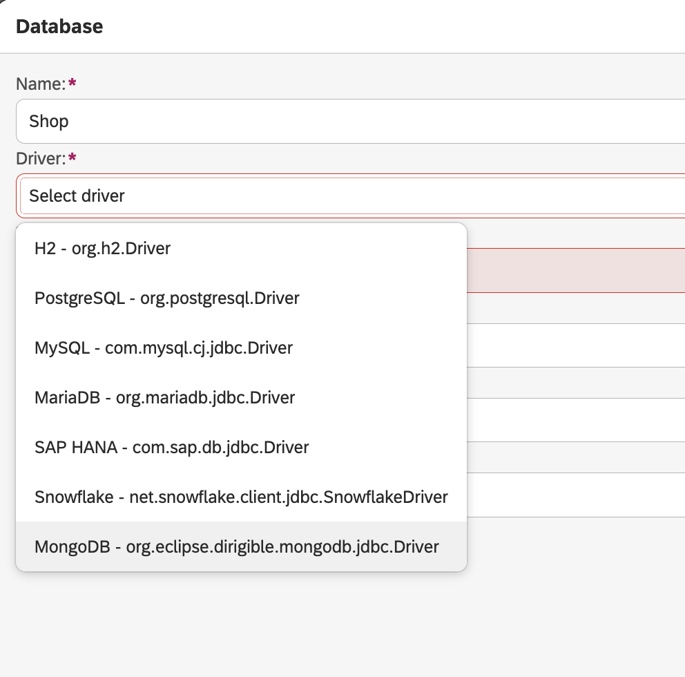

> Hades will list your databases and collections in the `Explorer` view.

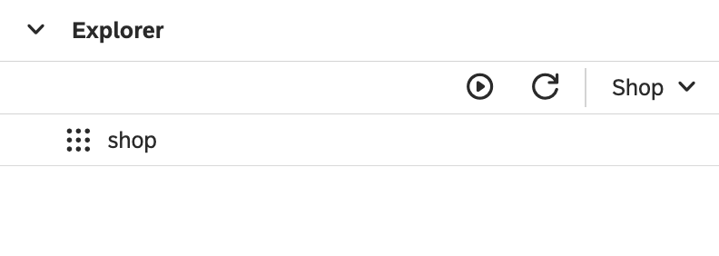

### Step 3: Create a Sample `orders` Collection

1. In Hades UI `Explorer` view, navigate to your DocumentDB database
1. In the `Statements` view enter:

**update:**
```json
{ create: "orders"}
```

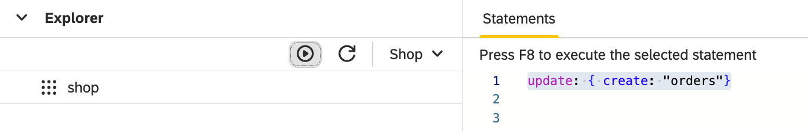

1. Refresh to check the collection has been created:

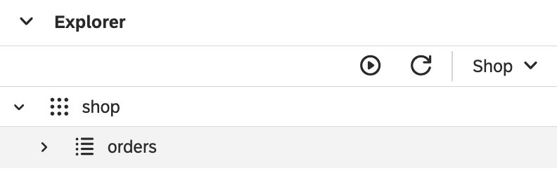

### Step 4: Insert a few records

**update:**
```json
{insert: "orders", documents: [
    {
    "orderId": "ORD-10001",
    "contractId": "C-2023-001",
    "customerName": "Alice Johnson",
    "status": "PENDING",
    "createdAt": "2024-10-01T12:00:00Z",
    "createdBy": "alice.j",
    "totalAmount": 1200.50
  },
  {
    "orderId": "ORD-10002",
    "contractId": "C-2023-002",
    "customerName": "Bob Smith",
    "status": "APPROVED",
    "createdAt": "2024-10-02T09:15:00Z",
    "createdBy": "bob.s",
    "totalAmount": 850.00
  },
  {
    "orderId": "ORD-10003",
    "contractId": "C-2023-003",
    "customerName": "Carla Rivera",
    "status": "PENDING",
    "createdAt": "2024-10-03T14:30:00Z",
    "createdBy": "carla.r",
    "totalAmount": 1575.75
  },
  {
    "orderId": "ORD-10004",
    "contractId": "C-2023-004",
    "customerName": "Daniel Lee",
    "status": "REJECTED",
    "createdAt": "2024-10-04T11:45:00Z",
    "createdBy": "daniel.l",
    "totalAmount": 640.20
  },
  {
    "orderId": "ORD-10005",
    "contractId": "C-2023-005",
    "customerName": "Eva Müller",
    "status": "APPROVED",
    "createdAt": "2024-10-05T16:10:00Z",
    "createdBy": "eva.m",
    "totalAmount": 1999.99
  }
]}
```

You can quickly check the inserted records by selecting the collection and choose `Show Content` from the popup-menu:

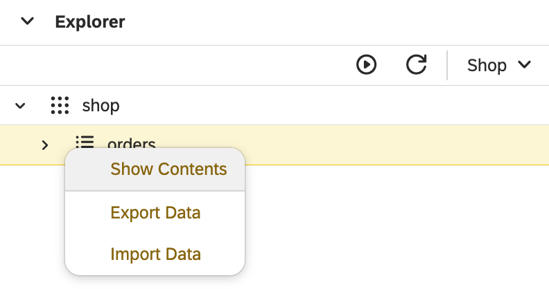

In the `Result` view you should see the inserted records:

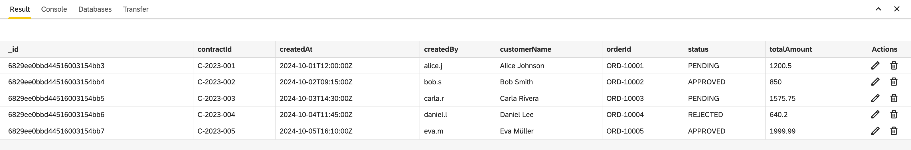

Step 5: Query the Collection

* Count all orders

**query:**
```json
{count: "orders"}
```

Use Hades UI to run a simple query and check the count.

* Find all orders

**query:**
```json
{find: "orders"}
```

* Filter by `createdAt`

**query:**
```json
{find: "orders",
  filter: {
    "createdAt": {
      "$gte": "2024-10-03T00:00:00Z"
    }
  }
}
```

* Limit results

**query:**
```json
{find: "orders", limit: 2}
```

* Projection (include specific fields)

**query:**
```json
{find: "orders",
  filter: {
    "totalAmount": {
      "$gte": 1000
    }
  },
  projection: {
    "totalAmount": true,
    "status": true,
    _id: false
  }
}
```

### Step 6: Update Records

Update order status

**update:**
```json
{update: "orders",
	updates: [
	  {
	    q: { "orderId": "ORD-10001" },
	    u: { "$set": { "status": "APPROVED" }}
	  }
	]
}
```

### Step 7: Delete Records

Delete an order

**update:**
```json
{delete: "orders",
  deletes: [
		{ q:  {"orderId": "ORD-10003"}, limit: 0}
	]
}
```

### Step 8: Drop Collection

**update:**
```json
{ drop: "orders-archives"}
```


### List of commands from MongoDB documentation:

- [General](https://www.mongodb.com/docs/manual/reference/command/nav-crud/)
- [Find](https://www.mongodb.com/docs/manual/reference/command/find/)
- [Insert](https://www.mongodb.com/docs/manual/reference/command/insert/)
- [Update](https://www.mongodb.com/docs/manual/reference/command/update/)
- [Delete](https://www.mongodb.com/docs/manual/reference/command/delete/)
- [Operators](https://www.mongodb.com/docs/manual/reference/operator/query/)


### Step 9: Export

In Hades UI, click on the collection in the `Explorer` view → Choose `Export Data`

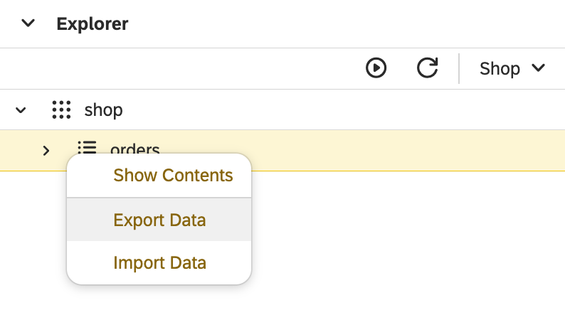

> Useful for backups or cloning test data

### Step 10: Import

Choose your target collection (e.g., orders-archive)

Click `Import Data` → Select the file exported earlier

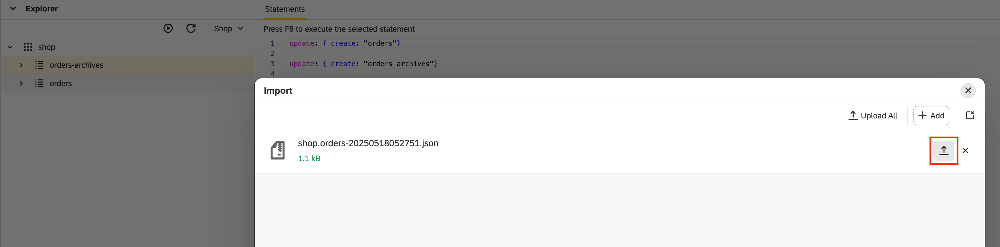

you should see the status of the file as `uploaded`

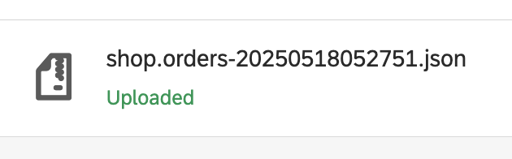

> Works great for migrating sandbox data across environments.

## Bonus: Data Anonymization & Randomization

* Hades includes built-in tools to anonymize or randomize sensitive data. This is especially useful for:
* Testing environments with production-like data
* GDPR/PII compliance for developers
* Creating safe data snapshots

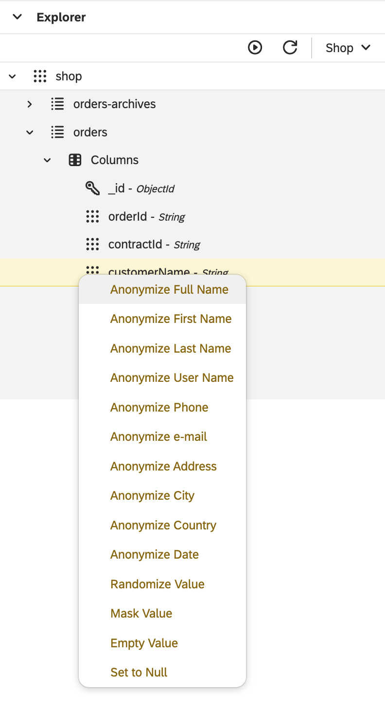

### Examples of what you can do:

* Replace real emails with fake ones: john@example.com → user123@fake.com
* Randomize names and phone numbers
* Nullify specific fields like SSNs or credit card numbers

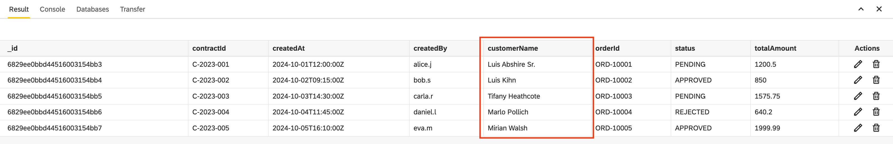

These tools allow safe testing with realistic data, helping your QA and Dev teams work more effectively without risking sensitive information.

## Why Hades?

* Open source & free of charge
* No vendor lock-in
* SQL + NoSQL support in a single UI
* A fast, browser-based interface for managing MongoDB-compatible databases
* Secure, in-VPC deployment on AWS ECS
* Full control of collections, documents, and query results
* Tools for exporting, importing, and even editing data in-place
* Works across AWS, GCP, Azure, or on-prem
* Intuitive UI for daily database management
* Perfect for dev, test, and data migration teams

## Get Started Now

Deploy Hades today from AWS Marketplace as an AMI or ECS container, connect it to your MongoDB or RDS instances, and experience powerful database tooling—without the cost.

Explore the full product page: https://www.codbex.com/products/hades