# Mastering Data Seeding - using CSV and CSVIM in Rhea by codbex

## Introduction

In the fast-paced world of cloud-native development, the most expensive resource isn't your server—it's your time. Why spend hours writing custom boilerplate scripts to parse and upload data when you could do it in seconds? Rhea by codbex is redefining the Low-Code experience by turning tedious database seeding into a simple, declarative process. By leveraging the power of CSVIM (CSV Import Model), you can transform flat files into fully functional database records with zero manual coding. In this post, we’ll show you how to move away from 'Pro-Code' bottlenecks and embrace a streamlined, configuration-first approach that gets your data-driven apps live in record time.

## Sample project

### Entities

#### Create a New Project
- Create a new project and name it **`sample-csvim`**.
- Right-click on **Project → New → Entity Data Model** and name it **`sample-csvim.edm`**.

#### Country Entity

- Add Perspective for **`Country`**

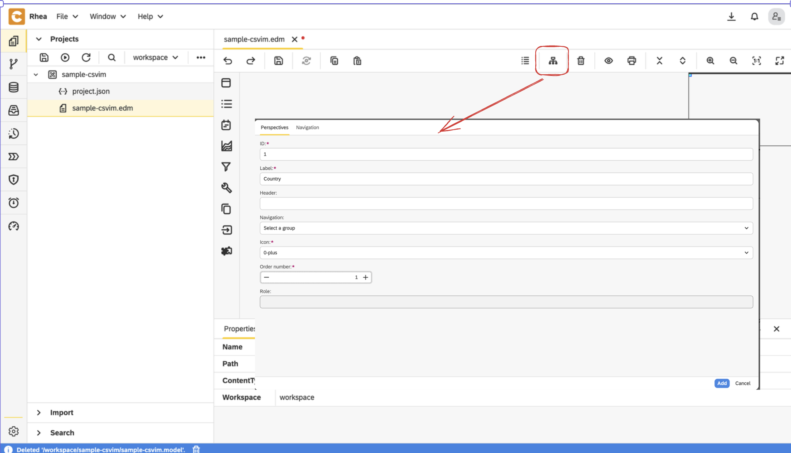

- Create an entity and set its name to **`Country`**

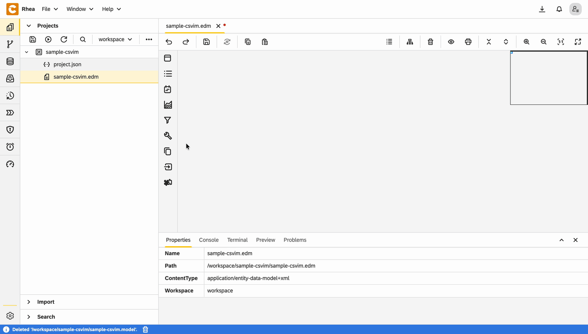

- Right-click on the entity and open **`Properties`**
- In the **User Interface** section:
    - Set **Layout type** to **`Manage Master Entities`**
    - Choose the already defined **perspective**: **`Country`**

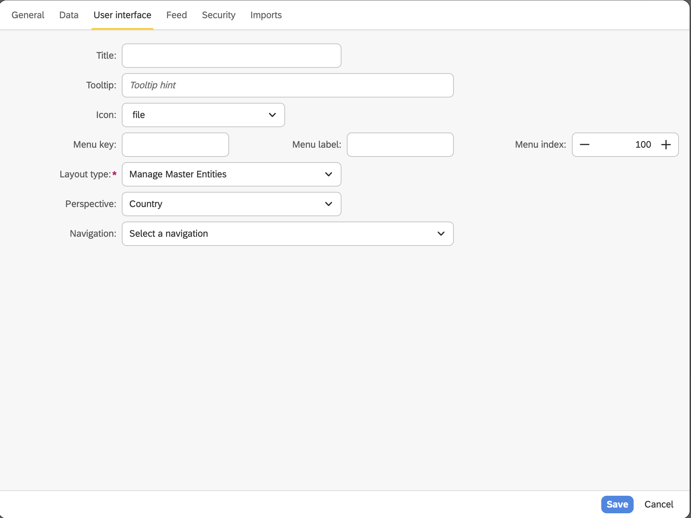

- Add text field for **`Name`**

#### City Entity

- Add Perspective for **`City`**
- Create an entity and set its name to **`City`**

- Right-click on the entity and open **`Properties`**
- In the **User Interface** section:
    - Set **Layout type** to **`Manage Master Entities`**
    - Choose the already defined **perspective**: **`City`**

- Add text field for **`Name`**
- Add relationship to **`Country`**

Configuration for **`Country`** field

- From **User Interface** view, choose:
    - **`Dropdown`** for widget type
    - **`Id`** for dropdown key
    - **`Name`** for dropdown value

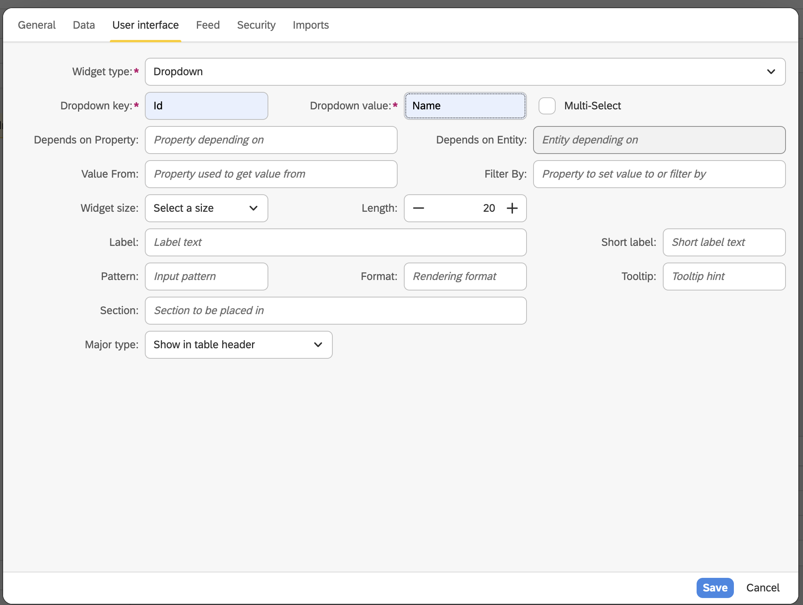

### **Final EDM**

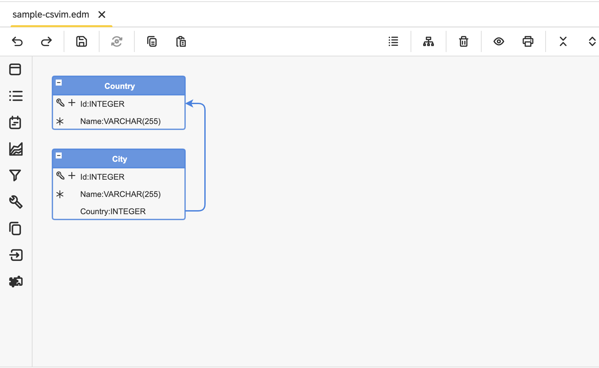

1. Right-click on **EDM file  Generate** and choose **Entity Data to JSON Transformer Model**.

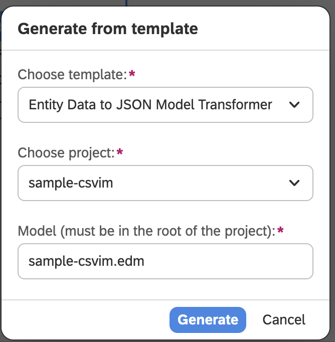

2. **Right-click on `.model` file**, choose **Application - UI (Angular JS)**, fill fields in the next window with your details, and click **Generate**.

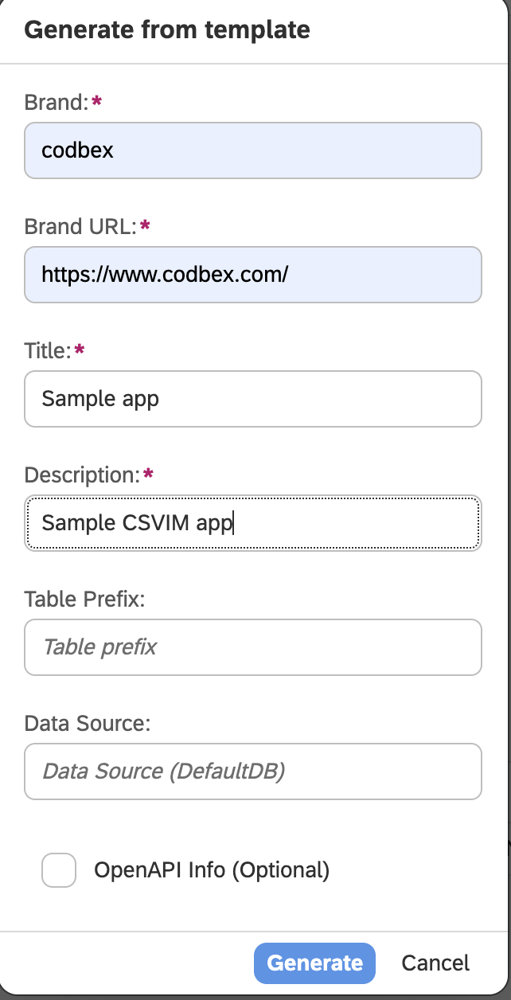

### CSV and CSVIM files

#### Cities

- Create folder and name it **`cities`**
    - Create file **`cities.csv`** and add the following content in it
  
```
CITY_ID,CITY_NAME,CITY_COUNTRY 
1,Sofia,1
2,Plovdiv,1
3,Varna,1
4,Burgas,1
5,Ruse,1
6,Rome,2
7,Milan,2
8,Naples,2
9,Florence,2
10,Venice,2
11,Paris,3
12,Lyon,3
13,Marseille,3
14,Toulouse,3
15,Nice,3
16,Madrid,4
17,Barcelona,4 
18,Valencia,4
19,Seville,4
20,Zaragoza,4
21,Vienna,5
22,Salzburg,5
23,Innsbruck,5
24,Graz,5
25,Linz,5
```
   - Create file **`cities-lang.table`** and configure the table this way

  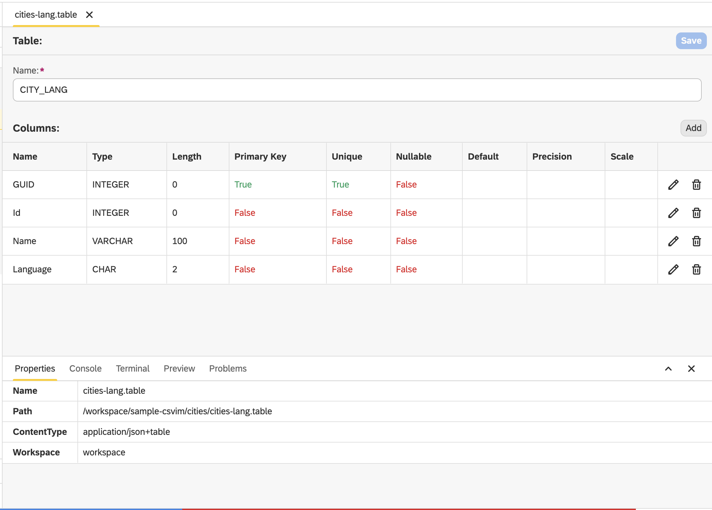

   - Create file **`cities-lang.csv`** and add the following content in it

```
GUID,Id,Name,Language
1,1,София,bg
2,2,Пловдив,bg
3,3,Варна,bg
4,4,Бургас,bg
5,5,Русе,bg
6,6,Рим,bg
7,7,Милано,bg
8,8,Неапол,bg
9,9,Флоренция,bg
10,10,Венеция,bg
11,11,Париж,bg
12,12,Лион,bg
13,13,Марсилия,bg
14,14,Тулуза,bg
15,15,Ница,bg
16,16,Мадрид,bg
17,17,Барселона,bg
18,18,Валенсия,bg
19,19,Севиля,bg
20,20,Сарагоса,bg
21,21,Виена,bg
22,22,Залцбург,bg
23,23,Инсбрук,bg
24,24,Грац,bg
25,25,Линц,bg
26,1,Sofia,de
27,2,Plowdiw,de
28,3,Warna,de
29,4,Burgas,de
30,5,Russe,de
31,6,Rom,de
32,7,Mailand,de
33,8,Neapel,de
34,9,Florenz,de
35,10,Venedig,de
36,11,Paris,de
37,12,Lyon,de
38,13,Marseille,de
39,14,Toulouse,de
40,15,Nizza,de
41,16,Madrid,de
42,17,Barcelona,de
43,18,Valencia,de
44,19,Sevilla,de
45,20,Saragossa,de
46,21,Wien,de
47,22,Salzburg,de
48,23,Innsbruck,de
49,24,Graz,de
50,25,Linz,de
51,1,Sofia,fr
52,2,Plovdiv,fr
53,3,Varna,fr
54,4,Bourgas,fr
55,5,Roussé,fr
56,6,Rome,fr
57,7,Milan,fr
58,8,Naples,fr
59,9,Florence,fr
60,10,Venise,fr
61,11,Paris,fr
62,12,Lyon,fr
63,13,Marseille,fr
64,14,Toulouse,fr
65,15,Nice,fr
66,16,Madrid,fr
67,17,Barcelone,fr
68,18,Valence,fr
69,19,Séville,fr
70,20,Saragosse,fr
71,21,Vienne,fr
72,22,Salzbourg,fr
73,23,Innsbruck,fr
74,24,Graz,fr
75,25,Linz,fr
```

#### Countries

- Create folder and name it **`countries`**
    - Create file **`countries.csv`** and add the following content in it
  
```
COUNTRY_ID,COUNTRY_NAME
1,Bulgaria
2,Italy
3,France
4,Spain
5,Austria
 ```

   - Create file **`countries-lang.table`** and configure the table this way

  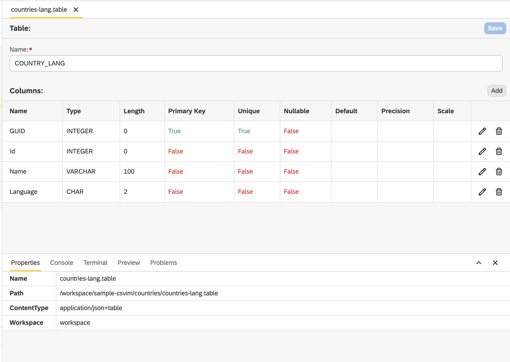

   - Create file **`countries-lang.csv`** and add the following content in it

```
GUID,Id,Name,Language
1,1,България,bg
2,2,Италия,bg
3,3,Франция,bg
4,4,Испания,bg
5,5,Австрия,bg
6,1,Bulgarien,de
7,2,Italien,de
8,3,Frankreich,de
9,4,Spanien,de
10,5,Österreich,de
11,1,Bulgarie,fr
12,2,Italie,fr
13,3,France,fr
14,4,Espagne,fr
15,5,Autriche,fr
```

- Create **`sample-csvim.csvim`** and add each of the **`.csv`** files this way

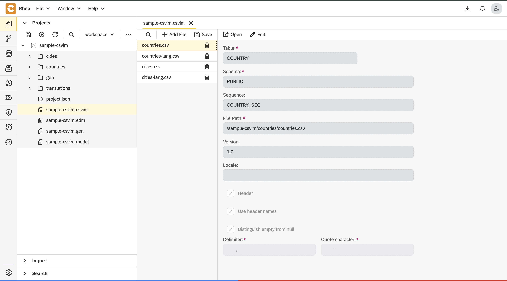

- Save all and publish

- Go to database perspective and check if there is data seeded in the database

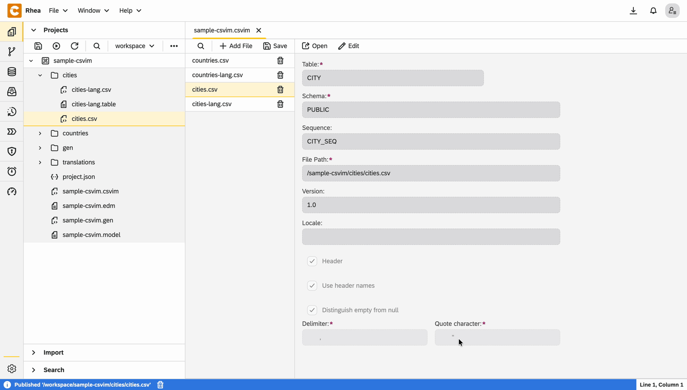

## Conclusion

In this guide, we’ve shown how [Rhea](https://www.codbex.com/products/rhea) by codbex revolutionizes data seeding. With just a few configuration files and zero lines of custom boilerplate code, we have built a fully functional, multi-language data structure. Rhea doesn't just import rows; it allows you to maintain a clean, model-driven architecture while keeping your development process agile.

Ready to build your own? [Click here](https://github.com/codbex/codbex-sample-csvim) to learn more or access the Sample App code.