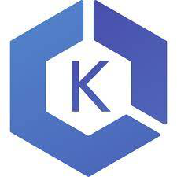

{{ page.title }}
===

<h3 class="pull-right price-tag">contact us at: <a href="mailto:office@codbex.com">office@codbex.com</a></h3>

<h2><i class="fa fa-server fa-fw"></i>
For specific needs including non-standard add-ons with premium SLAs
</h2>

<b>codbex</b> runtime Premium Edition includes all the available features for rapid application development of cloud applications from the open-source project <a href="https://www.dirigible.io">Eclipse Dirigible</a>, as well as the devops tools for opearating the workloads.

Eclipse Dirigible provides capabilities for end-to-end development process from database modeling and management, through RESTful services authoring using various dynamic languages, to pattern-based user interface generation, role-based security, external services integration, testing, debugging, operations, and monitoring.

Features included, but not limited to:

- <a href="https://www.dirigible.io/help/development/ide/perspectives/database/" target="_blank">Database Management</a> 
- <a href="https://www.dirigible.io/help/development/ide/modelers/database-schema/" target="_blank">Schema Modeling</a> 
- <a href="https://www.dirigible.io/help/development/ide/editor-csvim/" target="_blank">Data Import</a> 
- <a href="https://www.dirigible.io/help/development/ide/" target="_blank">Back-end Services Authoring</a> 
- <a href="https://www.dirigible.io/api/" target="_blank">Enterprise JavaScript API Support</a> 
- <a href="https://www.dirigible.io/help/development/ide/modelers/form-designer/" target="_blank">User Interfaces</a> 
- <a href="https://sap.github.io/fundamental-styles/?path=/docs/introduction--overview" target="_blank">Themes Support</a> 
- <a href="https://www.dirigible.io/help/development/ide/modelers/entity-data/" target="_blank">Entity Data Modeling</a> 
- <a href="https://www.dirigible.io/help/development/ide/modelers/bpmn/" target="_blank">Business Processes Modeling</a> 
- <a href="https://www.dirigible.io/help/development/ide/views/jobs/" target="_blank">Jobs Definitions</a> 
- <a href="https://olingo.apache.org/" target="_blank">OData REST Services</a> 
- <a href="https://www.dirigible.io/help/development/ide/views/listeners/" target="_blank">Message Listeners Definitions</a> 
- <a href="https://www.dirigible.io/help/development/extensions/#extensibility" target="_blank">Extensions Definitions</a> 
- <a href="https://www.dirigible.io/help/development/ide/perspectives/operations/" target="_blank">Operations and Monitoring</a> 

 

Support can be requested via <a href="https://github.com/eclipse/dirigible/issues">public channels</a> of Dirigible project itself.

In addition for Professional Edition you get

- Source code repository setup on GitHub 
- CI/CD pipelines for automatic udates on GitHub 
- Deployed on Google Cloud Platform 
- Support via e-mail with reponse time of two business days 

In addition for Enterprise Edition you get

- All included in the Professional Edition 
- Source code repository setup on any Git provider 
- Private source code repositories
- CI/CD pipelines for automatic udates on private servers 
- Deployed on public cloud provider - GCP, AWS, Azure 
- Dedicated managed Kubernetes cluster
- Support via e-mail with reponse time of two business hours 

SAP HANA XS classic development model support

- Project <a href="https://www/xsk.io">XSK</a> is a compatible environment for applications based on SAP HANA Extended Application Services (XS). You can deploy it separately from a SAP HANA instance as a Docker container on Kubernetes, on Cloud Foundry, or even locally in standalone mode.
- More details can be found at: <a href="https://blogs.sap.com/2021/11/30/from-neo-to-multi-cloud-foundation-how-to-transfer-my-sap-hana-xs-classic-applications-in-sap-btp-kyma-runtime/">From Neo to Multi-Cloud Foundation: How-To Transfer My SAP HANA XS Classic Applications in SAP BTP, Kyma runtime</a>

 

diagram from <a href="https://www.xsk.io">https://www.xsk.io</a>

 

    